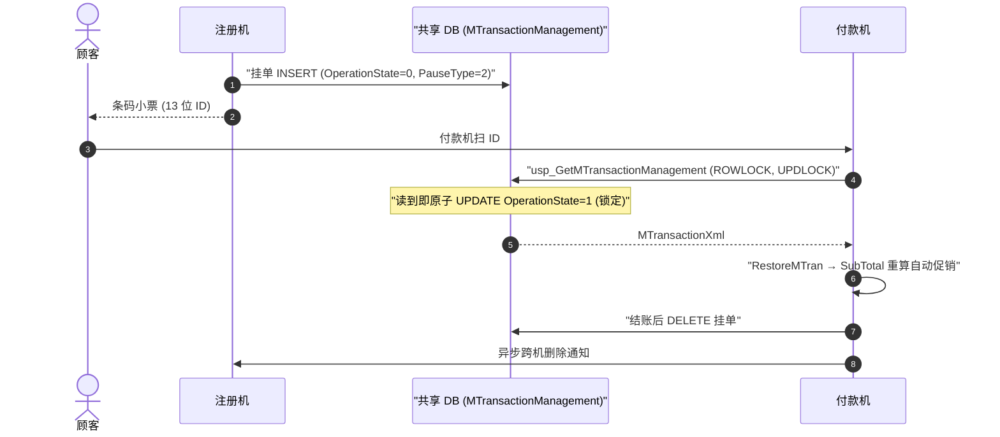

# 挂单与呼出 端到端流程

> **范围仅 POS4U 侧。** 挂单（一時保留）把当前购物车序列化为 XML 暂存，呼出（呼び出し）在同机或**跨机**（半自助：注册机挂 → 付款机呼）恢复。核心是**跨机并发下"一单不能被双结"**。规则之家 = [sales](../30_domain/sales.md)。
>
> ⚠️ 本页不含 ST-POS/kugelpos（904）内容——那是新系统实装，与 POS4U AS-IS 无关，属别仓。

## 1. 挂单类型 `PauseTypes`（**9 种**，非旧文档误记的 5）

`Common/Common.Const/PauseTypes.cs:11-51` 定义 9 种保留：

| # | PauseType | 说明 |
|---|---|---|
| 1 | `Pause` | 通常保留 |
| 2 | `SemiSelf` | 半自助保留（注册机挂→付款机呼） |
| 3 | `TwoOperators` | 二人制保留 |
| 4 | `TwoOperatorsCheckerPause` | 二人制·扫描员通常保留 |
| 5 | `TwoOperatorsCashierPause` | 二人制·收银员通常保留 |
| 6 | `FullSelf` | 全自助保留 |
| 7 | `TwoSelfOperators` | 二人制セルフ保留 |
| 8 | `TwoSelfOperatorsCheckerPause` | 二人制セルフ·扫描员通常保留 |
| 9 | `TwoSelfOperatorsCashierPause` | 二人制セルフ·收银员通常保留 |

> 📌 订正记录：`01-` 旧报告只列 5 种（漏计 6-9 的 Self 系列）；[90-verification P1 #5](../../90-verification/reverse-docs-vs-code-audit-2026-07-14.md) 已指出，本页以代码为准。

## 2. 挂单 ID：13 位 + M10W31 校验位

`MTranObject.CreateMTransactionId`（`Business/Business.Sales/MTranObject.cs:659-668`）：

```
MTransactionId = PREFIX(2) + TerminalNo(4) + ServiceType(1) + SequenceNo(5) + CD(1)  = 13 位
```

- `PREFIX = "13"`（`MTranObject.cs:23`）
- `ServiceType`：WinPOS=`1` / LogicService=`2`（`:662`）
- `SequenceNo`：`BusinessCounter.NumberingCount(…, CounterCodes.MTransactionNo)`（`:666`）
- `CD`：`CheckDigitManager.AddCheckDigit(CheckDigitTypes.CheckDigitM10W31, …)`（`:668`）—— M10W31 算法本体在 `POS4U.Framework.dll`（无源码，`uncheckable`），此处只核到**调用**。

## 3. 跨机呼出：行级互斥锁



- **锁机制**（`usp_GetMTransactionManagement.StoredProcedure.sql`）：`WITH (ROWLOCK, UPDLOCK)` 读取 + 同事务原子改 `OperationState=1`，物理层杜绝"一单多呼、一单双结"。允许**原锁定终端重入**（断电/超时自救）。
- **状态**：`OperationState` 0（待机）→ 1（呼出中/独占）→ 2（复元完成）。
- **失败补偿**：`RestoreMTran` 异常时异步把 `OperationState` 回滚为 0，释放锁。

## 4. 呼出重算：手动折扣还原、自动促销重算

`RestoreTranObject`（`Business/Business.Sales/RestoreTranObject.cs`）：

- **手动折扣**（`DiscountMarkDown`/`ManualDiscountLineItem`）：原样还原（尊重收银员干预）。
- **自动促销**（`DiscountAutoItem`/`DiscountGroupSet`/`DiscountMixMatch`/`DiscountFanCoupon`）：还原时**跳过**，呼出后 `tran.SubTotal("")` 按**呼出时刻最新主数据**重算——保证挂单期间主数据变更后仍算出合规金额。规则细节 → [discount](../30_domain/discount.md)。

## 5. 生命周期清理（双重安全网）

| 机制 | 触发 | 动作 |
|---|---|---|
| 服务初始化清理 | 付款机 `OnInit`（`Device.MTranService/MTranServiceWinPOS.cs`） | 删自己在各注册机上的残留挂单 |
| 日终批处理 | `WinPOS.Batch/BatchDeleteMTransaction.cs` → `usp_DeleteMTransactionManagementAll` | `DELETE FROM MTransactionManagement` 全清 |

## 6. 关联与家

- 数据表 `MTransactionManagement` 字段 → [40_data/03](../40_data/03_tran_tables.md)
- 挂单支付排他（仅券类可共存）→ [payment_change](./payment_change.md)
- 五元组主键与"跨终端序列不冲突"的取舍 → [ADR-001](../80_decisions/adr-001-five-tuple-pk.md)

## 7. 可信度

- verified：`PauseTypes`=9、ID 结构（`MTranObject.cs:23/659-668`）、锁 SP、清理入口逐条回代码。
- uncheckable：`CheckDigitM10W31` 算法本体（框架 DLL）；跨机 HTTP 通知的对端行为。
