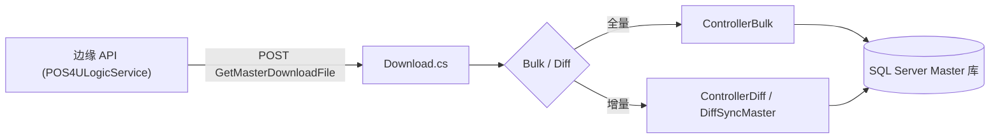
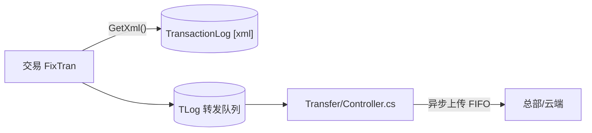

# 主数据下行同步与交易流水上行转发

> 店端与总部/云的两条数据管道：**下行**（主数据同步到店端 SQL Server）与**上行**（交易流水 TLog 转发出店）。后台进程之家 = [60_services/background](../60_services/background/index.md)。

## 1. 下行：主数据同步（MasterSync）

`POS4UBackground/Business/Background.Business.MasterSyncPos/`，两种模式：

| 模式 | 控制器 | 说明 |
|---|---|---|
| **全量 Bulk** | `ControllerBulk.cs` / `MasterSyncPosBulkLogic.cs` | 拉取完整主数据包并导入店端库 |
| **增量 Diff** | `ControllerDiff.cs` / `MasterSyncPosDiff.cs` / `DiffSyncMaster.cs` | 准实时改价等差分合并 |

- **拉取动作**：向**边缘 API** POST `"GetMasterDownloadFile"`（`Library/Download.cs:54`）取下载文件——**不是** `01-` 旧报告臆想的"HTTP GET+Gzip 覆盖 SQLite / 5 分钟轮询"；店端是 **SQL Server**，见 [conventions §2](../00_portal/conventions.md)。
- **调度**：`MasterSyncPosSchedule.cs`。
- 导入落表 → [40_data](../40_data/01_overview.md)；边缘 API 契约 → [60_services/edge-api](../60_services/edge-api/index.md)。

## 2. 上行：交易流水转发（Transfer）

交易 `FixTran` 时，流水以 **XML** 一体化落盘到 `TransactionLog.TransactionData [xml] NOT NULL`（`Application/Database/01_Tables/dbo.TransactionLog.Table.sql:24`），并入转发队列（`usp_InsertTLogQueue`）；后台 `Background.Business.Transfer/Controller.cs` 读队列异步上传。

- **XML 持久化取舍** → [ADR-004](../80_decisions/adr-004-tlog-xml-persist.md)。
- **保序**：单终端流水严格 FIFO；上传失败重试。
- **落盘 SP**：`usp_InsertTransactionLog`（主表）+ `usp_InsertTLogQueue`（队列）→ [40_data/05](../40_data/05_stored_procedures.md)。

## 3. 关联

- 交易落盘发生在 [sale_end_to_end #8](./sale_end_to_end.md) / [return_void](./return_void.md) / [open_close_daily](./open_close_daily.md) 等所有交易结尾。
- 离线积分的事后补传搭这条上行链 → [point_accrual_offline](./point_accrual_offline.md)。

## 4. 可信度

- verified：`Download.cs:54` POST 目标、Bulk/Diff 控制器、`TransactionLog` xml 列、转发控制器位置逐条回代码。
- uncheckable：边缘 API 与总部/云对端的返回内容、上传对账为外部系统。
