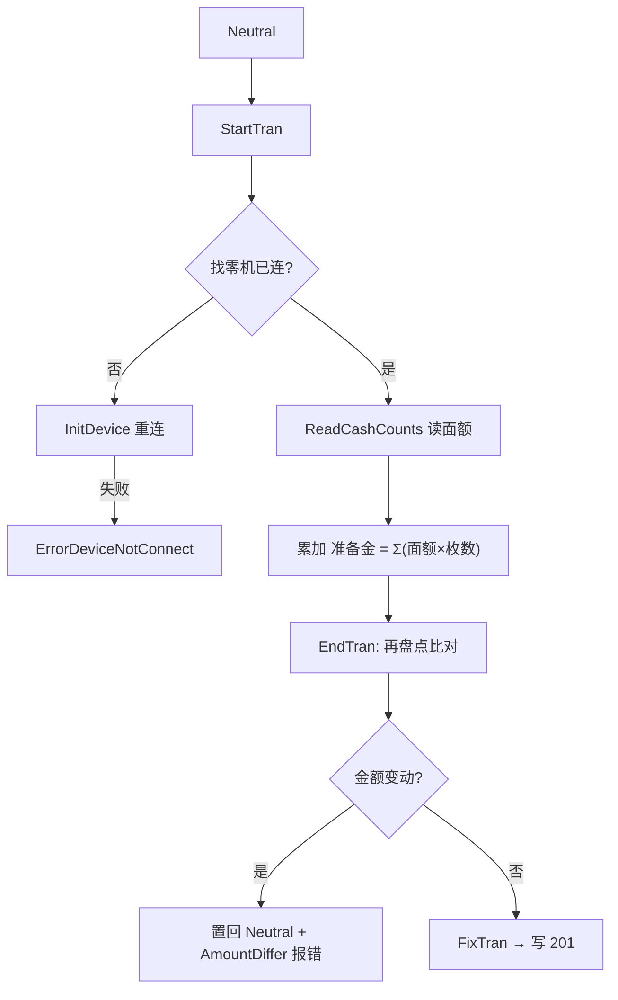

# 开店点检与关店精算 日周期

> 每个营业日的起点（開設 OpenCount）与终点（精算 CloseCount）。二者深度耦合**自动找零机**与外接支付终端（CAFIS）。规则之家 = [opencount](../30_domain/opencount.md) / [closecount](../30_domain/closecount.md)。

## 1. 交易码（`TranLogTypes.cs`，**订正**）

| 交易 | 码 | 行 |
|---|---|---|
| 開設 OpenCount | **`OpenCount = 201`** | `TranLogTypes.cs:97` |
| 精算 CloseCount | **`CloseCount = 202`** | `TranLogTypes.cs:102` |

> 📌 订正记录：`01-` 旧报告把开闭设标为 `301/302`——那其实是 `NormalSelfSales`/`CanceledSelfSales`（セルフ売上，`TranLogTypes.cs:122-127`）。開設/精算的正确码是 **201/202**（[90-verification P1 #5](../../90-verification/reverse-docs-vs-code-audit-2026-07-14.md)）。

## 2. 開設（OpenCount）

`OpenCountTran`（`Business/Business.OpenCount/OpenCountTran.cs`）——目的是盘点并确认找零机内的营业准备金。

- **准备金**：正常钱箱 + 溢出钱箱（`OverCount`）面额之和。
- **两阶段防篡改**：`StartTran` 与 `EndTran` 两次盘点，其间被动过则拒绝开设。
- **零元保护**：读到 0 元时进 `CashChangerAmountNonConfirm`，需 UI 二次确认（防硬件瞬时异常）。
- 找零机交互之家 → [cashchanger](../30_domain/cashchanger.md) · [50_devices](../50_devices/index.md)。

## 3. 精算（CloseCount）

`CloseCountTran`（`Business/Business.CloseCount/CloseCountTran.cs`）——日终最复杂流程，20+ 状态。核心是**多重阻断前置条件**：

| 规则 | 校验 | 阻断态 |
|---|---|---|
| BR-CC-001 | 存在未结挂账（`MTransactionManagement`） | `WaitingForConfirmUnOperatedMTran` → 需先 [呼出结清或作废](./hold_recall.md) |
| BR-CC-002 | 集计差错（`SummaryError > 0`） | `WaitingForConfirmSummaryError` |
| BR-CC-003 | 找零机回收箱有残留（`OverCount.Amount > 0`） | `ErrorCloseCountRecoveryBox` → 需物理回收 |
| BR-CC-004 | 找零机违算（`GetUncertainState()`） | `ErrorCloseCountUncertain` |

外接支付终端在精算时逐一发起"日计（Daily Summary）"：CAFIS Arch（借记）、CAFIS Arch LAN（信用/银联）、自助支付终端 ModeSelf。规则细节 → [closecount](../30_domain/closecount.md)。

## 4. 精算后批处理链

`FixTran`（写 202）后触发 `POS4UBackground` 日结批处理：`BatchCloseCountReport`（精算报表）→ `BatchSummaryComplete`（推进营业日）→ `BatchPutBusinessCounter`（重置流水号计数器）→ `BatchCyclicClear`（清缓存）。后台服务之家 → [60_services/background](../60_services/background/index.md)。

## 5. 可信度

- verified：交易码 201/202、`OpenCountTran`/`CloseCountTran` 位置回代码。
- unverified：`BR-CC-00x` 阻断态名与批处理类名来自 `01-` 深评，引用前建议回 `Business.CloseCount` + `POS4UBackground` 复核。
- uncheckable：CAFIS 日计、找零机固件"违算"判定为外部/设备侧。
