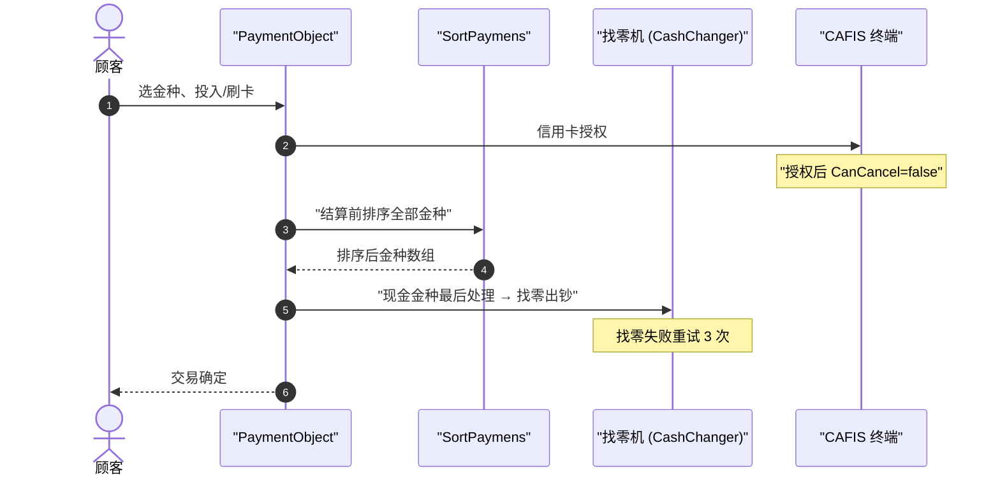

# 复合支付与找零 端到端流程

> 一笔交易可叠加多个金种（现金 / 积分 / ValueCard / 商品券 / 信用卡 CAFIS …）。核心不是"收了多少"，而是**以什么顺序消费这些金种**——决定了找零从哪个金种出、哪个金种不可回退。规则之家 = [payment](../30_domain/payment.md)。

## 1. 金种排序：`SortPaymens`（决定处理顺序）

`Business/Business.Payment/PaymentObject.cs:781-791` 用四级排序键决定支付处理次序：

```csharp
payments
  .OrderBy(p => !p.CanOverDeposit ? 0 : 1)   // ① 不可超付(不可溢收) 的金种优先
  .ThenBy(p => !p.CanChange ? 0 : 1)          // ② 不可找零 的金种优先
  .ThenByDescending(p => p.PaymentType != PaymentTypes.Cash
        ? p.FaceAmount ?? p.DepositAmount : decimal.MinValue)  // ③ 非现金按面额降序；现金 = MinValue
  .ThenBy(p => p.KeyNo);                       // ④ 同序按录入序号
```

**语义**：不能超付/不能找零的金种（如积分、商品券）先消费掉，把可以找零的**现金留到最后**（`decimal.MinValue` 使现金恒排最末），保证找零永远从现金给出、且券类不会被找零套现。这是"逐字命中"的高保真分析点（[90-verification 亮点 §2.2](../../90-verification/reverse-docs-vs-code-audit-2026-07-14.md)）。

## 2. 结算时序



## 3. 关键闸门 → 家

| 闸门 | 触发点 | 说明 |
|---|---|---|
| **金种排序** | `PaymentObject.SortPaymens`（`:781-791`） | 见上 §1 |
| **找零重试** | 找零出钞失败重试 **3 次**（`PaymentObject.cs:560` 附近） | → [cashchanger](../30_domain/cashchanger.md) · [50_devices](../50_devices/index.md) |
| **刷卡后不可取消** | CAFIS 授权成功后 `CanCancel=false`（`PaymentCAFISArchLANBase.cs:311`） | 防止已扣款交易被撤 |
| **挂单支付排他** | 仅 `ExchangeTicket`/`TrialCoupon`/`AccountsReceivable` 可与挂单共存；现金/卡/电子已录入则禁挂 | → [hold_recall](./hold_recall.md) |

## 4. 关联

- 找零机开店点检/关店回收 → [open_close_daily](./open_close_daily.md)
- ValueCard（电子マネー）作为金种的余额扣减/逆转 → [emoney_charge](./emoney_charge.md) · [return_void](./return_void.md)
- 积分作为金种（Point 支付）→ [point_accrual_offline](./point_accrual_offline.md)

## 5. 可信度

- verified：`SortPaymens` 四级键逐字回代码；`CanCancel=false`（`PaymentCAFISArchLANBase.cs:311`）已核。
- unverified：找零重试"3 次"的确切行号（`:560` 附近）引用前建议回代码复核。
- uncheckable：CAFIS 网络授权、找零机固件行为为外部/设备侧。
