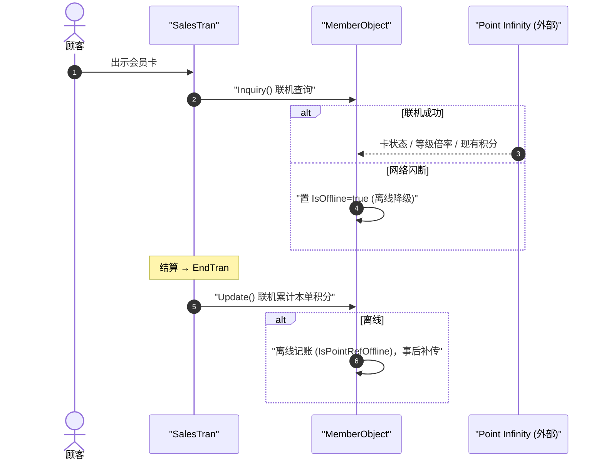

# 会员积分累计与离线降级 端到端流程

> POS 与外部会员积分平台（**Point Infinity**，外部系统）联机累计积分。设计要点是：网络闪断时**不能阻断结账**——降级为离线模式记账，事后补传。规则之家 = [member](../30_domain/member.md) / [point](../30_domain/point.md)；取舍 → [ADR-003](../80_decisions/adr-003-offline-degradation.md)。

## 1. 联机主线

## 2. 关键触发点 → 家

| 步骤 | 触发点（file:line） | 家 |
|---|---|---|
| 会员卡问询 | `MemberObject.Inquiry`；离线判定 `valueResult.Value.IsOffline`（`Business/Business.Member/MemberObject.cs:591`、`:679`） | → [member](../30_domain/member.md) |
| 离线标志落库 | `IsOffline = memberRow.IsPointRefOffline`（`MemberObject.cs:947`、`:1104`）；`salesHeader.IsOfflinePointCardNo`（`:983`） | → [40_data/03](../40_data/03_tran_tables.md) |
| 离线状态机节点 | `SalesTranStates.ValueCardOffline`（`Common/Common.Const/State/SalesTranStates.cs:119`） | → [20_framework](../20_framework/index.md) |
| 等级倍率积分 | 外部会员等级倍率查询（BR-POINT-002） | → [point](../30_domain/point.md) |
| 积分作为金种 | Point 支付在结算侧被逆序消费（不可找零，先消费） | → [payment_change](./payment_change.md) |
| 退货逆冲 | `Update(…, PointServiceDealDiv.Return)` 逆向扣减 | → [return_void](./return_void.md) |

## 3. 离线降级的设计意图

- **不可阻断收银**：会员平台是**外部依赖**，其抖动不得让顾客结不了账。故 `Inquiry`/`Update` 失败即降级为离线记账（`IsPointRefOffline`），交易照常 `FixTran`。
- **事后一致性**：离线累计的积分随 TLog 上行由后台补传给中台对账。上行链路 → [master_sync_tlog](./master_sync_tlog.md)。
- 完整取舍与边界 → [ADR-003 离线降级](../80_decisions/adr-003-offline-degradation.md)。

## 4. 可信度

- verified：`IsOffline`/`IsPointRefOffline`/`ValueCardOffline` 状态位与行号逐条回代码。
- uncheckable：**Point Infinity 平台**行为、等级倍率算法、补传对账为外部系统——本页只核到 POS 侧调用与离线标志。
