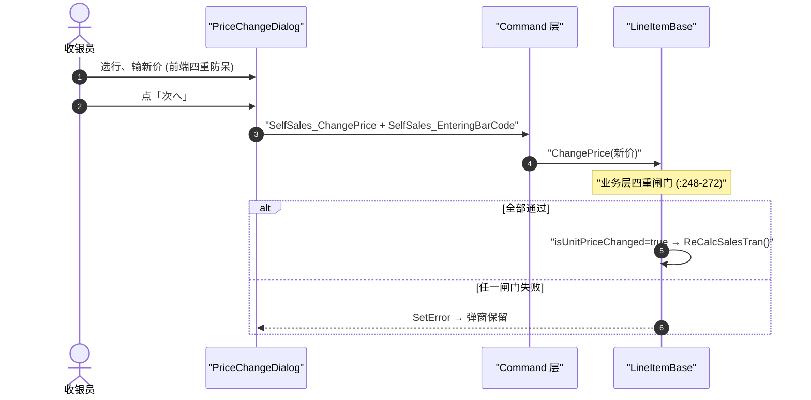

# 前台手动改价 端到端流程

> **范围仅 POS4U AS-IS。** 收银员在录入中对某行手动改单价（临期、生鲜折损、标价错误等）。改价是高敏操作：前端四重防呆 + 业务层四重闸门，两道拦截。规则之家 = [sales](../30_domain/sales.md)。
>
> ⚠️ 本页不含 ST-POS(Avalonia/Python) 落地设计——那属新系统实装，见 [migration-hints](../90_traceability/stpos-migration-hints.md) 外链，不在此展开。

## 1. 前端四重防呆（`PriceChangeDialog.xaml.cs`）

改价弹窗（居中，700×470，双栏触控）在 UI 层的四重校验：

| 机制 | 实现 | 目的 |
|---|---|---|
| ① 最大 6 位数字 | `InputInit`：`Init(6, 0, 0, InputValueTypes.Numeric)` | 上限 `999,999` 円，防手抖多位 |
| ② 首位 0 吃掉 | `NotifyKeyDown`：`if (input == "0") ClearInput()` | 杜绝 `000100` 畸形 |
| ③ 未修改锁 | `_isModifyFlag`：未触键时新单价锁显原售价 | 界面信息饱满 |
| ④ 千分位实时回显 | `FormatUtility.FormatCurrencyString` | `1250 → 1,250` 直观核对 |

**双事件级联**：点「次へ(確認)」同时投递 `SelfSales_ChangePrice`（带新价）+ `SelfSales_EnteringBarCode`（复位扫码态），一个线程周期闭环（事件码之家 → `Common/Common.Const/EventCodes.cs`）。

## 2. 业务层四重闸门（`LineItemBase.cs` 改价方法，`:248-272`）

改价请求进入 Business 层后，`LineItemBase` 顺序四道校验，任一失败即 `SetError` 拒绝：

| 闸门 | 代码（file:line） | 错误 |
|---|---|---|
| ① 单价可解析 | `LineItemCommonLogic.TryParseUnitPrice`（`:249`） | 解析失败即拒 |
| ② 取消行不可改价 | `if (LineItemState == Canceled)`（`:254`） | `ErrorCannotChangePriceForCanceled` |
| ③ 有手动折扣不可改价 | `LineItemDetails.Exists(x => x.LineItemDiscountData.HasManualDiscount)`（`:261`） | `ErrorCannotChangePriceForItemDiscount` |
| ④ 主数据改价禁止标志 | `IsChangePriceProhibition()`（`:268`） | `ErrorChangePriceProhibition` |

通过后置 `isUnitPriceChanged=true`，写新价并**级联 `ReCalcSalesTran()`** 重算折扣/税金/小计。

## 3. 时序

## 4. 关联与家

- 级联重算触及自动促销/税金 → [discount](../30_domain/discount.md) · [sale_end_to_end](./sale_end_to_end.md)
- 改价与手动折扣**互斥**（闸门③）——这与小计折扣缺陷相关背景 → [investigations/subtotal_discount_defect](../80_decisions/investigations/subtotal_discount_defect.md)

## 5. 可信度

- verified：业务层四重闸门逐行回代码（`LineItemBase.cs:249/254/261/268`，含真实 `MessageIds`）。
- unverified：前端 `PriceChangeDialog.xaml.cs` 四重防呆来自 `01-` 深评，引用前回 UI 层源码复核行号。
