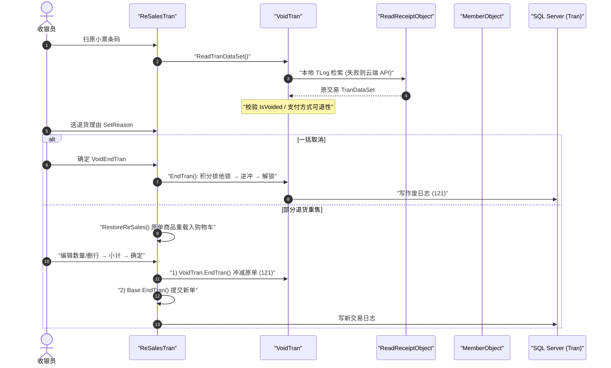

# 退货与作废 端到端流程

> 三个易混淆但不同的"负向"操作：**Void 一括取消**（整单作废）、**ReSales 部分退货重售**、**指定取消**（交易内单行撤销）。交易码之家 = `TranLogTypes.cs`；业务规则之家 = [resales](../30_domain/resales.md)。

## 1. 三者定位

| 操作 | 对象 | 交易码 | 实现类 |
|---|---|---|---|
| **一括取消 Void** | 已结账整笔 | `NormalVoid = 121`（`TranLogTypes.cs:67`） | `Business.ReSales/VoidTran.cs` |
| **部分退货重售 ReSales** | 已结账中的部分商品 | Void(121) + 新单销售/返品ログ（码见 resales 家；`NormalReturn = 105` `TranLogTypes.cs:47`） | `Business.ReSales/ReSalesTran.cs`（继承 `SalesTran`，内持一个 `VoidTran`） |
| **指定取消 / 直前取消** | **当前进行中**交易的单行 | 无独立交易码（改行 state） | `Sales_CancelSpecifiedLineByItem` / `Sales_ItemCancel` |

## 2. Void / ReSales 时序（复合机制）

## 3. 关键触发点 → 家

| 步骤 | 触发点 | 家 |
|---|---|---|
| 读原单 | `VoidTran.ReadTranDataSet` → `ReadReceiptObject`（本地先查，未命中走云端 `LogicServiceClient`） | → [resales](../30_domain/resales.md) · [60_services/edge-api](../60_services/edge-api/index.md) |
| 积分逆冲（异常安全） | `VoidTran.EndTran` 内 `try/finally`：`MemberObject.LockInquiry` → `FixPayments` → `Update(…, PointServiceDealDiv.Return)` → `finally: UnLockUpdate` | → [point_accrual_offline](./point_accrual_offline.md) · [member](../30_domain/member.md) |
| ValueCard 余额逆转 | ReSales 预计算 `CalPreReSalesValueCardAmount`；`ReSalesTran.EndTran` 同步 `balanceTotal` | → [emoney_charge](./emoney_charge.md) · [member](../30_domain/member.md) |
| 差额结算 | ReSales：原单退款额 − 新单应收额 = 找零或补款 | → [payment_change](./payment_change.md) |

## 4. 指定取消（交易内单行撤销）

发生在**进行中**的 `SalesTran`，不是结账后的退货。按有无置数分流：

| 触发 | 事件码 | 行为 |
|---|---|---|
| 无置数 | `Sales_ItemCancel`（直前取消） | 取消最近一行 |
| 有置数 | `Sales_CancelSpecifiedLineByItem`（指定取消） | 按"折后单价降序、KeyNo 降序"定位靶行 |

- **模式差异**：通常 POS 对同条码 `Fixed` 行**一键全消**（原单价≠0 时）；セルフ/LogicService 仅**数量−1**或单行取消。
- **乒乓翻转**：`LineItemBase.Cancel(SalesTran)` 对已 `Canceled` 行再取消会翻回 `Fixed`（撤销取消），并跑上限校验。
- **重算**：`ChangeLineItem<T>` 的 `finally` 无条件 `ReCalcSalesTran()`；`Canceled` 行排除出计算基数。
- **落盘/打印分离**：本地 BI 完整保留取消行（`IsCanceled=1`，`usp_SetBILineItems`）；云端上报过滤取消行；顾客票（`RJDeviceType.R`）隐藏取消行，日记账（`RJDeviceType.J`）保留并印「直前/指定取消」标（`Business.RJ/Layout/SalesLayout.cs:146-148`）。
- 明细规则之家 → [sales](../30_domain/sales.md) · [rj](../30_domain/rj.md)。

## 5. 可信度

- verified：交易码（121/105）、`VoidTran`/`ReSalesTran` 位置、指定取消版式点（`SalesLayout.cs:146-148`）逐条回代码。
- unverified：ReSales 新单具体交易码分支（101 vs 105，视差额方向）未逐条追调用链——引用前回 `Business.ReSales/ReSalesTran.cs` 确认。
- uncheckable：积分中台、CAFIS 逆冲、云端 TLog 检索为外部系统行为。
