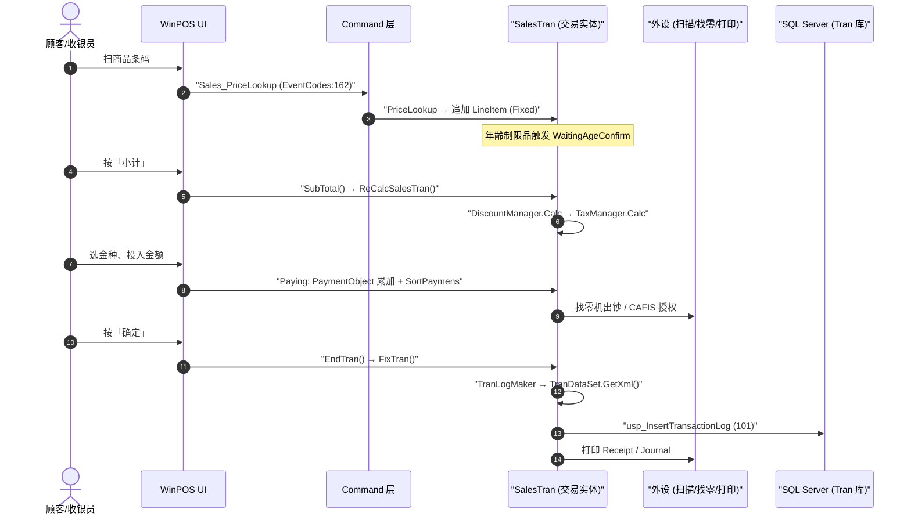

# 通常销售 端到端流程

> 一笔通常売上（`TranLogType.NormalSales = 101`，`TranLogTypes.cs:27`）从待机到落盘的主线。本页只串**顺序与触发点**，每步规则回其"家"。

## 全景时序

## 分步说明（触发点 → 家）

| # | 步骤 | 触发点（file:line） | 规则/字典之家 |
|---|---|---|---|
| 1 | 商品扫描·PLU 检索 | `EventCodes.Sales_PriceLookup`（`Common/Common.Const/EventCodes.cs:162`）→ `SalesTran.PriceLookup` | → [sales](../30_domain/sales.md) |
| 2 | 明细行累加 | 新增 `LineItem` 置 `LineItemStates.Fixed`；行金额 `LineItemBase.LineTotal`（`Business/Business.Sales/LineItem/LineItemBase.cs:119-123`） | → [sales](../30_domain/sales.md) |
| 3 | 年齢/药品/防犯确认 | 年齢制限品进入确认状态（`AgeConfirmType` + 5 种 `AgeConfirmTypes`，非虚构的 `IsAgeLimitProhibition`） | → [sales #合规](../30_domain/sales.md) |
| 4 | 小计·自动促销 | `SalesTran.SubTotal` → `ReCalcSalesTran` → `DiscountManager.Calc`（MixMatch/GroupSet/AutoItem，主数据在内存 `TranMasterDataSet.DiscountMixMatchMaster`，非 SQL 轮询） | → [discount](../30_domain/discount.md) |
| 5 | 税额计算 | `TaxManager.Calc`（`Business/Business.Tax`）；正确引用小计折扣分摊额 `TotalDiscountSubTotalDivided` | → [tax](../30_domain/tax.md) |
| 6 | 结算·多金种 | `PaymentObject` 累加，`SortPaymens`（`Business/Business.Payment/PaymentObject.cs:781-791`）四级排序 | → [payment_change](./payment_change.md) · [payment](../30_domain/payment.md) |
| 7 | 会员积分累计 | 有会员卡时 `MemberObject` 联机累计（含离线降级） | → [point_accrual_offline](./point_accrual_offline.md) |
| 8 | 交易确定·落盘 | `EndTran` → `FixTran` → `TranLogMaker` 构建 `TranDataSet` → `GetXml()` → `usp_InsertTransactionLog`（码 101） | → [ADR-004 TLog XML 持久化](../80_decisions/adr-004-tlog-xml-persist.md) · [40_data/03](../40_data/03_tran_tables.md) |
| 9 | 打印 Receipt/Journal | `Business.RJ` 版式；`RJDeviceType.R`（顾客票）/`.J`（电子日记账） | → [rj](../30_domain/rj.md) · [50_devices](../50_devices/index.md) |
| 10 | 异步上行转发 | 后台 `Background.Business.Transfer` 读队列上传 | → [master_sync_tlog](./master_sync_tlog.md) |

## 变体与关联流程

- **セルフ销售**：`TranLogType.NormalSelfSales = 301`（`TranLogTypes.cs:122`），走 `SelfStates`（39 状态）；结算在付款机侧，常与 [hold_recall](./hold_recall.md) 半自助流转联动。
- **手动改价**：第 2 步之后可分支到 [price_change](./price_change.md)。
- **取消明细**：直前/指定取消见 [return_void #指定取消](./return_void.md)。

## ⚠️ 已知缺陷（勿在新系统复刻）

若第 4 步启用了**手动小计折扣**（`ManualDiscountSubTotal`），第 8 步落盘会 100% 崩溃：`DiscountMaker.cs:34` 对空的 `SalesDiscount` 表 `FirstOrDefault()` 触发 `NullReferenceException`；且 `LineItemBase.LineTotal:123` 未扣减分摊额，合计金额本身也是错的。逐 file:line → [investigations/subtotal_discount_defect](../80_decisions/investigations/subtotal_discount_defect.md)。

## 可信度

- verified：状态码/交易码/`SortPaymens`/落盘 SP/缺陷点均逐条回代码（见 frontmatter `verified_by`）。
- uncheckable：`DiscountManager`/`TaxManager`/`TranBase.FixTran` 等基类语义在 `POS4U.Framework.dll`（无源码）——本页只核到"调用层存在"。
