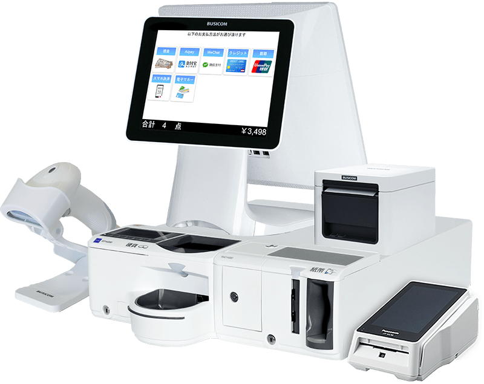
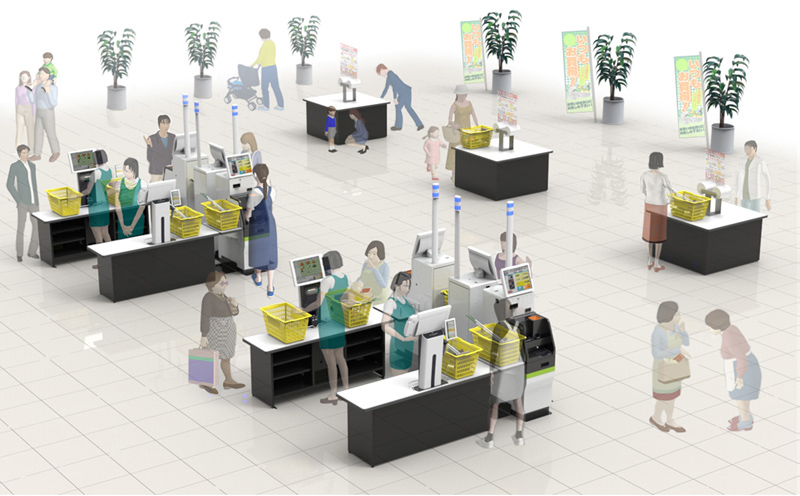
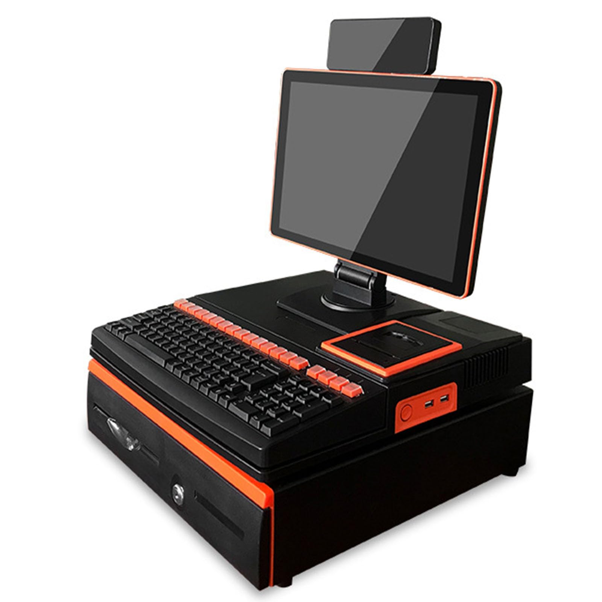
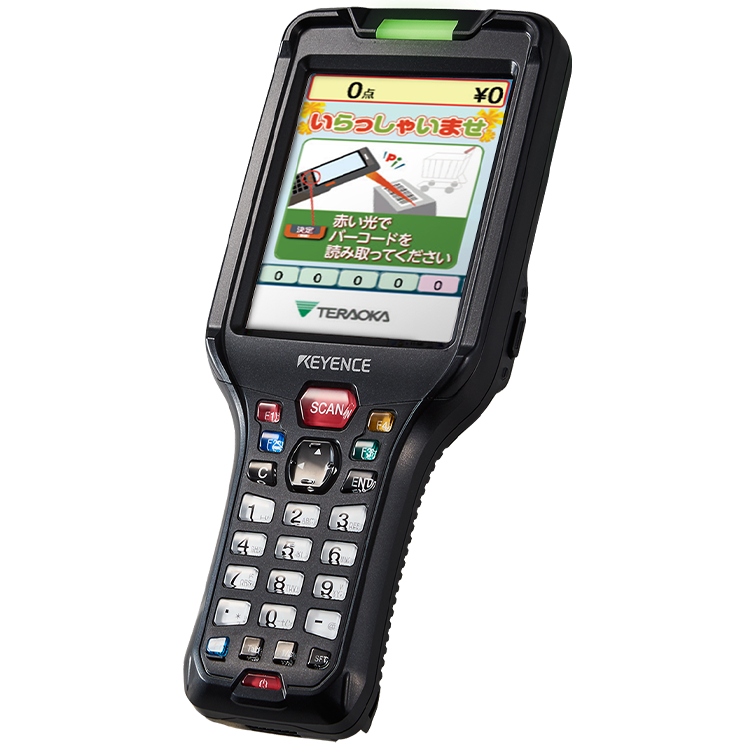
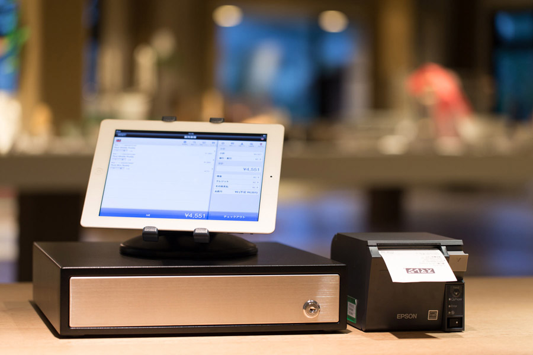

# POS端末種類

POS端末には、大まかに以下のような種類がある

**・一体型**

一体型は、POSレジ機能が搭載された端末に「レシートプリンター」やバーコードを読み取る「リーダー」などの周辺機器が一体化したものです。一般的なスーパーマーケットやコンビニなどで利用されているタイプをイメージすると分かりやすいでしょう。  
商品の管理から自動釣り銭機能、金額表示や決済機能（クレジットカードや非接触IC決済、ポイント機能など）が、ひとつの端末で利用できるPOS端末です。近年では、高機能かつ小型化が進んでおり、省スペース化が実現されています。

**・フリーレイアウト型**  

必要な周辺機器を選択できるPOS端末です。POSレジ機能が搭載された端末に、必要な周辺機器を自由に組み合わせられます。  
店舗のコンセプトやスペースに合わせたレイアウトの構築に最適です。

**・PC型**

一般的なPCをPOS端末として利用するタイプです。アプリケーションを起動すればPOSシステムを利用できるほか、一般的なPCで使えるメールやスケジュール管理、勤怠管理や顧客分析なども併用できます。  
POSシステムを一般的なPCの一部の機能として利用できるため、店頭での販売や接客時にはPOSシステムとして、一般業務ではPCとして使えます。そのため、POSシステムで集計・分析した結果を企業へメールで報告する作業もPC1台で可能です。

**・ハンディ型**

POSレジ機能を手軽に持ち運べることが最大の特徴です。飲食店の店内や、宅配サービスで広く活用されているタイプで、長時間持つバッテリーがあることや導入コストが安価であることもメリットだと言えます。

寺岡精工Wiz Series

**・タブレット型**

iPadやAndroidなどのタブレット端末にPOSレジ機能をインストールして利用するタイプのPOS端末です。持ち運べるPOSシステムとして、飲食店や個人商店などにも導入されています。

搭載されるPOSレジ機能はクラウドサービスタイプのものが多く、タブレットに入力される売上のデータはネットワークを通して集計・分析を行います。ハンディ型よりもバッテリーの持ちや耐久性が劣るというデメリットはありますが、汎用的なタブレットにPOSレジ機能をインストールできるため、端末のコストや導入機器を自由に選択できるメリットもあります。

‌

参照：[https://www.nec-solutioninnovators.co.jp/ss/retail/topics/pos/](https://www.nec-solutioninnovators.co.jp/ss/retail/topics/pos/)
