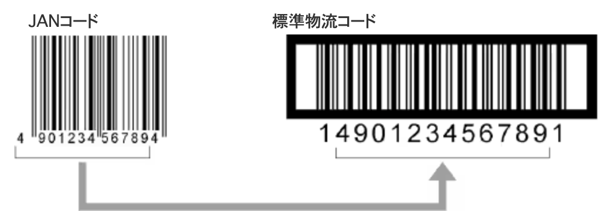
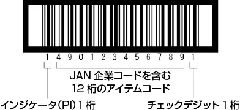
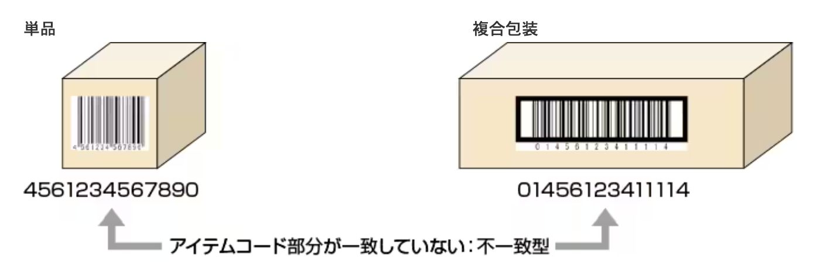

# 物流商品コード

## 標準物流コードとは

物流商品コードは主に段ボールなどの包装箱にマーキングされたバーコードで、物流用としてJISで規格化されています（JIS-X0502）。  
では、この物流商品コードはどのような経緯で発生したのでしょうか。

## 物流にはジャスト・イン・タイムが求められます

スーパー等の小売店では、売り場の面積を少しでも広くするために、余分な在庫をもたないことを目指しています。  
これを実現するためには、小売店の発注に対して、メーカー、問屋は指定された量を指定された日時に確実に届ける必要がでてきました。いわゆるジャスト・イン・タイム（JIT）の体制です。  
これにより、以下のような状況になりました。

### （１）梱包形態の多様化

小売店からの発注単位は、時には120個であったり、時には10個であったりと様々になってきます。よって、梱包形態も120個単位の梱包にしたり、10個単位にしたりと多様化することになるのです。

### （２）トラック輸送が物流の主流に

一度に輸送する量が減ったことと、輸送する回数が増えたことにより、トラック輸送が物流の主流となりました。しかし、現在の交通事情では、長時間駐車して荷物の積み降ろしをしているわけにはいきません。  
よって、決められた時間に到着するトラックに、予め積み込む荷物を荷揃え（ピッキング）しておく必要があります。この荷揃えの際に、いちいち目視で伝票を合わせていたのでは、時間に間に合わず、トラックに荷物を積み込めないという状況になってしまいます。

## 物流商品コードの誕生

このような物流の多様化にともない、物流商品コードが誕生したのです。  
物流商品コードには、中に入っている商品のJANコードの内容と梱包形態（何個入りか）が表示されています。  
物流商品コードをバーコードリーダで読ませることにより、包装箱に中に入っている商品の種類と梱包数が瞬時に分かるため、「ピッキング」「仕分け」「検品」「在庫管理」「棚卸し」などの物流の合理化が可能になるのです。

## 集合包装用商品コード（GTIN-14）

物流商品コードは、これまで国際EAN協会（現在のGS1）が14桁と定めた上で、国内用として16桁も認めていたため、16桁を標準として利用している業界もありました。  
しかし、GS1が2005年に国際標準の商品コードを14桁に統一し、包括したGTIN（Global Trade Item Number）を推進し始めたため、2010年3月までに14桁へ切り替えることとなりました。  
一般的に集合包装用の包材は、ダンボールなどバーコードの印刷精度が確保しにくい材料が使われる場合が多いため、印刷精度が必要なJANコードに比べると比較的印字制度の緩やかなITFが使用されています。

‌

集合包装用商品コードのデータ構成
‌

### インジケータ（PI）のつけ方

集合包装用商品コードの先頭1桁目はインジケータと呼ばれ、このインジケータの値により、集合包装の入り数の違いなどを分けることに使用しています。

|  | 集合包装商品用コードのインジケータ |
| --- | --- |
| インジケータ  
（PI） | 意味する内容 |
| --- | --- |
| 1～8 | 同一商品で荷姿が異なる 入り数が異なる 内箱と外箱の区別が必要 など |
| --- | --- |
| 9 | 計量商品用（アドオンが付加されている） |
| --- | --- |
| 0 | 集合包装（ダンボール）を1つの商品として識別する場合 |
| --- | --- |

（例）同じ商品でも梱包形態が違えば、インジケータが異なります。

JANコード標準物流コード

### 一致型と不一致型

日本の集合包装用商品コードは、ダンボールの中に入っている単品のJANコードをベースにして作る方法のみが使用されてきました。  
したがって、外装に表示される集合包装用商品コードと単品のJANコードとのアイテムコード部分が一致します（一致型）。  
しかし、国際標準では、ダンボール内に収納される単品のEANコードを使用せず、集合包装用として別の商品コードを使用することが認められています（不一致型）。  
日本でも、2007年から国際標準に対応するため、不一致型の商品コード体系を採用しています。  
不一致型は、インジケータ（PI）を‶0”と表示し、以下のようなケースで使用されます。

* 集合包装形態のまま、単品としても購入単位となる場合
* 一致型で、荷姿識別用のインジケータ（PI）を1 ～ 8までのすべてを使い切ってしまい、さらに9番目以降の荷姿として集合包装が発生する場合

‌

## 集合包装用商品コードの基本寸法

集合包装用商品コードの寸法は、ナローバー幅1mmを基準（倍率1倍）として、0.25 ～ 1.2倍までの拡大縮小が可能です（輸出用は0.625 ～ 1.2倍）。  
以下にそれぞれの倍率におけるバーコードの長さを示します。  
（バーコードの長さとは、クワイエットゾーンを含んだ長さをいいます。）

印刷位置の規定

| 倍率 | バーコードの長さ |
| --- | --- |
| 1.2 | 171mm |
| --- | --- |
| 1.0 | 143mm |
| --- | --- |
| 0.8 | 114mm |
| --- | --- |
| 0.625 | 89mm |
| --- | --- |
| 0.40 | 57mm |
| --- | --- |
| 0.25 | 36mm |
| --- | --- |

## なぜITFを使うのか

同じ大きさで同じ桁数を表わすのに、他のコードに比べITFはナロー幅が太くなるため、印刷の精度が悪くても印字が可能です。  
また、ナロー幅が太くなるため、長距離で読み取りできるようになります。

## 物流業での利用例（ITFコードを使った出荷検品）

多くの作業を人手に頼る物流業界では、ピッキングミスや納品先の間違えなどのミスが起こりがちです。原因は、出荷する製品の個数を間違えたり長い桁数の品番を読み間違えるなどのヒューマンエラーがほとんどです。  
バーコードを活用することで、納品先や製品の種類・個数を確認することができます。

### 出荷前：出荷先と出荷する製品・個数を関連付ける

「いつ・どこに・何を・何個」といった納品情報をデータとしてコンピュータに登録しておきます。  
たとえば、以下のような納品データがあったとします。

伝票番号101、出荷日8月1日、●●工業に、製品Aを5ケース  
伝票番号102、出荷日8月1日、〇〇工業に、製品Aを2ケース

この伝票番号コードにして出荷伝票または納品書にバーコードで印字しておきます。

### 納品時：納品のチェック

出荷伝票や納品書のバーコードを読み取ります。読み取ったデータはコンピュータ上の納品データと照合されるため、伝票番号と出荷日や出荷先・製品・個数が一致しているかを確認することができます。

### バーコードを使うメリット

製品の数だけバーコードを読み取る場合は、読み取ったデータ数が納品データの製品数量を超えていないかチェックできます。ハンディーターミナルのキーから数量を入力する場合でも数量のチェックが可能です。また、伝票番号と納品先が一致しているかを、コンピュータやハンディターミナルなどの画面上で確認することができます。

## アドオンバージョンとは

アドオンバージョンとは、例えばハム、ソーセージなど個々の包装により重量が異なり、それにしたがって価格も異なるような商品に対して付加される物流コードです。標準（拡張）バージョンの後に付加されます。  
アドオンバージョンは、計量値を示す5桁と、1桁のチェックデジットで構成され、小数点が必要な場合は3桁目と4桁目の間が小数点と決められています。  
しかし最近は、「アドオンバージョン」ではなく、CODE128をもとに作られた「GS1-128」が計量値を表わすコードとして使用されています。

## ベアラーバーについて

段ボールへのバーコードの印字は、フレキソ印刷（樹脂またはゴム凸版を用いた印刷方法）でおこなわれます。  
段ボールの表面は完全な平面ではないために、フレキソ版の印圧が一定にはなりにくく、バーコードのバーに太りができたりします。  
ベアラーバーは、バーコードのバーに印圧が直接掛からないように、印圧を一定に保つための手段として設けられています。

‌

‌
