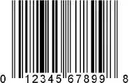
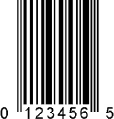

# UPC

## UPCとは

UPCは、アメリカ、カナダで使用されている統一商品コードです。ヨーロッパのEANや日本のJANは、このUPCをもとに作られています。UPCは日本でも、JIS-X0507として規格化されています。  
UPCには、主にUPC-AとUPC-Eのふたつが利用されており、UPC-Aは12桁、UPC-Eは8桁で構成されています。

UPC-A

UPC-E
## UPC-Aのナンバーシステムキャラクタとデータ構成

UPC-Aは、アメリカとカナダで使用されているものですので、国コードはありません。  
かわりに、先頭の1桁はナンバーシステムキャラクタ（NS）と呼ばれ、その値により、情報の内容が異なります。  
以下にNSの値によるデータ構成の代表例をまとめています。

| NS | 用途 | データの構成 |
| --- | --- | --- |
| 0,6,7 | ソースマーキング用  
（JAN/EANと同様の体系です） |  |
| --- | --- | --- |
| 1,8,9 | ソースマーキング用  
（JAN/EANと同様の体系です） |  |
| --- | --- | --- |
| 2 | インストアマーキング用  
（計量商品） |  |
| --- | --- | --- |
| 5 | クーポン用 |  |
| --- | --- | --- |

1. C/D=チェックデジット
2. 2000年3月20日以降申請分のメーカーコードについてはJAN（EAN）と同様7桁になっています。

## 北米への商品輸出について

アメリカ、カナダへ輸出するときには、これまでは必ず米国のコード管理機関が付番するUPCメーカーコードを取得しなければなりませんでしたが、2005年以降はアメリカ、カナダの小売業でもJANコードを使用できる状態になってきています。ただし、まだ100%ではないため、JANコードでアメリカ、カナダへ輸出する際には取引先の対応状況を確認する必要があります。  
取引先の対応状況により、JANコードが使用できない場合は、UPCメーカーコードを申請する必要があります。
