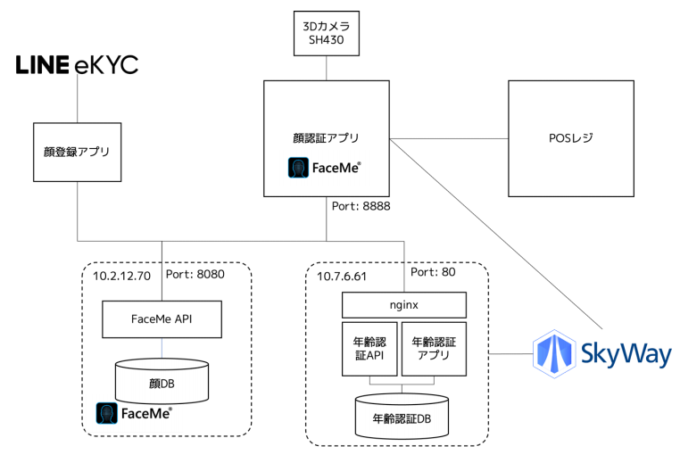
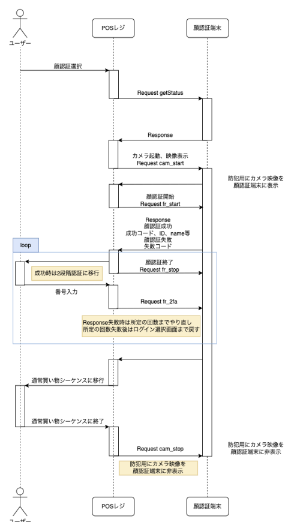
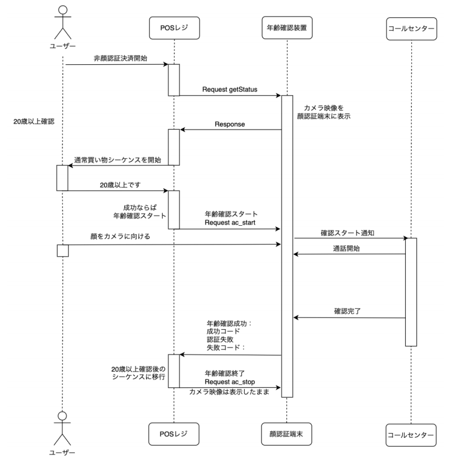
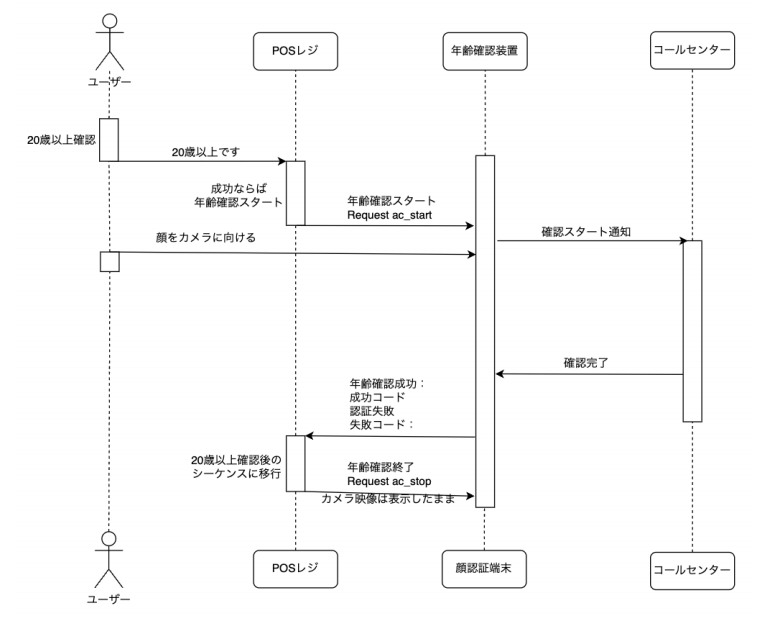

# TelpoとのAPI仕様

### 1.顔認証機構全体ブロック図

### 2.顔認証シーケンス図

### 3.年齢確認シーケンス図

3.1年齢確認通話なしのシーケンス

3.2年齢確認通話ありのシーケンス

‌

[https://docs.google.com/document/d/1TiFpuY61Ktjtq-qRflJ-CSEcvKv4_EFhCd5sUebXbWg/edit](https://docs.google.com/document/d/1TiFpuY61Ktjtq-qRflJ-CSEcvKv4_EFhCd5sUebXbWg/edit)
