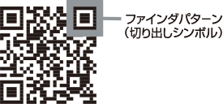
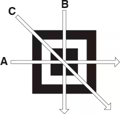
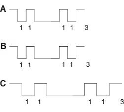
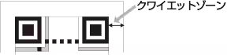
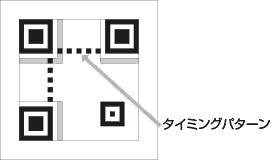
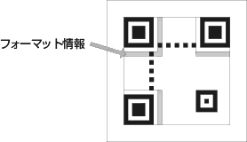
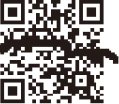

# QRコードのしくみ

QRコード（Quick Responseコード）は、高速読み取りを重視したマトリクス型2次元コードとして、1994年 株式会社デンソーウェーブにより開発されました。1997年AIMIのITS規格に登録され、2000年にISO/IEC規格になっています。  
またマイクロQRコードも、2004年にJIS-X-0510として規格化されています。

## QRコードとは

QRコードはマトリクス型2次元コードのひとつで、「QR」とはQuick Responseに由来します。  
QRコードは作成や使用に手続きや費用が発生しないこと、またバーコードに比べて記録データの大容量化や高密度化、読み取りエラーの低減が可能で、省スペースで印字できることなどの点で優れています。そのため、入出庫・在庫管理・ピッキング・配送管理など、製造や物流の現場で幅広く使われています。

## QRコードの仕様

QRコードを構成する最小の単位（白黒の正方形）をセルといいます。セルの組み合わせでQRコードは表され、位置検出パターン（ファインダパターン）と、タイミングパターン、誤り訂正レベルやマスク番号などの情報を持ったフォーマット情報、データ及び誤り訂正符合（リードソロモン符号）から構成されています。

|  |  | 仕様 |
| --- | --- | --- |
| 最小シンボルサイズ | 21セル× 21セル |
| --- | --- |
| 最大シンボルサイズ | 177セル× 177セル |
| --- | --- |
| 最大データ量 | 数字 | 7,089字 |
| --- | --- | --- |
| 英数字 | 4,296字 |
| 漢字 | 1,817字 |

## ファインダパターン（切り出しシンボル）

QRコードの3コーナーに配置される3個（マイクロQRは1個）の位置検出用パターンのこと。  
まずこのパターンを検索することでQRコードの位置を認識することができ、高速な読み取りを可能にしています。A、B、Cのどの位置からも必ず、白セルと黒セルの比率が1 : 1 : 3 : 1 : 1になっており、回転していても位置の検出や位置関係から回転角度を認識しています。  
方向性はなく360°どの方向からでも読みとれるため、作業の効率化を実現します。

## アライメントパターン

歪みによって生じる各セル（ドット）の位置ずれを補正します。  
モデル2より採用されています。

## クワイエットゾーン

2次元コードシンボルのまわりにある空白の部分。QRコードモデル1、モデル2で4セル分、マイクロQRコードで2セル分の空白が必要です。

## タイミングパターン

白セルと黒セルが交互に配置され、シンボル内のモジュール座標を決定するのに使用しています。

## フォーマット情報

QRコードシンボルに、使用されている誤り訂正率とマスクパターンに関する情報を持っています。デコードを行なう際には、まず始めにここを読み出しています。

## 誤り訂正符号（リードソロモン符号）

QRコードの一部分が損傷した場合でもデータを損失することなく、復元することができるようにリードソロモン法を用いて生成された符号のこと。復元率は、シンボルの損傷の度合いに応じた4段階のレベルを持っています。

シミ

汚れ

破損

| 誤り訂正レベル | シンボルに対する面積 |
| --- | --- |
| L | 7% |
| --- | --- |
| M | 15% |
| --- | --- |
| Q | 25% |
| --- | --- |
| H | 30% |
| --- | --- |

## データと誤り訂正符号の配置

データと誤り訂正符号は以下のように配置されます。（モデル2、バージョン2、誤り訂正レベルMの場合の例）これに、ファインダパタ－ンと同じ形状のマークが現れないように、マスクをかけることでQRコードが形成されます。

‌
