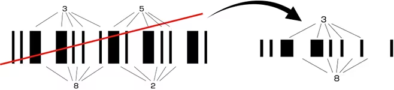

# ITF

## ITFとは

ITFは、インターリーブド2of5（Interleaved Two of Five）の略で、主に段ボールに印刷されている物流商品コード用のバーコードとして利用されているコードです。  
2of5と呼ばれるコードには下のようにいくつかの種類があり、それら全て、5本のバー（スペース）のうち2本が太バー（太スペース）という構成（2of5）で一つのキャラクタ（数字）を表しています。  
構成は類似していますが、全く別のコードです。

### 2of5ファミリー

| インターリーブド2of5（ITF） | 本章で詳しく解説します。 |
| --- | --- |
| インダストリアル2of5 | 以前工業用として使われていたが、バーにしか情報を持たせていないため、サイズが大きく、現在はあまり使われていない。物流管理用として一部使われている。 |
| --- | --- |
| マトリクス2of5 | インダストリアル2of5と違い、バー、スペースどちらにも情報を持たせている。 |
| --- | --- |
| COOP2of5 | 生協で使われているコード。生協コードとも呼ばれている。 |
| --- | --- |
| IATA | IATA（国際航空輸送協会）が航空貨物の管理用などで使用しているコード。 |
| --- | --- |

## ITFの構成

* 5本のバー（スペース）で1文字を表わします。（5本の内2本が太いので、2of5という）
* ITFは下のようにバーで表わしたキャラクタの間にスペースで表わしたキャラクタをはさみ込んだ形になっています。  
  （Interleaved：～と～の間に）

| キャラクタ | バーのパターン |
| --- | --- |
| START |  |
| --- | --- |
| 2 |  |
| --- | --- |
| 3 |  |
| --- | --- |
| 5 |  |
| --- | --- |
| 8 |  |
| --- | --- |
| STOP |  |
| --- | --- |

* 1文字目は、バー5本で表わし、2文字目はスペース5本で表わすという構成となっているため必ず偶数桁になります。  
  （「ITFの5桁」という使い方はありません）
* バー、スペースどちらにも情報を持たせているため、非常に密度の高い構成になっています。
* スタート/ストップキャラクタはないが、スタートとストップを表わすバーパターンがあります。

## ITFのキャラクタ構成

ITFは下表のような構成で作られています。表わすことができるキャラクタは、数値（0 ～ 9）のみです。

| キャラクタ | バーのパターン |
| --- | --- |
| START |  |
| --- | --- |
| 0 |  |
| --- | --- |
| 1 |  |
| --- | --- |
| 2 |  |
| --- | --- |
| 3 |  |
| --- | --- |
| 4 |  |
| --- | --- |
| 5 |  |
| --- | --- |
| 6 |  |
| --- | --- |
| 7 |  |
| --- | --- |
| 8 |  |
| --- | --- |
| 9 |  |
| --- | --- |
| STOP |  |
| --- | --- |

## ITFの特徴

ITFは、非常に情報密度が高いバーコードであるため、以下のような特徴を持っています。

* 同じ桁数なら、他のコードに比べ、バーコードの大きさを小さくできる。  
  つまり、狭いスペースにバーコードを付けたい場合に有効です。
* 同じサイズなら、他のコードに比べ、情報をより多く入れることができる。（桁数を多くできる。）
* 同じサイズ、桁数ならば、バーコードのバー幅を大きくすることができる。  
  バー幅が広くなれば、バーコードリーダが非常に読みやすくなり、長距離にも対応できるようになります。

バーコードの長さ比較

同じナローバー幅、同じ情報量で、それぞれのコードの種類におけるバーコードの長さを比較したものです。ITFが最も小さくなります。（バイナリレベルのバーコードで比較）

ITF

CODE39

NW-7

## ITFの問題点

ITFコードは、非常にメリットの多いバーコードですが、その構成上、「桁落ち」が発生しやすいという問題点を持っています。  
桁落ちとは、「3852」という内容のバーコードを、「38」と桁を落として読んでしまう現象です。

‌

レーザが右のように斜めにスキャンした場合、「38」と読んでしまいます。

ITFを使用する場合、「桁落ち」を防ぐため、ある決まった桁数以外、読まなくする「桁指定」をバーコードリーダ側で設定する必要があります。

## ITFコードと物流業

ITFコードは、JANコードの先頭の1桁目をインジケータと呼ばれる識別子としたものです。インジケータには集合包装の荷姿や員数・販売単位などを1～8までの整数で表し、段ボール箱包装やシュリンク包装といった包装様式の違いや内箱と外箱の区別などを記録することができます。このため、10個や12個の製品をカートン単位で扱う物流業ではITFコードが多く用いられています。

## その他の2of5コード

ITF（インターリーブド2of5）の仲間である「COOP2of5」と「インダストリアル2of5」をご紹介します。

### COOP2of5

COOP2of5は、生協で使用していることから、この名前が付いています。  
通常このコードは、生協に納品される商品が入っている段ボール箱に印刷されており、商品の検品作業の際に利用されます。  
COOP2of5のバー構成 は以下のようになっています。

| キャラクタ | バーのパターン |
| --- | --- |
| START |  |
| --- | --- |
| 0 |  |
| --- | --- |
| 1 |  |
| --- | --- |
| 2 |  |
| --- | --- |
| 3 |  |
| --- | --- |
| 4 |  |
| --- | --- |
| 5 |  |
| --- | --- |
| 6 |  |
| --- | --- |
| 7 |  |
| --- | --- |
| 8 |  |
| --- | --- |
| 9 |  |
| --- | --- |
| STOP |  |
| --- | --- |

### インダストリアル2of5

もともと工業用として使用されていましたが、現在ではほとんど使われていません。  
物流用途で一部使用されているところもあるようです。  
インダストリアル2of5のバー構成は、以下のように、5本のバーで1文字を表わし、スペースには情報を持たせてありません。  
よって、情報密度が非常に低い構成となっています。

| キャラクタ | バーのパターン |
| --- | --- |
| START |  |
| --- | --- |
| 0 |  |
| --- | --- |
| 1 |  |
| --- | --- |
| 2 |  |
| --- | --- |
| 3 |  |
| --- | --- |
| 4 |  |
| --- | --- |
| 5 |  |
| --- | --- |
| 6 |  |
| --- | --- |
| 7 |  |
| --- | --- |
| 8 |  |
| --- | --- |
| 9 |  |
| --- | --- |
| STOP |  |
| --- | --- |
