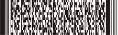
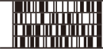
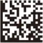
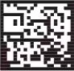
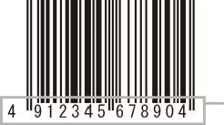

# 2次元コードの種類と特徴

2次元コードにはスタック型2次元コードとマトリクス型2次元コードがあり、これらは管理する情報の量や印字面積、読み取り方法などによって使い分けられます。ここでは、この2種類の2次元コードの特徴について説明します。

## 2次元コードとは

2次元コードは、1次元コードであるバーコードに対し、横（水平）、縦（垂直）の両方向に情報を持っています。このため、記憶密度が高く小さな面積に多くの情報を格納できます。また、読み取りエラーの訂正により安定した読み取りが可能です。これにより、小さな部品/製品や、バーコードでは不可能だった大容量のトレーサビリティ管理を可能にします。また、従来2次元コードは主に製造業での部品管理や物流業の在庫管理で利用されてきましたが、近年では日常生活でも広く利用されています。

## 2次元コードの種類

2次元コードにはスタック型2次元コードとマトリクス型2次元コードがあります。スタック型2次元コードはマルチローシンボル体系ともいわれ、代表的なコードにはPDF417やCODE49があります。また、マトリクス型2次元コードはマトリクスシンボル体系ともいわれ、代表的なコードにはQRコードやDataMatrix・VeriCodeなどがあります。

‌

### スタック型2次元コード

代表例：従来のバーコードを縦に積み上げた形

PDF417

CODE49

従来のバーコードを縦に積み重ねた構造を持つ2次元コードで、一般的に外形は長方形です。  
一般的なレーザスキャンでも原理的に読み取り可能ですが、レーザ光を積み重ねたそれぞれのバーコード部分を横切るようにスキャンさせる必要があるため、角度のずれは±10°程度しか許容できません。  
（一般的なレーザスキャンであっても、2次元コードを読み取るためのソフトウェアが組み込まれている製品でなければ読み取ることはできません。）

### マトリクス型2次元コード

代表例：情報を白と黒のセルで縦横モザイク状に表示

QRコード

DataMatrix

VeriCode
セルと呼ばれる正方形または点を格子状に配列した構造を持つ2次元コードで、一般的に外形は正方形です。2次元コードの位置検出を容易にするために、正方形の枠やL字のフレームで囲われていたり、ファインダパターン（切り出しシンボル）と呼ばれる特徴的なマークがシンボルのなかに配置されています。読み取りは、セルの配置パターンを画像処理によりデコードするため、カメラまたは2次元CCD素子内蔵のリーダを使用します。したがって、シンボルの方向に影響されることなく、360°全方向で読み取ることができます。

## 2次元コードの特徴

2次元コードは、バーコードに比べて記録データの大容量化や高密度化・読み取りエラーの低減などの点で優れています。ここでは、これらメリットをもたらす2次元コードの記録方法と効果とデメリットについて説明します。

### メリット1：データ記録容量が大きい

バーコードは、下図のように1方向だけしか情報を持たないのに対し、2次元コードは横（水平）、縦（垂直）の両方向に情報を持っているため、バーコードの数十倍から数百倍のデータをコード化することができます。  
バーコードが記録できる容量は数10文字程度ですが、2次元コードならば2,000 ～ 3,000文字もの情報を持たせることができます。

### メリット2：データ密度が高い（ラベルの小型化を実現）

同じ情報量ならばバーコードに比べ1/30の省スペース化を実現しました。  
電子部品への印字にも対応可能です。

### メリット3：エラー修正（データの復元）ができる

2次元コードには、汚れや欠損に対してデータを修復する機能があり、コード自体の10～30％が欠損しても復元して読み取る能力を持っています。  
データの復元には「リードソロモン法」という数学的なエラー検出・訂正の手法を用いており、データ復元はもちろんのこと、誤読（間違ったデータとして読み取る現象）も発生することはありません。

### デメリット：データの損傷が発生したときの回避策がない

バーコードの場合、欠損が大きく仮にバ－コ－ドリーダで読めなかった場合、バーコードの下に人が目で見て読める（ヒューマンリーダブル）文字を付加し、それをキーボードで入力することで、運用に支障を来さないようにしています。

2次元コードの場合、データ容量が非常に大きく、一般的にヒューマンリーダブルの文字は付加されないため、データ復元ができないほどの大きな損傷が発生すると、データ入力の手段がなくなり、運用がストップしてしまいます。（ヒューマンリーダブルの文字を付加することも可能ですが、キーボードで100文字以上の文字を入力させるのは現実的ではありません。）2次元コード導入にあたっては、もし読めなかった場合の対処を十分に考慮したシステム構築をする必要があります。

**ヒューマンリーダブル**情報の確認、キーボードでの入力が可能です。
