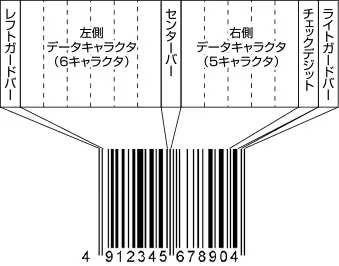
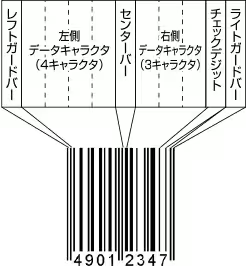
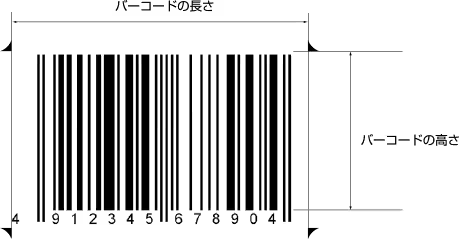

# JAN/EAN

## JAN/EANとは

EAN（European Article Number）は、JAN（Japanese Article Number）コードの海外での名称であり、JANコードはEANコードを基に作られています。  
EANコードはJANコードと同様、国・企業・商品を示す数字で構成されており、末尾にはチェック用の数字が付きます。また、アメリカやカナダといった北米で使用されているUPCコードとも互換性がある国際的な共通商品コードです。  
利用範囲は広くPOSシステムはもちろん、製造業においても多くのシーンで利用されています。

## JAN/EANの構成

スタート/ストップキャラクタはありませんが、バーコードの左側にレフトガードバー、右側にライトガードバー、真ん中にセンターバーと呼ばれるバーがあります。

その他の数字は、順々に並べてあります。  
ただし、標準バージョンの桁数は上記の並びを見ると、チェックデジットを含め12桁分しかありませんが、実際は13桁表わすことができます。

## JAN/EANのキャラクタ構成

JAN/EANは以下のようなキャラクタ構成で作られています。  
センターバーより左側と右側では、表わす数字のバーのパターンが異なります。  
センターバーより左側のバーパターンは、「奇数パリティ」「偶数パリティ」の2種類があります。

| キャラクタ | 左側奇数パリティ | 左側偶数パリティ | 右側偶数パリティ |
| --- | --- | --- | --- |
| バーのパターン | バーのパターン | バーのパターン |
| --- | --- | --- |
| 0 |  |  |  |
| --- | --- | --- | --- |
| 1 |  |  |  |
| --- | --- | --- | --- |
| 2 |  |  |  |
| --- | --- | --- | --- |
| 3 |  |  |  |
| --- | --- | --- | --- |
| 4 |  |  |  |
| --- | --- | --- | --- |
| 5 |  |  |  |
| --- | --- | --- | --- |
| 6 |  |  |  |
| --- | --- | --- | --- |
| 7 |  |  |  |
| --- | --- | --- | --- |
| 8 |  |  |  |
| --- | --- | --- | --- |
| 9 |  |  |  |
| --- | --- | --- | --- |
| レフトガードバー |  |  |  |
| --- | --- | --- | --- |
| センターバー |  |
| --- | --- |
| ライトガードバー |  |
| --- | --- |

標準バージョンの先頭桁については、センターバーより左側の6文字分が奇数パリティ、偶数パリティのどの組み合わせで作られているかで決定されます。  
その組み合わせは、以下の通りです。

O…奇数パリティ、E…偶数パリティ

| 最初の文字 | OとEの組み合わせ |
| --- | --- |
| 0 | OOOOOO |
| --- | --- |
| 1 | OOEOEE |
| --- | --- |
| 2 | OOEEOE |
| --- | --- |
| 3 | OOEEEO |
| --- | --- |
| 4 | OEOOEE |
| --- | --- |
| 5 | OEEOOE |
| --- | --- |
| 6 | OEEEOO |
| --- | --- |
| 7 | OEOEOE |
| --- | --- |
| 8 | OEOEEO |
| --- | --- |
| 9 | OEEOEO |
| --- | --- |

短縮タイプ（8桁）の場合は、左側の文字（4桁分）全て奇数パリティで作られます。

‌

## 基本寸法と倍率

JAN/EANコードの寸法には、以下のような規定があります。（JIS-X0507）

* 基本寸法のナローバー幅は、0.33mmです。
* 基本寸法の0.8 ～ 2.0倍まで拡大、縮小が可能です。（ナローバー幅は、0.26 ～ 0.66mm）

以下に拡大倍率ごとのサイズの比較をします。（標準タイプ（13桁）において）

| 倍率 | 0.8 | 1.0 | 1.2 | 2.0 |
| --- | --- | --- | --- | --- |
| ナローバー幅 | 0.264mm | 0.33mm | 0.396mm | 0.66mm |
| --- | --- | --- | --- | --- |
| バーコードの長さ | 29.83mm | 37.29mm | 44.75mm | 74.58mm |
| --- | --- | --- | --- | --- |
| バーコードの高さ | 18.29mm | 22.86mm | 27.43mm | 45.72mm |
| --- | --- | --- | --- | --- |

‌

## JANのバー構成上の特徴

JAN/EANのバー構成上で特徴的なことは以下のことがあげられます。

* バーの太さが4段階あるため、印字精度の高いプリンタが必要。  
  つまり、FA用インクジェットプリンタやドットインパクトプリンタなど印字精度の低いプリンタで印字しても安定して読み取ることはできません。
* 桁数が固定である（13桁 or 8桁）ため、ユーザが自由なデータ構成を選択することができません。
