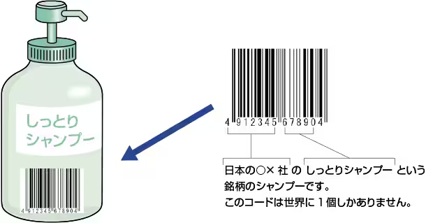
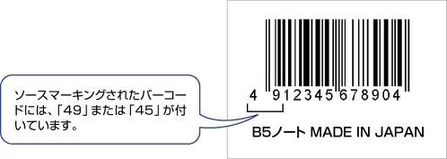
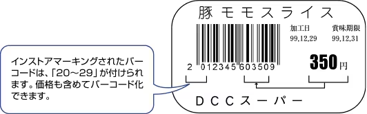
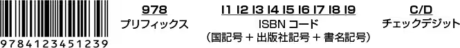
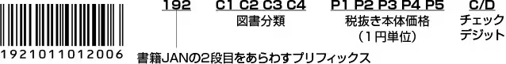
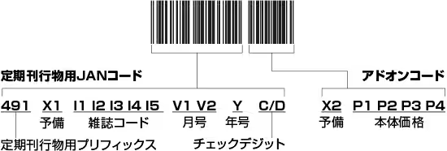

# JAN

### JANコード

JANコードは、商品用の流通コードとして商品などに表示され、コンビニエンスストアやスーパーを中心に広く利用されているPOSシステムで活用されています。  
JANコードは、国際的にはEANコードと呼ばれ、アメリカ、カナダにおけるUPCと互換性のある国際的な共通商品コードです。  
（JANコードは、日本国内のみの呼び方であり、海外ではEANコードと呼びます。）

* JANコードは、JIS-X0501で規格化されていましたが、2004年にEAN/UPCが規格化されたことから、現在は、JIS-X0507 バーコードシンボル-EAN/UPC-基本仕様に包含されています。
* JAN=Japan Article NumberEAN=European Article NumberUPC=Universal Product Code

‌

## JANのデータ構成

JANコードには、標準タイプ（13桁）と短縮タイプ（8桁）の2つの種類があります。  
さらに標準タイプには、最初の7桁がJAN企業コードとなっているものと、9桁がJAN企業コードとなっているものに分けられます。

### 標準タイプ（13桁）

A：7桁JAN企業コード

1. ①：JAN 企業コード（7桁）
2. ②：商品アイテムコード（5桁）
3. ③：チェックデジット（1桁）

B：9桁JAN企業コード

1. ①：JAN 企業コード（9桁）
2. ②：商品アイテムコード（3桁）
3. ③：チェックデジット（1桁）

### 短縮タイプ（8桁）

1. ①：JAN 企業コード（6桁）
2. ②：商品アイテムコード（1桁）
3. ③：チェックデジット（1桁）

短縮タイプは、以下の条件を満たしている場合に貸与されます。

* すでに標準タイプのJAN企業コードの貸与を受けていること。
* 標準タイプのJANコードでは、ソースマーキングできない小さな商品の予定があること。

デザイン上の希望で短縮タイプのJAN企業コードの貸与を受けることはできません。

#### （1）JAN企業コード

JAN企業コードは国コードを含め9桁と7桁があります。短縮タイプでは6桁になります。  
先頭の2桁は日本をあらわす国コードです。日本は45、49です。  
申請するアイテム数が5万点以上の場合は、7桁のJAN企業コードが通知されます。  
なお、先頭の3桁を見ると、9桁JAN企業コードなのか、7桁JAN企業コードなのかを区別することができます。

* 456 ～ 459→ 9桁JAN企業コード
* 450 ～ 455→7桁JAN企業コード
* 490 ～ 499→7桁JAN企業コード

**9桁JAN企業コードについて**

JAN企業コード申請の急増に伴い、2001年1月以降の新規登録分より9桁JAN企業コードが採番されはじめました。

既に7桁の企業コードを取得された企業については従来通り7桁の企業コードがそのまま利用できますので、コード体系を変更する必要はありません。  
総桁数（13桁）は変更ありません。  
短縮バージョン（8桁）については変更ありません。

2001年1月以降は、JAN企業コードが7桁、9桁のものが並行して利用されますが、右のような付番となりますので、同一番号のJANコードが発生することはありません。

つまり最初の3桁を見ることで、JAN企業コードが7桁なのか9桁なのかが分ります。

7桁のJAN企業コード：	  
4900000～4999999  
4500000～4559999

9桁のJAN企業コード：  
456000000～459999999

#### （2）商品アイテムコード

商品アイテムコードは、商品を識別するためのコードで、JAN企業コードを取得した企業が自由に設定できます。  
当然同じメーカーでも商品が違えば、商品アイテムコードは異なります。  
商品アイテムコードは、単品（容量、色、味など）識別できる最小単位で、重複しないように設定する必要があります。

#### （3）チェックデジット

モジュラス10/3ウェイトの計算方法で算出します。

#### 国コード表

| 国コード | 国名 |
| --- | --- |
| 000～019 | アメリカ合衆国 |
| 030～039 | アメリカ合衆国 |
| 050～059 | アメリカ合衆国クーポン用 |
| 060～139 | アメリカ合衆国 |
| 200～299 | 小売業インストアコード用 |
| 300～379 | フランス |
| 380 | ブルガリア |
| 383 | スロベニア |
| 385 | クロアチア |
| 387 | ボスニア・ヘルツェゴビナ |
| 389 | モンテネグロ |
| 400～440 | ドイツ連邦共和国 |
| 690～691 | 中華人民共和国 |
| 489 | 香港 |
| 471 | 台湾 |
| 880 | 大韓民国 |
| 885 | タイ |
| 888 | シンガポール |
| 890 | インド |
| 893 | ベトナム |
| 899 | インドネシア |
| 90～91 | オーストリア |
| 93 | オーストラリア |
| 94 | ニュージーランド |
| 955 | マレーシア |
| 977 | 定期刊行物(ISSN) |
| 978～979 | 書籍用(ISBN) |
| 98～99 | クーポン用 |

### ソースマーキングとインストアマーキング

#### ソースマーキング

製造元や発売元が商品の生産・包装の段階でJANコードを商品の包装や容器に印刷することをいいます。  
スーパーなどに置いてある食品や日用品などのほとんどにJANコードがソースマーキングされています。  
商品にソースマーキングする場合、前述のように企業コードを登録申請する必要があります。

‌

#### インストアマーキング

生鮮食料品（野菜や肉など）は、個々の重さによって値段が異なるため、そのスーパー独自のマーキングが施されたラベルを貼り付けられています。このように、店内でのみ使うので、インストアマーキングと呼びます。  
インストアマーキングされた商品（例えば、野菜）は、その店内のみでしか販売しないため、メーカーコードを取得する必要もなく、データの構成を自由に設定することができます。  
価格を含めてバーコード化することもできるのです。ただし、JANの国コードに対応する最初の2桁については、混同を避けるため20 ～ 29を使用するように決められています。

‌

## 電気製品販売業での利用例（電気部品の販売管理）

電気製品は、単品で販売されるものだけでなく、複数の製品を1セットで販売するコンポーネント製品もあります。これらの部品にバーコードを付けることで、単品の製品はもちろんコンポーネント製品の在庫を管理することができます。

### 販売数の管理

製品の梱包箱に、製品番号がバーコードで印刷されたラベルを貼っておきます。販売時は販売する製品のバーコードを読み取るだけで、販売数を管理することができます。また、コンポーネント製品はコンポーネントに付与されたバーコードを読み取ることで、構成する製品の販売数を管理することができます。これなら、複雑な製品構成のコンポーネント製品に含まれる単品製品の販売数を簡単に管理することが可能です。

### 在庫の管理

単品製品もコンポーネント製品も、販売された製品数はすべてデータベースに記録されます。このデータベースを参照することで、在庫数を把握することができます。また、次回の入荷予定日をデータベースに登録しておくと、正確な納品日をお知らせすることも可能です。

### バーコードを使うメリット

バーコードで販売数と在庫数が把握できるので、「あと何台販売できるか」といった販売予定数が算出できます。また、欠品が予想される製品がわかるので、追加注文のタイミングを予測することが可能です。さらに、販売の現場での操作は、ハンディターミナルでバーコードを読み取るだけです。このように、バーコードを用いることで、誰でも簡単に正確な在庫管理を実現することができます。

‌

## その他の業界の利用例

### 書籍のJANコード（ISBNコード）

書籍には1冊1冊を分類するためのISBN（International Standard Book Number）が付番されています。  
書籍JANコードは2段のバーコードで構成されており、1段目は「978」からはじまるISBN用バーコード、2段目は「192」ではじまる日本独自の図書分類と税抜き本体価格を表示したバーコードです。

‌

‌

* 日本の国記号は「4」です。
* 出版社記号、書名記号は桁数が可変です。（合計8桁）

ISBNを付与する対象となる出版物の形態は、以下のようなものが分類されます。

* 印刷・製本された書籍
* 雑誌扱いで配本されるコミックスとムック
* 点字出版物
* マイクロフィルム出版物
* 電子書籍、または書籍をそのままデジタル化した出版物
* カセットテープ/CD等に朗読音声などを録音、収録するオーディオブック
* 地図（1枚ものの印刷物は対象外）
* テキスト・イラスト等の書籍出版物を主な構成要素とする複合メディア出版物

### 定期刊行物コード（雑誌）

定期刊行物コード（雑誌）とは、雑誌などの定期刊行物用に使用するJANコードで、通常のJANコードとはデータ構成が異なります。  
定期刊行物コードは、13桁のJANコードと5桁のアドオンコードで構成されます。

‌

‌
