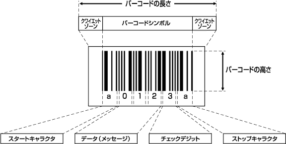
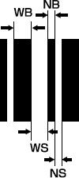
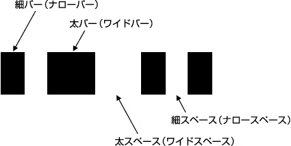
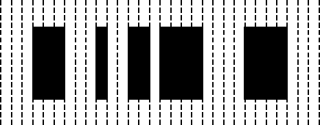
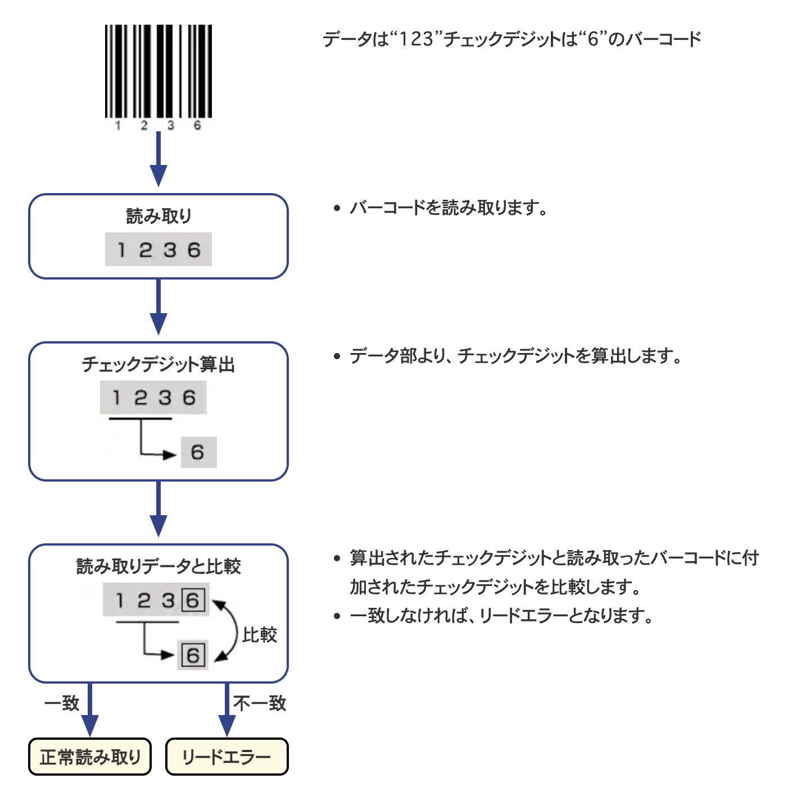
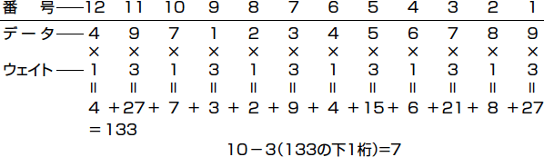

# バーコードのしくみ

## バーコードとは

バーコードとは、バーコードシンボルというバーで表現した符号の総称です。バーコードは、流通や商品管理に必要な国名や業種・商品名・価格などPOS（Point Of Sales：販売時点情報管理）の情報が含まれており、ハンディターミナルやバーコードリーダで読み取ることができます。  
なお、一般にバーコードという場合は1次元コードを意味しますが、ISO/IEC規格では、2次元コードも含めてバーコードと呼んでいます。

‌

## **バーコードの構成**

・クワイエットゾーン（マージン）  
バーコードシンボルの左右にある余白の部分。この余白が十分でないと、読み取れません。  
左右に、ナローバー幅（最小エレメント）の7倍\~10倍以上必要です。

‌

・スタート/ストップキャラクタ  
データの始まりと終わりを表わす文字。  
スタート/ストップキャラクタはバーコードの種類により異なり、CODE39では“＊”、NW-7では“a”,“b”,“c”,“d”です。（JAN/EAN/UPC、ITF、CODE128の場合は、文字ではなく、スタート/ストップを表すバーパターンがあります。）

‌

データ（メッセージ）  
データとして表されている文字（数字、アルファベットなど）のバーパターンが左側から並んでいます。  
上図では、0,1,2の文字を表すバーパターンを左から順番に並べることで、「012」というデータを表しています。

‌

チェックデジット  
読み誤りがないかチェックするために、算出された数値で、バーコードデータの直後に付加されます。

‌

バーコードの長さ  
バーコードの長さは、左右のクワイエットゾーンを含んだ長さをいいます。  
つまり、バーコードリーダの読み取り幅内に、クワイエットゾーンも含めたバーコードが入っていないと読み取れません。

‌

## ナローバーとワイドバー

バーコードを構成する最小単位であるバーとスペースについて解説します。バーコードは、細・太のバーとスペースの組みあわせでできており、それぞれのバーとスペースは以下のように呼ばれます。

| NB：ナローバー | 細バー |
| --- | --- |
| WB：ワイドバー | 太バー |
| --- | --- |
| NS：ナロースペース | 細スペース |
| --- | --- |
| WS：ワイドスペース | 太スペース |
| --- | --- |

細（ナロー）、太（ワイド）の太さは、次のような比率で決められています。  
NB：WB = NS：WS =1：2 ～1：3

細・太の比率が上記の範囲以外であると、バーコードリーダの読み取りが不安定になることがあります。  
バーコードを作成する場合は、この比率に十分注意する必要があります。通常は以下の比率で作成してください。  
**NB：WB = NS：WS =1：2.5　（推奨値）**

このナローバーの太さがどれくらいであるかが、バーコードリーダ選定のポイントになります。  
ナローバー幅は、「最小エレメント幅」とも呼ばれます。

###### ナローバー幅が細いと

###### バーコードのサイズが小さくなります。

###### 決まったスペースに桁数の多いバーコードを印字できます。

###### バーコードリーダで読み取れる範囲（読み取り深度）が狭くなります。

###### バーコードを印字するプリンタに高い精度が必要になります。（レーザープリンタ、熱転写プリンタ）

###### ナローバー幅が太いと

###### バーコードのサイズが大きくなります。

###### バーコードリーダで読み取れる範囲（読み取り深度）が広くなります。

###### バーコードを印字するプリンタは精度が低くてもよい。（ドットプリンタ、FA用インクジェットプリンタ）

**バイナリレベルとマルチレベル**

CODE39、NW-7、ITFという種類のバーコードは、前項のように細太2段階のサイズのバー、スペースで構成されています。これを「バイナリレベル」のバーコードと呼びます。  
細いものと太いものの比率は、1：2 ～ 3と許容度が広くなっています。

‌

JAN、CODE128という種類のバーコードは、バー（スペース）のサイズが4段階あり、これを「マルチレベル」のバーコードと呼びます。  
比率は、1：2：3：4と、許容範囲はほとんどありません。

‌

「マルチレベル」のJAN/EAN/UPC、CODE128は、バーの太さが4段階あります。  
また、GS1 DataBarでは、バーの太さが8段階あります（比率=1：2：3：4：5：6：7：8）。  
これらのバーコードは、バーサイズの許容範囲がほとんどありませんので、印字状態が悪いと、バーの太さの区別がつきにくく、読み取りエラー発生の危険が高くなります。  
ドットインパクトプリンタなど、印字品質が低いプリンタでは、マルチレベルのバーコードの印刷に適していません。

## チェックデジットとは

チェックデジットは、読み誤りがないかをチェックするために、算出された数値です。  
以下にそのチェックの流れと計算方法を解説します。

‌

チェックデジットの計算法

JAN/EAN/UPC、ITFに適用されるモジュラス10/3ウェイトと呼ばれるチェックデジットの計算方法を例に説明します。

1. ①コードの数字に右端から順に番号を付けます。
2. ②奇数番号の数字には3を、偶数番号の数字には1をそれぞれ掛けます。
3. ③その数の総和を求め、下1桁の数を10から引いて出た数がチェックデジットです。

こうして、チェックデジット7が計算できます。

‌
