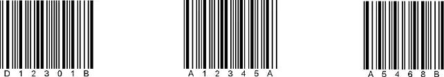
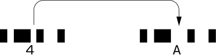

# NW-7

## NW-7とは

NW-7は1972年にモナークマーキング社によって開発された2of5に次ぐ比較的初期のバーコードです。  
血液の管理用、宅配便の配送伝票、図書の管理、会員カード、書き留め郵便の管理用など、数字の連番印刷が必要なものに広く利用されています。

## NW-7の構成

NW-7はNarrow（狭い）とWide（広い）の2種類の、4本のバーと3本のスペース（合計7本）で一つのキャラクタ（文字）を表わしますので、NW-7と呼ばれます。アメリカでは、CODABARと呼ばれます。  
日本でもコーダバー（NW-7）という名称で規格化されています（JISX0506）。  
基本的なバーの構成としては以下のようになります。

* 7本のバー、スペースで一つの文字（キャラクタ）を表わします。
* バーコードの始まりと終わりには、A,B,C,D（a,b,c,d）のいずれかが付けられます。（スタート/ストップキャラクタ）

‌

※スタート／ストップキャラクタは 

A ---- A　B ---- B　A ---- C　D ---- A 

など、様々な組み合わせが可能です。

* キャラクタ間ギャップについては、CODE39と同じです。

## NW-7のキャラクタ構成

表わすことのできるキャラクタは、数値（0 ～ 9）、アルファベット（A,B,C,D）, 記号（- , $ , /, . , + ）です。

| キャラクタ | バーのパターン |
| --- | --- |
| 0 |  |
| --- | --- |
| 1 |  |
| --- | --- |
| 2 |  |
| --- | --- |
| 3 |  |
| --- | --- |
| 4 |  |
| --- | --- |
| 5 |  |
| --- | --- |
| 6 |  |
| --- | --- |
| 7 |  |
| --- | --- |
| 8 |  |
| --- | --- |
| 9 |  |
| --- | --- |
| ー |  |
| --- | --- |
| $ |  |
| --- | --- |
| : |  |
| --- | --- |
| ／ |  |
| --- | --- |
| . |  |
| --- | --- |
| ＋ |  |
| --- | --- |
| A |  |
| --- | --- |
| B |  |
| --- | --- |
| C |  |
| --- | --- |
| D |  |
| --- | --- |

## NW-7の特徴

ITFに比べ、桁落ちが少なく、CODE39に比べ、サイズが小さくなります。  
ただし、NW-7も桁落ちが絶対に発生しないというわけではなく、（印字状態が悪い場合は）以下のように、比較的簡単に桁落ちを起こします。

あるスペースが1本だけ太ってしまうと、それがストップキャラクタに見えてしまい、桁落ちが発生してしまいます。

ITFと同様、NW-7についても、ある決まった桁数以外読まなくする「桁指定」をバーコードリーダ側で設定することをおすすめします。

スタート・ストップキャラクタの使い分けができるため、様々な表現方法が可能です。  
例えば、A ---- Aは定価、A ---- Cは特価、C ---- Cはバーゲン価格という使い方が可能です。

## 運送業での利用例（集荷～仕分け～配送サービスの向上）

集荷と仕分け、そして発送を可能な限り素早く行うことは、運送業にとって最も重要な課題です。また、これらの作業は正確でなければならず、かつ低コストでなければなりません。バーコードを活用することで、これらの課題を解決することができます。

### 送付元での活用

ドライバーが送り状のバーコードをハンディターミナルで読み取り、ハンディターミナルで配達先を指定すると、携帯プリンタからバーコードの付いたラベルが出てきます。このラベルには、配送する方面がバーコードで印字されています。

### 集配センターでの活用

ドライバーが集めた荷物は集配センターに送られます。集配センターでは、入荷した荷物を全国の集配センターに向けて仕分けます。仕分けにはコンベアやソーターなどが使われます。荷物に貼り付けられたバーコードを固定式のバーコードリーダが読み取り、全自動で仕分けます。仕分けた荷物は全国各地の集配センターに出荷されます。  
全国各地の集配センターに到着した荷物は、コンベアに乗せられてバーコードが読み取られ、到着が確認されます。そして、集配範囲ごとに仕分けられ、担当するトラックによって送付先に届けられます。

### 配達完了の登録

送付先で荷物の配達が完了すると、ドライバーは荷物のバーコードをハンディターミナルで読み取り、配達の完了をシステムに登録します。

### バーコードを使うメリット

集荷時に配送先のデータがバーコードで印字されるため、集荷と同時に仕分けの準備ができ、バーコードを使って仕分けの徹底した自動化が可能です。また、今、荷物がどこにあるのかも把握することができるため、届け先に正確な配達時刻を通知することができます。
