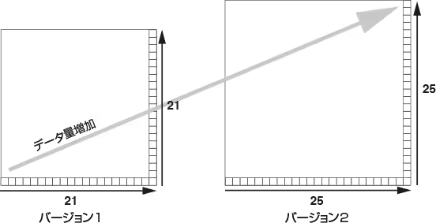
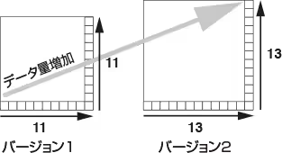

# QRコードの種類と大きさ、データ容量

## QRコードの種類

QRコードには「モデル1」「モデル2」「マイクロQR」の3種類があります。それぞれに特長、データ容量が異なります。  
なお、バージョンとはQRコードの大きさを表し、データ量が増えるとバージョンが大きくなります。（サイズも大きくなります。）バージョン1は21 × 21セル（マイクロQRは11 × 11セル）で構成され、ひとつバージョンが上がると、4セル（マイクロQRは2セル）ずつ大きくなります。

### モデル1

モデル2, マイクロQRコードの原型となったコードです。バージョン1から14までをAIMI規格としています。

| 最大データ容量 |
| --- |
| 数字 | 1,167字 |
| --- | --- |
| 英数字 | 707字 |
| --- | --- |
| バイナリ | 468バイト |
| --- | --- |
| 漢字 | 299文字 |
| --- | --- |

バージョンが1あがることに縦横に4セル追加されます。

### モデル2

位置補正機能を高めるため、モデル1に対してアライメントパターンを追加し、より大容量のデータにも対応した機能拡張仕様です。バージョン１から40までをAIMI規格としています。バージョン40には数字だけなら最大7,089文もコード化することができます。

| 最大データ容量 |
| --- |
| 数字 | 7,089字 |
| --- | --- |
| 英数字 | 4,296字 |
| --- | --- |
| バイナリ | 2,953バイト |
| --- | --- |
| 漢字 | 1,817文字 |
| --- | --- |

バージョンが1あがることに縦横に4セル追加されます。

モデル1、2 共通

### マイクロQR

基板管理などのFA用途で要求の高い極小コードへの適応を図るために、QRコードの切り出しシンボルを1つにして印字面積効率を向上しました。最小のセル構成が11 × 11での印字が可能で、情報が少ない場合にはより小さく印字できます。

| 最大データ容量 |
| --- |
| 数字 | 35字 |
| --- | --- |
| 英数字 | 21字 |
| --- | --- |
| バイナリ | 15バイト |
| --- | --- |
| 漢字 | 9文字 |
| --- | --- |

バージョンが1あがることに縦横に2セル追加されます。

## 大きさの求め方

QRコードの大きさは、バージョンを決めて、セルサイズを設定することで確定します。

### （１）バージョンの決定

データ容量・文字種、誤り訂正レベルを決めることにより、候補の中から選びます。各バージョンの最大入力文字数を下記の「各バージョンの最大入力文字数」の項目で参照ください。

### （２）セルサイズの設定

印字するセルの大きさをプリンタの解像度、スキャナの性能を考慮して決定します。

### （３）大きさの確定

決定したバージョンのセル数に印字可能なセルサイズを掛け合わせることで、QRコードの実際の大きさを求めることができます。  
確保すべきスペースを求める場合は、これにクワイエットゾーンを加えます。モデル1，2 で4セル、マイクロQRで2セル必要です。

##### 例えば、セルサイズ = 0.25mm のとき

**QR コードの大きさ**は、

* バージョン1（21 × 21）5.25 × 5.25mm
* バージョン4（33 × 33）8.25 × 8.25mm

**確保すべきスペース（クワイエットゾーンを含む）**は、

* バージョン1（29 × 29）7.25 × 7.25mm
* バージョン4（41 × 41）10.25 × 10.25mm

## 各バージョンの最大入力文字数

### モデル2

#### 数字

| バージョン  
（セル数） | L | M | Q | H |
| --- | --- | --- | --- | --- |
| 1(21) | 41 | 34 | 27 | 17 |
| --- | --- | --- | --- | --- |
| 2(25) | 77 | 63 | 48 | 34 |
| --- | --- | --- | --- | --- |
| 3(29) | 127 | 101 | 77 | 58 |
| --- | --- | --- | --- | --- |
| 4(33) | 187 | 149 | 111 | 82 |
| --- | --- | --- | --- | --- |
| 5(37) | 255 | 202 | 144 | 106 |
| --- | --- | --- | --- | --- |
| 6(41) | 322 | 255 | 178 | 139 |
| --- | --- | --- | --- | --- |
| 7(45) | 370 | 293 | 207 | 154 |
| --- | --- | --- | --- | --- |
| 8(49) | 461 | 365 | 259 | 202 |
| --- | --- | --- | --- | --- |
| 9(53) | 552 | 432 | 312 | 235 |
| --- | --- | --- | --- | --- |
| 10(57) | 652 | 513 | 364 | 288 |
| --- | --- | --- | --- | --- |
| 11(61) | 772 | 604 | 427 | 331 |
| --- | --- | --- | --- | --- |
| 12(65) | 883 | 691 | 489 | 374 |
| --- | --- | --- | --- | --- |
| 13(69) | 1,022 | 796 | 580 | 427 |
| --- | --- | --- | --- | --- |
| 14(73) | 1,101 | 871 | 621 | 468 |
| --- | --- | --- | --- | --- |
| 15(77) | 1,250 | 991 | 703 | 530 |
| --- | --- | --- | --- | --- |
| 16(81) | 1,408 | 1,082 | 775 | 602 |
| --- | --- | --- | --- | --- |
| 17(85) | 1,548 | 1,212 | 876 | 674 |
| --- | --- | --- | --- | --- |
| 18(89) | 1,725 | 1,346 | 948 | 746 |
| --- | --- | --- | --- | --- |
| 19(93) | 1,903 | 1,500 | 1,063 | 813 |
| --- | --- | --- | --- | --- |
| 20(97) | 2,061 | 1,600 | 1,159 | 919 |
| --- | --- | --- | --- | --- |
| 21(101) | 2,232 | 1,708 | 1,224 | 969 |
| --- | --- | --- | --- | --- |
| 22(105) | 2,409 | 1,872 | 1,358 | 1,056 |
| --- | --- | --- | --- | --- |

#### 英数字

| バージョン  
（セル数） | L | M | Q | H |
| --- | --- | --- | --- | --- |
| 1(21) | 25 | 20 | 16 | 10 |
| --- | --- | --- | --- | --- |
| 2(25) | 47 | 38 | 29 | 20 |
| --- | --- | --- | --- | --- |
| 3(29) | 77 | 61 | 47 | 35 |
| --- | --- | --- | --- | --- |
| 4(33) | 114 | 90 | 67 | 50 |
| --- | --- | --- | --- | --- |
| 5(37) | 154 | 122 | 87 | 64 |
| --- | --- | --- | --- | --- |
| 6(41) | 195 | 154 | 108 | 84 |
| --- | --- | --- | --- | --- |
| 7(45) | 224 | 178 | 125 | 93 |
| --- | --- | --- | --- | --- |
| 8(49) | 279 | 221 | 157 | 122 |
| --- | --- | --- | --- | --- |
| 9(53) | 335 | 262 | 189 | 143 |
| --- | --- | --- | --- | --- |
| 10(57) | 395 | 311 | 221 | 174 |
| --- | --- | --- | --- | --- |
| 11(61) | 468 | 366 | 259 | 200 |
| --- | --- | --- | --- | --- |
| 12(65) | 535 | 419 | 296 | 227 |
| --- | --- | --- | --- | --- |
| 13(69) | 619 | 483 | 352 | 259 |
| --- | --- | --- | --- | --- |
| 14(73) | 667 | 528 | 376 | 283 |
| --- | --- | --- | --- | --- |
| 15(77) | 758 | 600 | 426 | 321 |
| --- | --- | --- | --- | --- |
| 16(81) | 854 | 656 | 470 | 365 |
| --- | --- | --- | --- | --- |
| 17(85) | 938 | 734 | 531 | 408 |
| --- | --- | --- | --- | --- |
| 18(89) | 1,046 | 816 | 574 | 452 |
| --- | --- | --- | --- | --- |
| 19(93) | 1,153 | 909 | 644 | 493 |
| --- | --- | --- | --- | --- |
| 20(97) | 1,249 | 970 | 702 | 557 |
| --- | --- | --- | --- | --- |
| 21(101) | 1,352 | 1,035 | 742 | 587 |
| --- | --- | --- | --- | --- |
| 22(105) | 1,460 | 1,134 | 823 | 640 |
| --- | --- | --- | --- | --- |

#### バイナリ

| バージョン  
（セル数） | L | M | Q | H |
| --- | --- | --- | --- | --- |
| 1(21) | 17 | 14 | 11 | 7 |
| --- | --- | --- | --- | --- |
| 2(25) | 32 | 26 | 20 | 14 |
| --- | --- | --- | --- | --- |
| 3(29) | 53 | 42 | 32 | 24 |
| --- | --- | --- | --- | --- |
| 4(33) | 78 | 62 | 46 | 34 |
| --- | --- | --- | --- | --- |
| 5(37) | 106 | 84 | 60 | 44 |
| --- | --- | --- | --- | --- |
| 6(41) | 134 | 106 | 74 | 58 |
| --- | --- | --- | --- | --- |
| 7(45) | 154 | 122 | 86 | 64 |
| --- | --- | --- | --- | --- |
| 8(49) | 192 | 152 | 108 | 84 |
| --- | --- | --- | --- | --- |
| 9(53) | 230 | 180 | 130 | 98 |
| --- | --- | --- | --- | --- |
| 10(57) | 271 | 213 | 151 | 119 |
| --- | --- | --- | --- | --- |
| 11(61) | 321 | 251 | 177 | 137 |
| --- | --- | --- | --- | --- |
| 12(65) | 367 | 287 | 203 | 155 |
| --- | --- | --- | --- | --- |
| 13(69) | 425 | 331 | 241 | 177 |
| --- | --- | --- | --- | --- |
| 14(73) | 458 | 362 | 258 | 194 |
| --- | --- | --- | --- | --- |
| 15(77) | 520 | 412 | 292 | 220 |
| --- | --- | --- | --- | --- |
| 16(81) | 586 | 450 | 322 | 250 |
| --- | --- | --- | --- | --- |
| 17(85) | 644 | 504 | 364 | 280 |
| --- | --- | --- | --- | --- |
| 18(89) | 718 | 560 | 394 | 310 |
| --- | --- | --- | --- | --- |
| 19(93) | 792 | 624 | 442 | 338 |
| --- | --- | --- | --- | --- |
| 20(97) | 858 | 666 | 482 | 382 |
| --- | --- | --- | --- | --- |
| 21(101) | 929 | 711 | 509 | 403 |
| --- | --- | --- | --- | --- |
| 22(105) | 1,003 | 779 | 565 | 439 |
| --- | --- | --- | --- | --- |

#### 漢字

| バージョン  
（セル数） | L | M | Q | H |
| --- | --- | --- | --- | --- |
| 1(21) | 10 | 8 | 7 | 4 |
| --- | --- | --- | --- | --- |
| 2(25) | 20 | 16 | 12 | 8 |
| --- | --- | --- | --- | --- |
| 3(29) | 32 | 26 | 20 | 15 |
| --- | --- | --- | --- | --- |
| 4(33) | 48 | 38 | 28 | 21 |
| --- | --- | --- | --- | --- |
| 5(37) | 65 | 52 | 37 | 27 |
| --- | --- | --- | --- | --- |
| 6(41) | 82 | 65 | 45 | 36 |
| --- | --- | --- | --- | --- |
| 7(45) | 95 | 75 | 53 | 39 |
| --- | --- | --- | --- | --- |
| 8(49) | 118 | 93 | 66 | 52 |
| --- | --- | --- | --- | --- |
| 9(53) | 141 | 111 | 80 | 60 |
| --- | --- | --- | --- | --- |
| 10(57) | 167 | 131 | 93 | 74 |
| --- | --- | --- | --- | --- |
| 11(61) | 198 | 155 | 109 | 85 |
| --- | --- | --- | --- | --- |
| 12(65) | 226 | 177 | 125 | 96 |
| --- | --- | --- | --- | --- |
| 13(69) | 262 | 204 | 149 | 109 |
| --- | --- | --- | --- | --- |
| 14(73) | 282 | 223 | 159 | 120 |
| --- | --- | --- | --- | --- |
| 15(77) | 320 | 254 | 180 | 136 |
| --- | --- | --- | --- | --- |
| 16(81) | 361 | 277 | 198 | 154 |
| --- | --- | --- | --- | --- |
| 17(85) | 397 | 310 | 224 | 173 |
| --- | --- | --- | --- | --- |
| 18(89) | 442 | 345 | 243 | 191 |
| --- | --- | --- | --- | --- |
| 19(93) | 488 | 384 | 272 | 208 |
| --- | --- | --- | --- | --- |
| 20(97) | 528 | 410 | 297 | 235 |
| --- | --- | --- | --- | --- |
| 21(101) | 572 | 438 | 314 | 248 |
| --- | --- | --- | --- | --- |
| 22(105) | 618 | 480 | 348 | 270 |
| --- | --- | --- | --- | --- |

### マイクロQR

#### バージョン：M1(11)

| 誤り訂正 | 数字 | 英数字 | バイナリ | 漢字 |
| --- | --- | --- | --- | --- |
| 誤り検出 | 5 | - | - | - |
| --- | --- | --- | --- | --- |

#### バージョン：M2(13)

| 誤り訂正 | 数字 | 英数字 | バイナリ | 漢字 |
| --- | --- | --- | --- | --- |
| L | 10 | 6 | - | - |
| --- | --- | --- | --- | --- |
| M | 8 | 5 | - | - |
| --- | --- | --- | --- | --- |

#### バージョン：M3(15)

| 誤り訂正 | 数字 | 英数字 | バイナリ | 漢字 |
| --- | --- | --- | --- | --- |
| L | 23 | 14 | 9 | 6 |
| --- | --- | --- | --- | --- |
| M | 18 | 11 | 7 | 4 |
| --- | --- | --- | --- | --- |

#### バージョン：M4(17)

| 誤り訂正 | 数字 | 英数字 | バイナリ | 漢字 |
| --- | --- | --- | --- | --- |
| L | 35 | 21 | 15 | 9 |
| --- | --- | --- | --- | --- |
| M | 30 | 18 | 13 | 8 |
| --- | --- | --- | --- | --- |
| Q | 21 | 13 | 9 | 5 |
| --- | --- | --- | --- | --- |

上記の文字数は、最大入力可能文字数であるため、入力するデータの構成（たとえば、数字と記号の混在や、アルファベットの大文字、小文字の混在など）によっては、表の文字数以下のデータ量であっても、バージョン （セル数）が増加することがあります。
