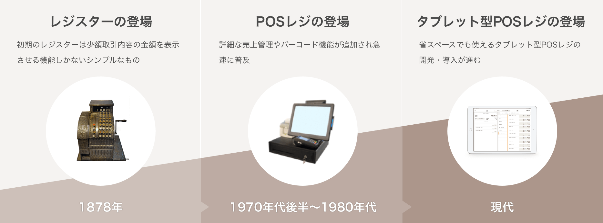

# POSの歴史

‌

POSレジは、時代とともに変化を遂げていたレジスターの一つとして登場しました。世界最初のレジスターは、アメリカのカフェ経営者によって生み出されました。レジスターを生み出したカフェ経営者は、自らが営むカフェで頻発していた、スタッフによる売上金のごまかしという不正を防止するために開発したとされています。初期のレジスターは、少額取引のみの金額内容を表示し、お客様とスタッフが取引金額を確認するためだけのものでした。

レジスターの登場から約30年後、日本でもようやく百貨店や大手デパートの一部で取り入れられ始めました。こうして、日本におけるレジ文化が本格的に産声を挙げたのです。レジスターが日本の百貨店やデパートに次々と導入されるとともに、それと比例するように日本人の消費も増加していきました。消費の増加はレジスターの導入店に新たなニーズを生み、今では当たり前になっている合計金額の表示やレシートの発行など、多くの機能が追加されていくきっかけとなりました。

1970年代に入ると、アメリカのスーパーマーケットが利幅の減少を食い止めるべく、従来のレジスターよりもさらに詳細な商品管理ができるPOSレジを開発しました。日本にもPOSレジは輸入され、POSレジの誕生まで日陰の存在だったバーコードの技術と合わさって、急速に普及していきました。

現在では、百貨店やスーパーなどの大型店舗だけでなく、小規模な店舗でもPOSレジが取り入れられています。特に飲食店ではPOSレジの導入が進んでおり、スムーズな接客やリピーターの確保、メニュー改善など、会計処理に留まらず経営管理の基盤としても必要不可欠となっています。

さらに、POSレジの機能面の充実や軽量化についても開発が進んでいます。予約システムや従業員の退勤管理、オーダーエントリーシステムなど、さまざまな機能が開発されており、店舗に合わせて専門性の高いPOSレジの導入が可能となりました。

近年ではiPadに専用のアプリをインストールするだけで、簡単にiPadをPOSレジとして利用できるものも登場しました。コンパクトかつ高いデザイン性が魅力のiPadなどのタブレットがPOSレジ端末として利用できるため、ファッション性の高い業界や内装にこだわりのある店舗への導入が進んでいます。
