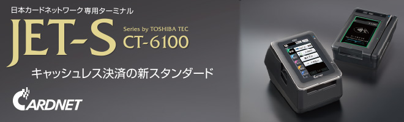
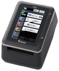
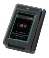
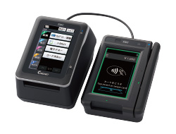
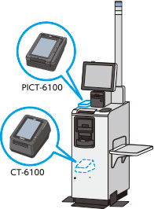
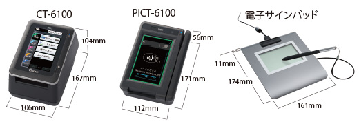

# TEC JET-S CT6100

‌

### 2端末共通の洗練されたデザイン

**店員様側端末 CT-6100**  
少し濡れた指、手袋、爪先で操作できる抵抗膜式タッチパネル採用。  
カウンター下にも設置しやすいローボディ設計。

**お客様側端末 PICT-6100**  
お客様ご自身で全決済処理が可能。  
ランダムキー配列と覗き見防止フィルム内蔵で、キー入力を保護。

**店舗レイアウトに柔軟対応**  
非接触リーダライタとピンパッドをお客様側端末として統合。電源は本体から供給されるため、コンセントは１個口で設置可能。

**スムーズで使いやすく進化**  
接触IC・磁気カード・タッチ決済を同時に待ち受けることが可能。コード支払いでは、お客様側端末にカメラ映像をリアルタイムに表示するので、かざしやすい。

**さまざまなPOSレジと連動が可能**  
従来から好評をいただいているPOS連動機能に加え、新たにセルフレジとの連動も可能に。

### 主な特長

#### 進化する決済サービスに応える

クレジットのタッチ決済(EMV Contactless)、銀聯、J-Debit、各種電子マネー、コード支払い、多通貨決済(DCC)に対応。

#### セキュリティの高さを保持

高いセキュリティ性を保証する、PCI PTSV6.0(Online/Offline)認定を取得。

#### 決済時にお客様をお待たせしない

高速のCPUとメモリを採用し、端末の処理速度が向上しました。また、変わらぬレシート印字の高速性で、お客様のストレスを軽減します。

#### 現行機CT-5100のアプリを継承

従来機で慣れ親しんだ画面UIを継承し、置き換え当日からすぐ運用可能。

#### 加盟店様の要望を盛り込んだ端末仕様

取引伝票・日計票の変更や、一括日計の導入など、加盟店様の声を盛り込み、使いやすさ、快適さを追求した端末。

#### POS連動でミスや手間を排除

POSレジとの連携で、２度打ちが不要になることから入力ミスを低減し、正確かつ高速な決済を実現。ケーブル接続不要のLAN型POS連動も可能です。  
※POSのメーカー及び機種により接続できない場合があります。ご希望の場合はお申し込み前にメーカー及びPOS販売代理店にお問い合わせください。

#### お客様操作のセルフレジとの連動も可能

セルフレジとの連動で、店員様側端末の操作を不要とし、お客様によるセルフレジとお客様側端末の操作だけで、各種決済サービスがご利用いただけます。  
※POSの開発及び検定が必要になる場合があります。ご希望の場合はお申し込み前にメーカーまたは、POS販売代理店にお問い合わせください。

#### LAN回線からの接続

インターネット/専用線（フレッツ・イーサ）/4G(LTE)回線を使用したSeeGullなど、多様な接続回線に対応できます。

### 商品仕様

‌

####   
CT-6100仕様

| 寸法 | 約106(W)×167(D)×104(H)mm |
| --- | --- |
| 質量 | 約840g（ACアダプタ、ロール紙除く） |
| 消費電力 | 7W（待機時）、43W（動作時）※PICT-6100接続時 |
| 液晶表示部・バックライト付 | 4.3型ワイドスクリーン・カラーTFT液晶 |
| プリンタ | サーマルタイプ、印字速度：200mm/秒（最大） |
| キーボード部 | 抵抗膜式タッチパネル |
| 適合通信回線 | LAN回線（10BASE-T/100BASE-TX/1000BASE-T準拠） |
| 外部インターフェース | PICT-6100用×1、POS接続用×1  
LAN回線接続用×1、USB※1×2 |
| 電源ケーブル長 | 電源ケーブル：全長3.7m（ACアダプタ出力ケーブル1.8m含む） |

#### PICT-6100 仕様

| 寸法 | 約112(W)×171(D)×56(H)mm |
| --- | --- |
| 質量 | 約475g（ケーブル除く） |
| 消費電力 | 3W（待機時）、6W（最大） |
| 液晶表示部・バックライト付 | 5.0型ワイドスクリーン・カラーTFT液晶 |
| キーボード部 | 静電容量式タッチパネル |
| カードリーダ部（手動式） | JIS I第1、第2トラック（ISO1、2）及びJIS II |
| ケーブル長 | 約3m |

#### STU-430 （電子サインパッド）仕様 （オプション）

| 寸法 | 約161(W)×174(D)×11(H)mm ＊突起部を除く |
| --- | --- |
| 質量 | 約280g |
| 消費電力 | 1.0W（最大） |
| 最大表示解像度 | 320×200ドット |
| 電源 | USB（バスパワー） |

※1 USB1.1/2.0対応。USB周辺機器すべての動作を保証するものではありません。当社指定機器をご使用ください。

[https://drive.google.com/file/d/1REv6yQDZ__FVdcoQzNv1sq6dM7vNaFNs/view?usp=sharing](https://drive.google.com/file/d/1REv6yQDZ__FVdcoQzNv1sq6dM7vNaFNs/view?usp=sharing)[https://drive.google.com/file/d/1adwd-xd-i7kbbQQdCSyhEPKKn3f7szoH/view?usp=sharing](https://drive.google.com/file/d/1adwd-xd-i7kbbQQdCSyhEPKKn3f7szoH/view?usp=sharing)
