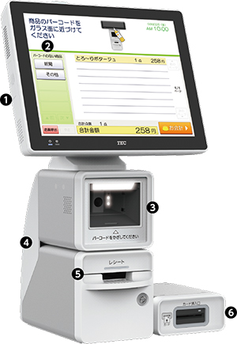

# WILLPOS-Self SS-950U

# カウンター設置型セルフレジ　WILLPOS-Self（ウィルポス・セルフ） SS-950U

### 主な特長

#### ❶ 画面と本体を一体化してコンパクトに

本体と画面がひとつに。また、スキャナやプリンタをひとつにまとめ、設置スペースを小さく。お客様の会計スペースをすっきりまとめました。

#### ❷ スキャン時に光るお知らせLED

確実に商品をスキャンできたか、LEDがお知らせ。操作する方や周囲の方も容易に確認できます。

#### ❸ お会計のストレスを軽減する高機能スキャナ

独自の画像認識技術による高性能カメラ式のスキャナを搭載。スムーズな読み取りだけでなく、値引き操作もシールをかざすだけで読み取れるなど、簡単に登録できます。

#### ❹ 小さいだけじゃない、スタイリッシュボディ

スタイリッシュボディで設置スペースを小さく。お客様のお会計スペースをすっきりまとめました。

#### ❺ 高速でスマートなプリンタ

高速（305mm/秒）かつ鮮明印字。残量が少なくなるとLEDサインでお知らせするレシートニアエンド機能や、レシート間カットのスタブ制御機能を搭載しました。

#### ❻ 外付け磁気カードリーダをご用意（オプション）

スピード会計に欠かせないカードリーダ。LEDサインで誘導し、直感的な操作をサポートします。

### 商品仕様

| 外形寸法（mm） | 150（W）×280（D）×（H）595.9mm  
※幅及び奥行はフットスペース寸法となります |
| --- | --- |
| 質量 | 14.1kg（オプション含まず） |
| OS | Microsoft®Windows®10 IoT Enterprise 2016 LTSB |
| CPU | 64ビット デュアルコアプロセッサ |
| メモリ | 4GB |
| 補助記憶 SSD | 60GB×1 |
| UPS | 内蔵（シャットダウン・瞬停用） |
| カードリーダ | オプション（自走式またはスリット式の選択）、JIS II、ISO1＆2 |
| プリンタ | 印字方式 ： 発色型感熱記録方式サーマル、  
文　　字 ： 漢字JIS第1・第2水準 ANK特殊記号 |
| 用紙 | 58mm幅 |
| 表示 | 15型カラーTFT（タッチパネル）チルト30°、お知らせLED付 |
| スキャナ | 固定スキャナ、タッチスキャナ（オプション） |
| 消費電力 | 最大116W（オプション含まず） |

