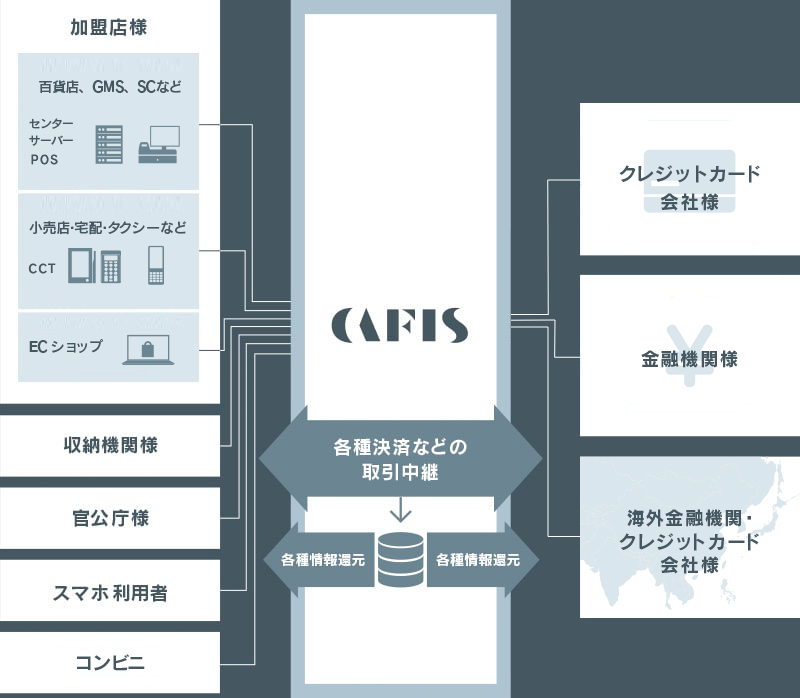

# CAFISの仕組み

CAFIS（キャフィス）とは、日本国内で最大級のキャッシュレス決済総合プラットフォームのことです。CAFISはクレジットカード、電子マネー、デビットカードに加え、国内外のQR決済や非接触ICクレジットカードなど、新たな決済手段にも対応しています。  
NTTデータが運用するCAFISは1984年に開始され、カード決済の利用数、取引量ともに日本で最大の運用実績を誇ります。CAFISは国内のクレジットカード会社、金融機関、収納機関と接続しており、加盟店は約2,000社にものぼります。

CAFISは決済手段の提供だけでなく、加盟店と金融機関の間に入り、クレジットカード決済に必要な信用照会を行なっています。信用照会とは、クレジットカードを提示する顧客がカード決済に問題ないか、カード会社の情報で確認する作業のことです。CAFISは通信回線で加盟店、クレジットカード会社、金融機関を接続しているため、オンライン上でカードの利用状況や限度額、有効期限や不正利用の有無を確認できます。

また、CAFISはデータセンターを2カ所に分散しているため、大規模災害があってもノンストップでサービスを提供できます。国際セキュリティガイドラインにも準拠、かつTCP/IP接続により、カード決済におけるセキュリティ対応も可能です。

‌

‌
