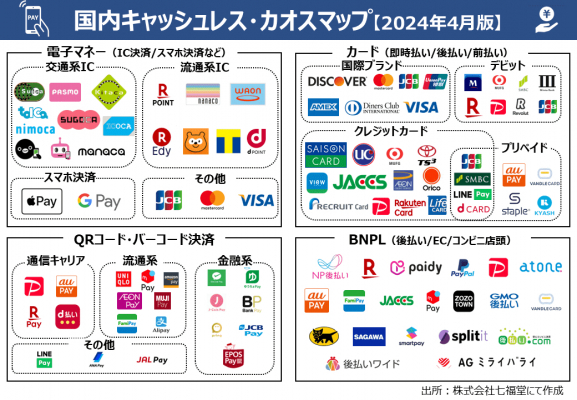

# カオスマップ2024年4月版

‌

株式会社七福堂は、キャッシュレス決済のプレイヤーが各分野で増加していることを背景とし、「キャッシュレス決済カオスマップ2024年4月版」を作成したため公開いたします。

主な調査方法：

調査方法：インターネット調査

調査主体：株式会社七福堂

調査期間：2024年3月20日～2024年4月5日

カオスマップ【2024年4月版】全容：

【画像 [https://www.dreamnews.jp/?action_Image=1&p=0000296575&id=bodyimage1](https://www.dreamnews.jp/?action_Image=1&p=0000296575&id=bodyimage1)】

### カオスマップの分類の補足：

分類の主軸として、

1. 「カード関連（クレジットカード/デビットカード/プリペイドカード）」、
2. 「電子マネー」、
3. 「QRコード決済/バーコード決済」、
4. 「BNPL（クレジットカード以外の後払い決済）」にて整理。

さらに各分類の中で、交通系IC、流通系ICなど細分類を設けております。

カオスマップ【2024年4月版】のサマリー：

### ・BNPL領域のプレイヤーの台頭：

2021年頃から、バンドルカード、atone、Paidy（ペイディ）、NP後払いなどの「BNPL（Buy Now Pay Later）」が台頭。キャッシュレス決済全体の中で、特に若者を中心にユーザー数を伸ばしながら存在感を強めています。

### ・スマホ決済で「Apple Pay」と「Google Pay」が存在感を強める：

Quick Payが2024年3月をもってサービス終了。また（株）NTTドコモが提供する決済サービスの「ID」も2023年10月には、新規申込みの受付を停止。そのため、スマホ決済では「Apple Pay」と「Google Pay」が更に存在感を強めることになっています。

「キャッシュレス決済カオスマップ2024年4月版」では、これらの重要なトピックを踏まえ、現時点におけるキャッシュレス決済の全体像が俯瞰できるようにしております。

‌
