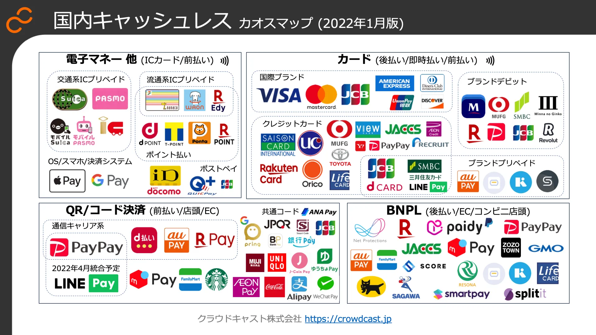

# カオスマップ (2022年1月版)

‌

クラウドキャスト株式会社（本社：東京都千代田区、代表取締役：星川 高志）は、代表 星川のブログで「国内キャッシュレス決済カオスマップ (2022年1月版)」を公開したことをお知らせします。前回の「国内キャッシュレス決済カオスマップ (2019年6月版)」以降、コロナ禍を経て特に「QR/コード決済」における通信キャリア系の台頭や既存プレイヤーの再編に加え、「BNPL（Buy Now, Pay Later/ 後払い決済）」のカオス領域が追加されました。

本カオスマップは、国内キャッシュレス決済の現状を4つの分類に分けて独自にマッピングしたものです。前回の「国内キャッシュレス決済カオスマップ (2019年6月版)」でもマッピングした「QR/コード決済」の領域においては、コロナ禍を経てキャッシュレス決済が個人に浸透したことも背景に、通信キャリア系の台頭や既存プレイヤーの再編が行われました。また、今回新たなカオス領域として、「BNPL（Buy Now, Pay Later/ 後払い決済）」が追加されました。

* **サマリー**

・ 諸外国に比べ遅れ気味だった国内キャッシュレス決済が、コロナ禍を経て個人へ浸透  
・「カード決済」においては、非接触型のタッチ決済も感染症対策で広く浸透  
・ 3年前のカオス領域だった「QR/コード決済」は、ユーザー数と加盟店数の双方が普及への鍵となり、数千万規模のユーザー基盤を持つ「通信キャリア系」および既存サービスへの決済機能組込型、共通コード/API基盤となるBaaSによる「会員アプリ融合型」が台頭  
・ 次のカオス領域としての「BNPL（後払い決済）※」を新規に追加、他領域からの参入がしばらく続くと予想  
・ 個人の次は、法人と行政にキャッシュレス決済普及の大きな波が来ると予想

※ BNPL（後払い決済）とは  
BNPLとは、Buy Now, Pay Laterの略で、商品購入時の代金の支払いを不要とし、後日支払うことを可能とする決済方法です。コンビニ支払いや銀行口座への振り込みが一般的で、ネットショッピングで用いられることが多い決済手段です。

‌
