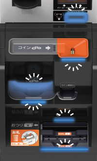
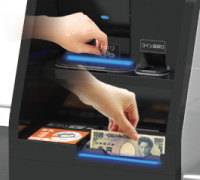
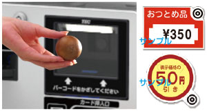
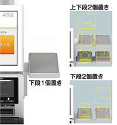
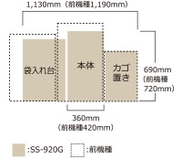

# WILLPOS-Self SS-900シリーズ

# セルフレジ　WILLPOS-Self（ウィルポス・セルフ） SS-900シリーズ

‌

## 主な特長

`セルフレジがここまで使いやすく、ここまでコンパクトに。`

#### 小銭を選り分けられるコイントレー付き硬貨投入口。 \[業界初\*\]

財布やポケットから小銭を出して、トレー上で確認が可能。また、投入口は入金時のみ開くシャッター付で、誤投入を防ぎます。

※東芝テック（株）は、コイントレー付き投入口に関する複数の特許を所有しています。「特許第6026694号」等

#### レジを中断させない、オーバーフロー硬貨自動出金機能。 \[業界初\*\]

硬貨釣銭機にオーバーフロー用の回収袋をつけたまま運用が可能。硬貨が満杯になっても、自動的に回収袋に出金されるため、回収の手間が省けます。また、コンパクトサイズの棒金ドロワがセットでき、補充金の管理も容易です。

※東芝テック（株）は、硬質オーバーフローに関する複数の特許を所有しています。「特許第6134426号」等

#### 遠くからでも状況がわかるパトランプ。

3色カラーと点滅・点灯の組み合わせで、レシートのニアエンドや釣銭不足を知らせる背の高いパトランプを設置。遠くからでも何が不足しているかがすぐ把握できます。

#### 迷わず操作できる、大きく明るい誘導LED。

硬貨・紙幣の入出金口、カードの挿入口の計5か所の操作場所をくっきり照らして誘導。使う人の直感的な操作をアシストします。

#### 視認性を高め、操作しやすい釣銭口を配置。

硬貨口は上に、紙幣口は下に配置。硬貨出金口の高さを196mmアップ（前機種比）。より見やすくなり、お釣りの取り忘れを抑止。紙幣口はATMと同様、上からの投入方式で迷いなく操作できます。

#### 青果が認識可能な新スキャナを搭載。 \[業界初\*\]

当社独自の画像認識技術により、青果を色と模様で識別できる画像処理式スキャナを搭載。また、バーコードの読み取り精度も高めたほか、値引きシールの読取りも可能です。  
※青果認識は今後対応予定

※東芝テック（株）は、値引きシール認識に関する複数の特許を所有しています。「特許第4422706号」等

※東芝テック（株）は、オブジェクト認識に関する複数の特許を所有しています。「特許第5194160号」等

#### 電磁ロック搭載によるキーレス運用を実現。 \[業界初\*\]

プリンタカバーと前面カバーを電磁ロック化。もしものときのエラー対応もキーを使わずカバーオープンでき、レシート交換や釣銭補充が可能。カギ管理の手間が省けます。

#### オプション置き台

電子マネー端末や、お箸・ストロー、その他の備品置き台に。左右どちらにも取付可能。

#### 場所と人がより自由に。コンパクトな設置面積。

本体サイズ幅は360mmと、前機種の約90％の面積で設置可能。スペースに余裕のないお店でも柔軟にレイアウトできます。

\[業界初\*\]:2016年3月31日時点 東芝テック調べ

### 商品仕様

SS-920G セルフレジ 仕様

| 外形寸法 | 1130（W）×690（D）×2032（H）mm（パトランプ含む）〈 ※本体360（W）mm〉 |
| --- | --- |
| 質量 | 本体：139.7kg（硬貨紙幣釣銭機除く）（内袋入れ台：42.6kg） |
| OS | Microsoft® Windows®10 IoT Enterprise 2016 LTSB |
| CPU | Intel Celeron G3900E（2.4Hz） |
| メモリ | 4GB |
| 補助記憶装置 | SSD 60GB x 1 |
| 内蔵UPS | ○（シャットダウン・瞬停用） |
| 自走式カードリーダ | JIS II、ISO1&2 |
| プリンタ | 印字方式：発色型感熱記録方式サーマル漢字JIS第1・第2水準 ANK特殊記号 |
| 表示 | 15型カラーTFT（タッチパネル）チルト25度、スイーベル左右15度 |
| レシート用紙 | 58mm幅 ※専用サーマルロール |
| 硬貨釣銭機 | 国内発行硬貨6金種 |
| 紙幣釣銭機 | 国内発行紙幣4金種 |
| 棒金ドロワ（オプション） | 260（W）×540（D）×55（H）mm　質量：約7kg |
| スキャナ | 固定スキャナ、タッチスキャナ（オプション） |
| パトランプ | 2段3色 |
| 袋入れ台 | 1台（スケール内蔵）最大2台設置可能 |
| 消費電力 | 135W（釣銭機含む） |

※弊社以外のハードウェアに関する保守サービスはおこないません。  
※SSDは消耗品です。  
※表示部のバックライトは1日当たりの使用時間によっては消耗部品となります。

<custom data-type="smartlink" data-id="id-0">https://www.toshibatec.co.jp/products/pos/wpss900/</custom>
