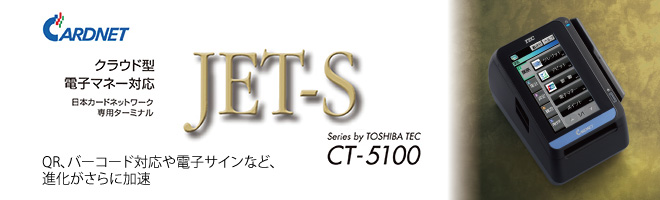
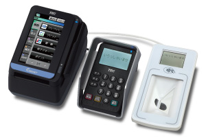
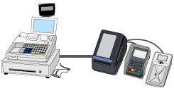
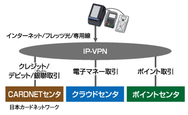
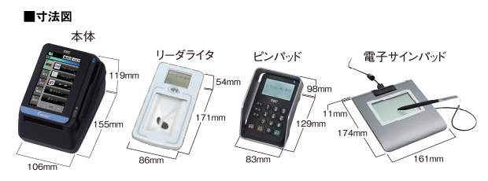

# TEC JET-S CT5100

‌

**フルフラットなタッチパネルを採用**  
美しいフォルムと快適な操作性を実現。

**サービスの幅が広がる**  
国際規格のNFC及びEMVcontactlessに対応できますので、お客様のご利用範囲が広がります。

**お客様の待ち時間を短く**  
CPUとメモリの性能向上でスピーディな操作が可能、プリンタ印字も高速化。

**電子サインパッドと接続可能 ※オプション**  
効率的な決済や、紙の省力化を実現します。

### 主な特長

‌

#### さまざまな電子マネーが使える

決済はクラウドセンターで行うので、リーダライタ1台で複数の電子マネーに対応。導入後に電子マネーを追加することも可能です。

‌

#### 対応可能なサービスが多彩に

QRコードやバーコードの読み取りが可能なリーダライタを接続することで、サービスの幅が広がります。また、国際規格のNFCおよびEMV Contactlessに対応できます。

‌

#### 高度なセキュリティ性

高いセキュリティを保証するPCIPTSV4.1（Online/Offline）認定を取得。また、暗証番号入力のかざし部も改良し、安心感も増しました。

‌

#### 多通貨決済（DCC）に対応して外国のお客様も安心

為替レートの最新情報より、通貨を選択いただくことで変動リスクを気にせず決済いただけます。今後増える海外のお客様にも安心して対応いただけます。

‌

#### POS連動で無駄な作業を排除

POSレジとの連動で２度打ちによる入力ミスなどを軽減し、正確でスピーディな決済を可能にします。

※POSのメーカー及び機種により接続できない場合があります。ご希望の場合はお申込み前にメーカー及びPOS販売代理店にお問い合わせください。

#### LAN回線からの接続対応

LANを経由してインターネット、フレッツ光または専用線で接続できます。

### 商品仕様

‌

‌

####   
CT-5100仕様

| 寸法 | 106（W）×155（D）×119（H）mm |
| --- | --- |
| 質量 | 約770g（ACアダプタ、ロール紙除く） |
| 消費電力 | 6W（待機時）、30W（動作時） |
| カードリーダ部（手動式） | JIS I第1、第2トラック（ISO1、2）及びJIS II |
| 液晶表示部・バックライト付 | 4.3型ワイドスクリーン・カラーTFT液晶 |
| プリンタ | サーマルタイプ、印字速度：200mm/秒（最大） |
| キーボード部 | 抵抗膜式タッチパネル |
| 適合通信回線 | LAN回線（10／100BASE-TX） |
| 外部インターフェース | ピンパッド用×1、POS接続用×1、外部機器接続用×1  
LAN回線接続用×1、USB（※1）×1、SDHCカードスロット（※2）×1 |
| 電源ケーブル長 | 電源ケーブル：全長3.7m（ACアダプタ出力ケーブル1.8m含む） |

#### 非接触リーダライタ仕様（オプション）　※ <　> 内はバーコードなしタイプ

| 寸法 | 86（W）×171（D）×54（H）㎜　ケーブル長 約2.0m |
| --- | --- |
| 質量 | 約320g<310g> |
| 消費電力 | 2W（待機時）、5W（最大） |
| ディスプレイ | 2.0型カラー液晶　全角8桁×6行（※3） |
| 電源 | AC100V±10%(50/60Hz)※専用ACアダプタで電源供給します。 |

#### PADCT-5100（ICカードリーダライタ付きピンパッド）仕様　（オプション）

| 寸法 | 83（W）×129（D）×98（H）mm、  
ケーブル長：3m  
※かざし部含む |
| --- | --- |
| 質量 | 約350g　※ケーブル含む、かざし部は含まない |
| 消費電力 | 2W（待機時）、4W（動作時） |
| 液晶表示部 | 表示ドット：128×64ドット、半角16桁×4行 |
| キーボード部 | 16キー、点字3カ所 |

#### STU-430 （電子サインパッド）仕様 （オプション）

| 寸法 | 約161（W）×174（D）×11（H）mm ※突起部を除く |
| --- | --- |
| 質量 | 約280g |
| 消費電力 | 1.0W（最大） |
| 最大表示解像度 | 320×200ドット |
| 電源 | USB（バスパワー） |

[https://drive.google.com/file/d/18-f-u9MuKURKL2NtP3k6xEvPb7uGprjU/view?usp=sharing](https://drive.google.com/file/d/18-f-u9MuKURKL2NtP3k6xEvPb7uGprjU/view?usp=sharing)
