# POSソリューションの種類（小売業界）

‌

## 有人系POS

### 通常レジ

代表例：

東芝テック株式会社は、食品スーパーマーケット等の量販店向けにPOSターミナル「WILLPOS Unity M-9000シリーズ」を2017年（平成29年）9月1日から発売いたします。

M-9000シリーズは従来のM-8000シリーズのコンセプトを継承しつつ、より使いやすくフレキシブルな機器構成を可能としました。制御部とフルフラットディスプレイが一体となった対面性に優れた新筐体を採用したことにより、スタイリッシュなデザインを実現しながらタッチパネル、キーボード、自動釣銭機、ドロワの配置を近づけ、操作性を向上させました。さらに、各種周辺機器をユニット化したことにより、従来のPOSターミナルの構成からキーボードのないタッチタイプやセルフタイプの構成等、十店十色それぞれのチェックアウトシーンにあわせたフレキシブルな構成が可能になりました。

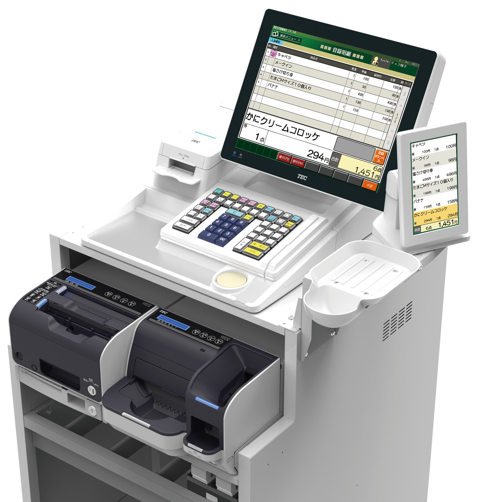フレキシブルPOSターミナル　WILLPOS-Unity（ウィルポス・ユニティ）M-9000

### レーンレジ

代表例：

富士通の量販店向けPOSシステム

TeamStore/M

**TeamStore/Mの特長・メリット**

* 2人制レーンに設置できる
* 15型のディスプレイに対応
* オリジナル電子マネー「ハウスカード機能」搭載

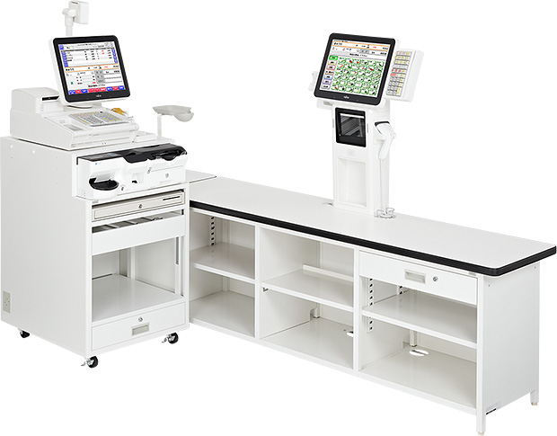TeamStore/M
### セミセルフ

代表例：

１）

東芝テックが展開するセルフレジ「WILLPOS-Self」シリーズ、そして「分担制チェックアウトシステム　SemiSelf」の製品は、レジ会計プロセスの簡便化と、レジ待ち、会計のスピードアップにある。

２）

**TERAOKAの代名詞「スピードセルフ」を実現する**  
**チェッカー従業員の使いやすさを追求したセミセルフ登録機WebSpeezaSL-C/S (G3)**

チェッカー従業員が商品登録を行い、お客様にお支払い操作をしていただくセミセルフ運用の登録機です。  
チェッカーは現金に触れる必要が無いため、衛生的かつ対人接触機会の低減を図ることが可能です。現金を扱わないことにより、教育期間の短縮にも繋がります。

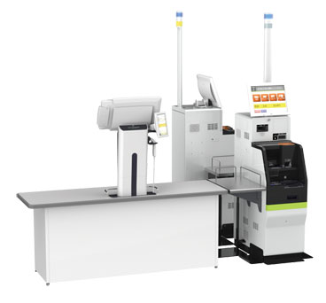SS-900Kセミセルフレジ用会計機タイプ

SS-900セミセルフレジ用 会計機設置イメージ
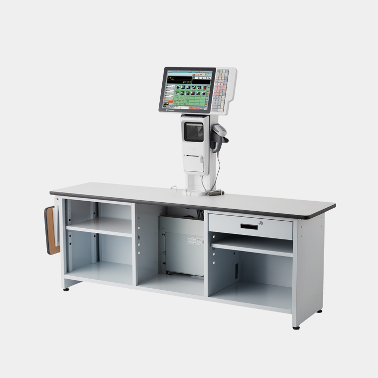寺岡精工WebSpeezaSL-C/S (G3)

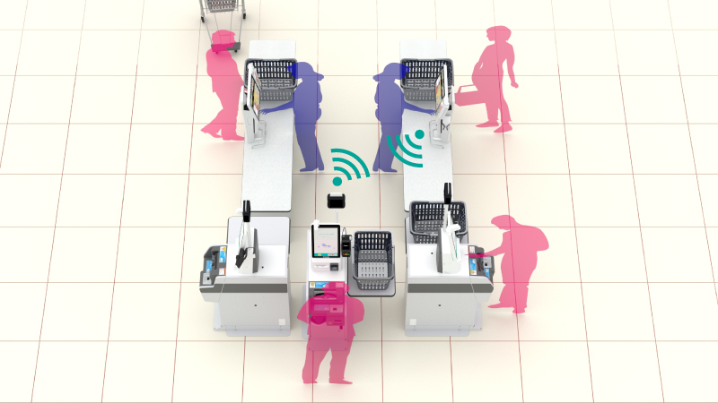TERAOKAが独自に開発したダイレクト指定方式によるデータ転送を使用いただくことで、チェッカーが指定した精算機へお会計データを飛ばすことができます。効率的なスピードセルフ（セミセルフ運用）を実現し、レジ待ち時間を短縮します。

### 対面型セミセルフ

代表例：

東芝テック　対面式セミセルフ　WILLPOS-Link（ウィルポス・リンク）

チェッカーさんが登録→お客様がお会計。分担制で待ち時間を大幅に短縮するセミセルフが対面式となって登場！ その名も「WILLPOS-Link」。お客様とのつながるようなコミュニケーションや、つなぐように早いお会計を大事にするお店に最適な「新対面販売」です。

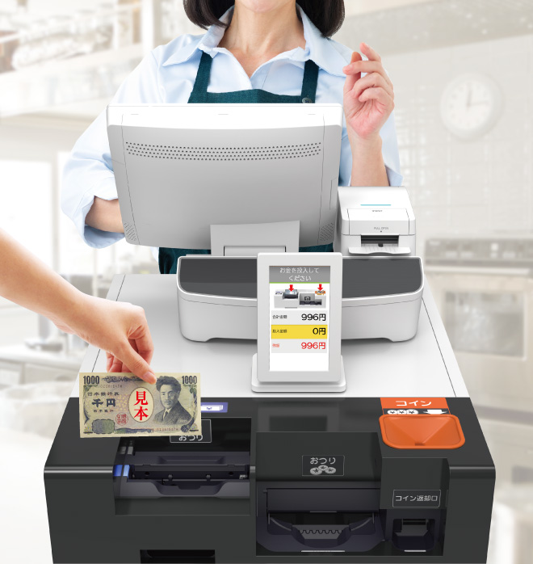東芝テック　対面式セミセルフ　WILLPOS-Link（ウィルポス・リンク）
‌

## 無人系POS

### フルセルフ

代表例：

セルフレジ　WILLPOS-Self（ウィルポス・セルフ） SS-900シリーズ

「SS-900」シリーズは、業界初の吟味台（硬貨トレイ）付き硬貨投入口、ATMと同様に上から紙幣を投入できる紙幣投入口、硬貨・紙幣の入出金口に明瞭な誘導LEDを搭載するなど消費者にとっての使いやすさ（消費者目線）を追求しました。また、業界初、電磁ロック搭載によるキーレス運用を可能とし、硬貨が容量を超えても自動で専用の回収袋に出金し端末を止めない機能や、多彩な表現力のパトランプ注1で遠くからでも端末の状況把握を可能とするなど店員にとって管理のしやすさ（店員目線）を追求しました。さらに業界最小設置面積を実現、限られた売場面積の有効活用を可能としました（店舗目線）。

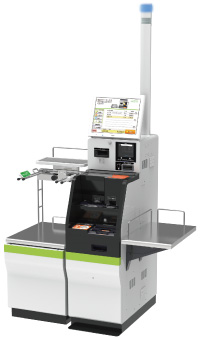セルフレジ　WILLPOS-Self（ウィルポス・セルフ） SS-900シリーズ

### キャッシュレスフルセルフ

代表例：

東芝テック株式会社は、食品スーパーマーケット等の量販店での会計の際、消費者自身で商品の登録から支払いまでを行うセルフレジおよび会計・チャージ機の新ラインナップ「SS-NEX」シリーズを発売します。

「SS-NEX」シリーズは、従来機種「SS-900」シリーズを踏襲し、さらに消費者にとっての使いやすさを追求しました。本シリーズ製品は、現金決済・キャッシュレス会計とも対応可能なセルフレジ、キャッシュレス会計専用セルフレジ、会計・チャージ機の3機種をラインナップし、先行してキャッシュレス会計専用セルフレジ「SS-N1C」を2022年9月に発売します。

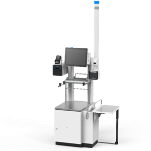現金・キャッシュレス会計対応セルフレジ「SS-N1G」

### レジカート型

代表例：

「_Skip Cart_」は、株式会社Retail AIが開発したスマートショッピングカート。2018年に開店した「スーパーセンタートライアル アイランドシティ店」は、日本初のスマートストアとして「Skip Cart」を導入しました。

カートにはタブレット端末とバーコードリーダーが搭載されており、商品を買い物かごに入れる際にバーコードをスキャンすることができます。スキャンした商品の合計金額や個数は随時タブレットに表示されるため、_買い忘れや予算オーバーを防ぐことができる_と利用者からも高い評価を得ているようです。

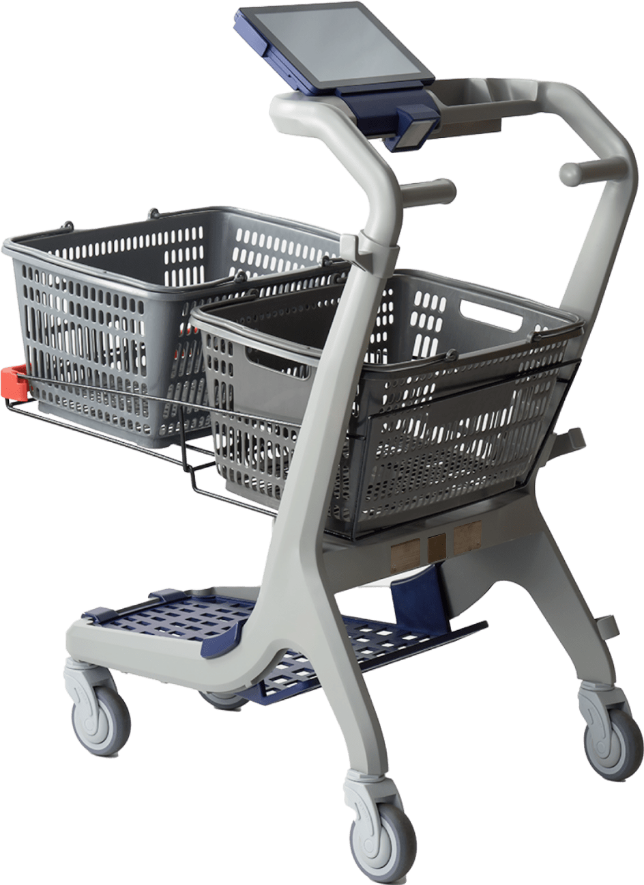Skip Cart
### スマホ型

代表例：

イオンリテールが企画・開発するセルフレジ「レジゴー」の展開店舗が２０２４年６月、３００店舗を突破しました。「レジゴー」は２０１９年５月から実証実験を進め、２０２０年３月に本格展開を開始した“ご自身でスキャンしながら買物ができる”新たなセルフレジです。

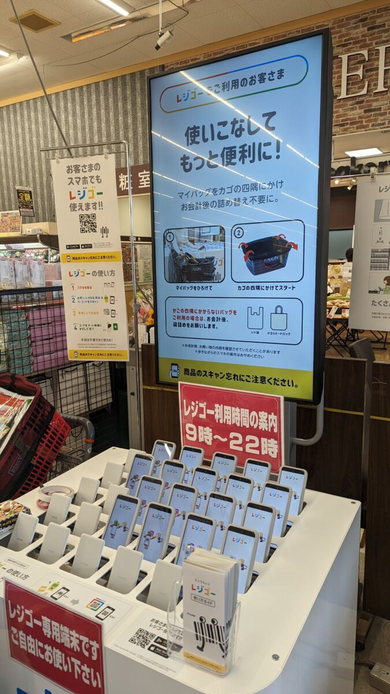レジゴー
‌

## そのた専用シーン

### チャージ機（セルフ）

代表例：

PFUは2017年9月26日、電子マネーチャージ機の新機種「MEDIASTAFF MCモデル マルチ電子マネーチャージ機」の販売を開始した。複数の電子マネーに対応するのが特徴。同社は「1台で4大ブランド（交通系、Edy、nanaco、WAON）のチャージに対応する装置は国内で初めてだろう」とする。

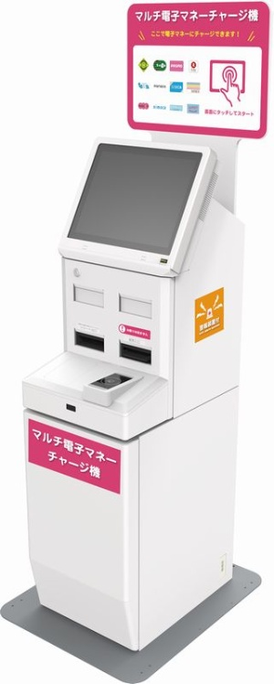MEDIASTAFF MCモデル マルチ電子マネーチャージ機
