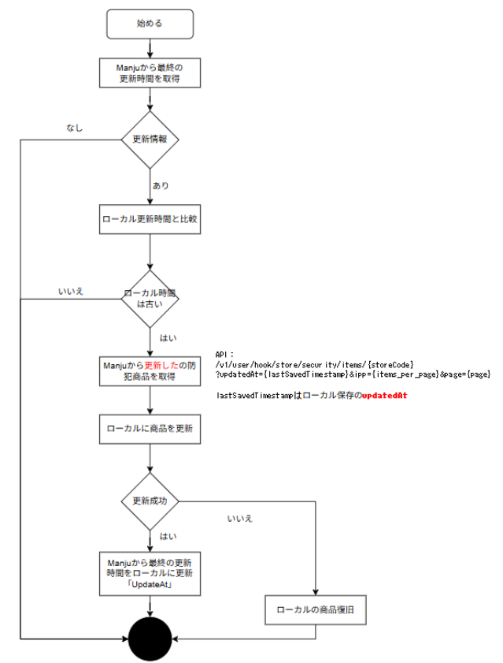

# 防犯商品

  
以下２つのAPIを使って実現する。  
①でカテゴリIDを取得して、②でカテゴリ内のボタン情報を取得するという流れになります。

**①Hook Latest Security Item By Store**   
　・防犯商品の更新日時を取得するAPI

**②Hook Hybrid Security Items By Store**  
　・防犯商品一覧のを取得するAPI  
　・①APIで更新がある場合のみ実行する

ここにマニュアルがあります。  
<custom data-type="smartlink" data-id="id-0">https://sandbox-console.raicart.io/ja/admin/engineer/documentation/manju/api</custom> 

‌

‌

処理フロー：

防犯商品の更新日時を取得：  
**■基本情報**

| 項目 | 値 | 備考 |
| --- | --- | --- |
| サービスURI | [https://sandbox.raicart.io/v1/user/hook/store/security/items/](https://sandbox.raicart.io/v1/user/hook/store/security/items/storeCode?updatedAt=updated_at&ipp=item_per_page&page=1)latest/{storeCode} |  |
| リクエストメソッド | GET |  |

**■リクエストパラメータ**

無し

**■レスポンスパラメータ**

| パラメータ名 | 型 | 説明 |
| --- | --- | --- |
| errorCode | String | エラー時のエラーコード |
| data |  |  |
| items |  |  |
| id | String | 商品コード |
| name | String | 商品名 |
| updatedAt | Number | 更新時間（unix時間） |
| deletedAt | Number | 削除時間（unix時間） |

‌

  
防犯商品一覧取得：  
**■基本情報**

| 項目 | 値 | 備考 |
| --- | --- | --- |
| サービスURI | [https://sandbox.raicart.io/v1/user/hook/store/security/items/storeCode?updatedAt=updated_at&ipp=item_per_page&page=1](https://sandbox.raicart.io/v1/user/hook/store/security/items/storeCode?updatedAt=updated_at&ipp=item_per_page&page=1) |  |
| リクエストメソッド | GET |  |

**■リクエストパラメータ**

| パラメータ名 | 型 | 説明 |
| --- | --- | --- |
| storeCode | String | 店舗コードを4桁（先頭0埋め）で指定してください。  
例）新宮店：0027 |
| updatedAt | Number | unix時間を設定してください。この時間より前に更新された商品のみを取得します。  
例）1700543743 |
| ipp | Number | １回（１ページ）で取得する商品数を50～300の範囲で指定してください。指定した数字毎にpageが加算されます。  
例）100 |
| page | Number | 何番目のページを取得するか指定してください。  
ページを指定しない場合はデフォルトは1、つまり最初のページになります。  
例）1 |

**■レスポンスパラメータ**

| パラメータ名 | 型 | 説明 |
| --- | --- | --- |
| errorCode | String | エラー時のエラーコード |
| data |  |  |
| total | Number | 総防犯商品登録数 |
| ipp | Number | １ページあたりの商品数 |
| page | Number | 取得データのページ数 |
| items |  |  |
| id | String | 商品コード |
| name | String | 商品名 |
| updatedAt | Number | 更新時間（unix時間） |
| deletedAt | Number | 削除時間（unix時間） |

**■API説明**

・このAPIはパブリックAPIであり、リクエストヘッダにClient-IdとClient-Secretがあることを想定しています。	  
　Client-IdとClient-Secretが無効な場合、Error401としてエラーを返します。	  
・このAPIはアクセス元のIPアドレスをチェックします。ゲートウェイのIPアドレスをホワイトリストに登録する必要があるため、連絡をお願いします。	  
・Content-Typeヘッダーにcharset=utf8;を含めないでください。	  
・このAPIの商品のレスポンスはupdated_at(降順)でソートされ、total(総防犯商品登録数)、ipp(ページごとの項目)、page(現在のページ)を返します。	  
・このAPIは、Client-IdとClient-Secretが有効であれば、商品一覧のオブジェクトを返却します。	  
　返却された items が ipp より小さい場合は、全ての商品を取得したことを意味します。	  
・商品はid、name、updatedAt、deletedAt の 4 つのフィールドが返されます。deletedAt が NULL でない場合は、この防犯商品が削除されたことを意味します。

‌
