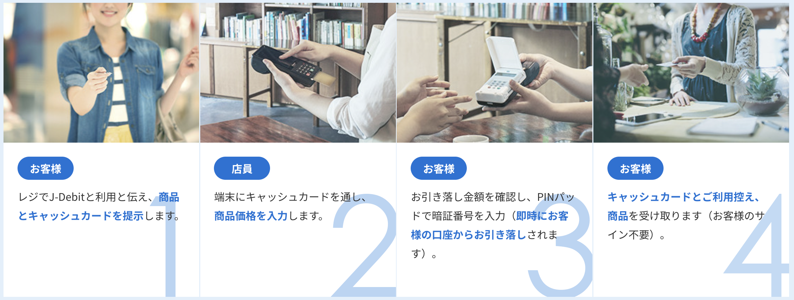

# J-Debit（ジェイデビット）

‌

‌

### J-Debitとは

J-Debitとはキャッシュカードで支払いができる即時決済サービスのことです。J-Debitに対応した金融機関のキャッシュカードを提示して支払うと、代金が自分の口座から即時に引き落とされ、店舗の口座に入金されます。買い物の際に手持ちの現金が少ない場合でも、ATMに寄らずに支払いが可能です。

J-Debitは国内1,000以上の金融機関から成り立つサービスであるため、ほとんどの金融機関が発行するキャッシュカードで使えます。なお、J-Debitはキャッシュカードを持っている人なら誰でも利用できるため、高校生でも使用が可能です。また、J-Debitには年会費や手数料がありません。

‌

### J-Debitの利用

J-DebitはJ-Debitマークのある加盟店で利用が可能です。J-Debitマークは青色のキャッシュカードと緑色の紙幣を組み合わせたデザインで、マークには文字で「J-Debit」と記載されています。

J-Debitマークは店舗のレジ付近などに表示されることがほとんどです。J-Debitはスーパー・ドラッグストア・飲食店など、さまざまな業種で利用でき、全国で約56万か所以上のJ-Debit加盟店で利用できます。

例えば、スーパーのコープこうべは兵庫県内・大阪府内の全店でJ-Debitの利用が可能です。コンビニのローソンでは、ゆうちょ銀行・信用金庫など一部のキャッシュカードでJ-Debitを使えます。しかし、セブン-イレブンやファミリーマートではJ-Debitを利用できないので注意しましょう。

J-Debitは海外の店舗でも利用できません。J-Debitを利用できる店舗はJ-Debitの公式サイトで確認できます。

J-Debitの利用方法はキャッシュカードを提示して暗証番号を入力するだけです。店舗でJ-Debitを使って支払う際は以下の手順で行います。

‌

‌

1.レジで「J-Debitで」と伝えて、キャッシュカードを提示する

2.端末にキャッシュカードを通し、商品価格を入力する

3.店員が入力した金額を確認して、端末にキャッシュカードの暗証番号を入力する

4.キャッシュカード・利用控えを受け取る

J-Debitで支払う際はサインが不要です。また、J-Debitで支払った場合、加盟店名・金額の利用履歴は銀行口座の利用明細などで確認できます。

‌

‌

‌

‌
