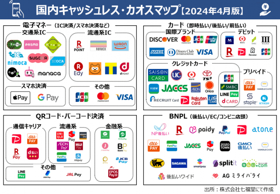
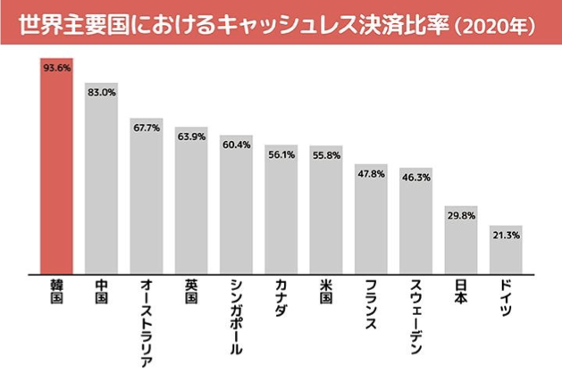
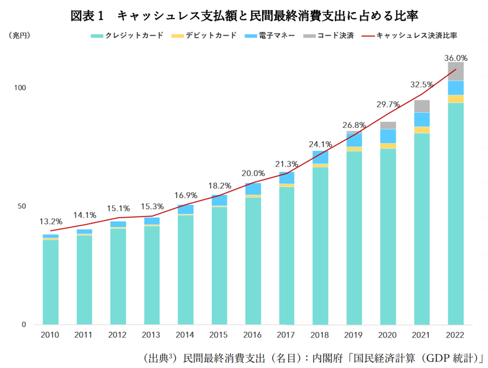
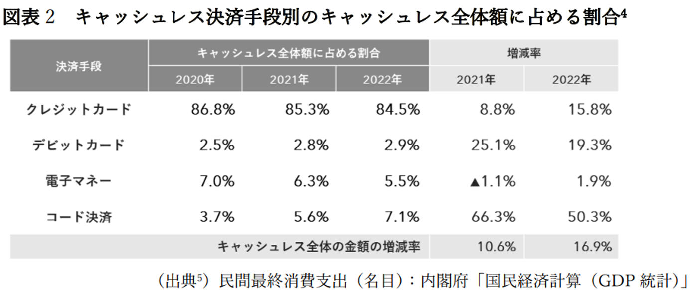
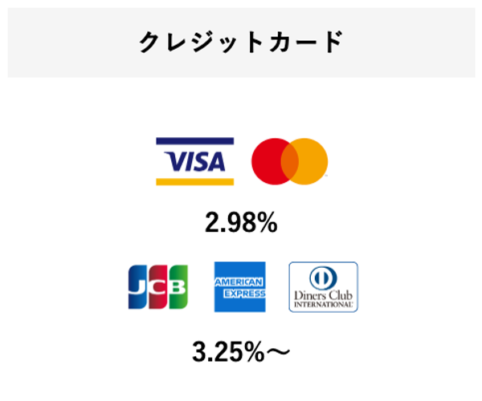
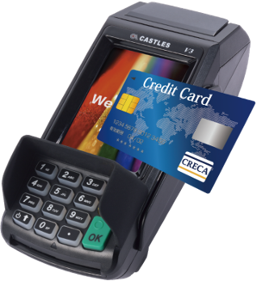
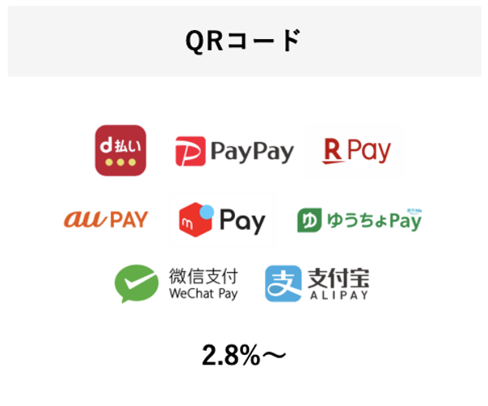
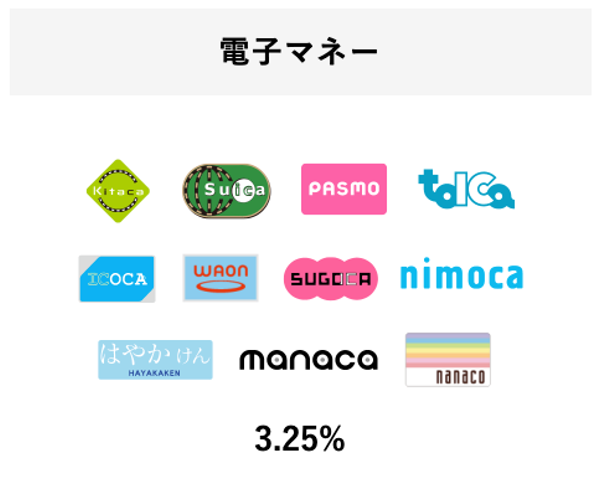

# キャッシュレス決済とは

### キャッシュレス決済とは

キャッシュレス決済とはお札や小銭などの現金を使用せずにお金を払うことです。  
キャッシュレス決済手段には、クレジットカード、デビットカード、電子マネー（プリペイド）や  
スマートフォン決済など、様々な手段があります。

[https://www.meti.go.jp/policy/mono_info_service/cashless/image_pdf_movie/cashless_iroha.pdf](https://www.meti.go.jp/policy/mono_info_service/cashless/image_pdf_movie/cashless_iroha.pdf)

### 日本市場におけ、キャッシュレス決済業界のカオスマップ

[https://retailai.atlassian.net/wiki/x/YYAYsQ](https://retailai.atlassian.net/wiki/x/YYAYsQ)‌

### 日本におけ、キャッシュレス事情 

・日本は世界キャッシュレス推進先進国より遅れてる

・韓国：９５.３％

　　・中国：８３.８％

　　・日本は２０２５年まで４０％達成目指す

### 小売スーパーのキャッシュレス決済導入率は95％　　　

| 決済手段 | 導入割合 | 金額割合 |
| --- | --- | --- |
| クレジット | 95.２％ | 16％ |
| 電子マネー | 81.９％ | 18.６％ |
| QRコード決済 | 66％ | 4.６％ |
| 現金 |  | **59.４％** |

‌

### 手数料について

