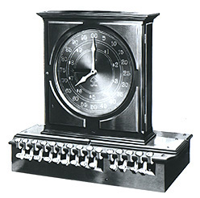
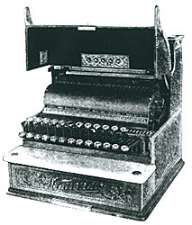
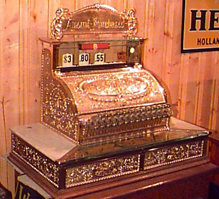
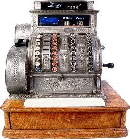
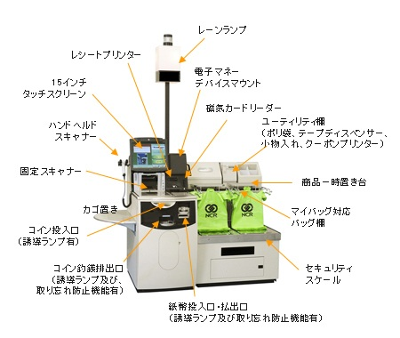

# POSの歴史詳細

‌

## 金銭登録機の時代

### レジスターの発明と普及（第１次世界大戦開戦まで）

#### 最初のレジスター

* 1878年 「Ritty's Incorruptible Cashier」  
  レジスターを発明したのはリティ（James Ritty）だとされている。その最初のレジスターは、長針でセント、短針でドルを表示する置時計のような形状であった。単に押しボタンの操作で金額表示して客と店員が確認するだけの機能であり、現金を格納したり、記録をとる機能はなかった。
* 1879年　ペーパー・ロール式レジスター  
  その後、リティは、レジスターの機能を追加していった。金額を入力すとベルが鳴り、ロール紙にピンで穴をあけて記録するようにした。
* 1883年　「Detail Adder」合計器つきレジスター  
  さらに、売上金を入れる引き出しが付き、個々の売上金額とともに合計金額が記録できるようになった。

Ritty's Incorruptible Cashier（1878）

Detail Adder（1883
‌

#### 初期のレジスター

* 1884年 パターソン、ＮＣＲ創立  
  パターソン（John H. Patterson）は、リティからレジスターの販売権利を買い取り、ＮＣＲ社（National Cash Register Company）を創設、レジスター事業に乗り出した。その後多くのレジスターメーカーが出現したが、ＮＣＲは、先行したこと、経営手腕が優れていたことにより、1912年には、米国内市場の９５%のシェアを握り、独占禁止法に抵触するまでになった。ＮＣＲの歴史がレジスターの歴史であるといってよい。
* 1892年　７９号レジスター（レシート発行のレジ第1号機）  
  売上合計、客数、分類、レシート発行機能などが追加されていった。ＮＣＲ初期のヒット製品が、初めてレシート発行機能をもった７９号レジスターである。
* 真鍮製レジスターの時代  
  初期のレジスタは、実用もさることながら、ステータスを示す店内装飾品でもあった。パターソンが最初に製作した最初のレジスタは磨かれた木製であったが、１８８８年以降は真鍮製や鋳鉄製になった。その時代を「the Brass Era of Cash Registers」という。当時のレジスタは、現在、骨董品として大きな市場になっている。しかし１９１４年からの第一次世界大戦により真鍮の需要が高まり、その後のレジスタは他の事務用製品と同様のスチール製になってしまった。

NCR Total Adder（1890）?

NCR #79（1892）?
#### 電動レジスター

最初の電動レジスターは、１９０６年にケタリング（Charles F. Kettering）が製作した。数年後に製造された「National Cash Register Class 1000 Autographic」はベストセラーになったという。しかし、当時は電動式と手動式は共存しており、電動レジスターが本格的に普及するのは、第１次世界大戦後となる。

‌

### 第２次世界大戦後のレジスターメーカー

#### 米国ＮＣＲの浮沈

* 1952年　ＣＲＣ（Computer Research Corporation ）買収。コンピュータ分野に参入
* 1974年　ＮＣＲ Corporationに改称
* 1982年　パソコン分野に参入
* 1991年　ＡＴ＆Ｔにより買収され子会社化  
  同年に買収されたテラデータと合わせて「ＮＣＲ部門」に
* 1997年　ＮＣＲ部門がＡＴ＆Ｔから独立。再度「ＮＣＲ」と改称
* 1999年　汎用コンピュータ生産から撤退
* 2000年　その後、流通業と金融業向けのソリューション提供とＡＴＭ生産に集中
* 2007年　テラデータの分社化

戦後もレジスター市場でのＮＣＲの独占的地位は変化せず、時代をリードする新製品を開発していた。コンピュータ（汎用機）やパソコンの分野にも進出。高性能機に特徴があり、特に金融業界でのシェアを高めた。寺データとの統合により、超並列プロセッサ分野でのシェアも高めた。ところが、汎用機市場ではＩＢＭ、パソコン市場ではコンバック（現ＨＰ）などとの競争に敗れてしまった。 　また、1970年代からレジスターは電子化され、機械的な工作のノウハウが重視されなくなり、電卓メーカーなどの参入が容易になった。さらに1980年代後半からは、ＰＯＳシステムが情報システムの主要な一部となり、レジスターはＰＯＳレジスターへと移行する。それにより、コンピュータメーカーやパソコンメーカーの参入が多くなってきた。現在の米国のＰＯＳ市場では、ＮＣＲは善戦しているが、ＩＢＭが首位になっている。

#### 日本ＮＣＲの経緯

* 1946年　日本ナショナル金銭登録機株式会社再開
* 1951年　米ＮＣＲ７０％出資による連携。戦後初の外資導入企業になる。
* 1957年　大磯工場竣工。独自生産を始める。
* 1961年　ベストセラー「22号レジスター」発売
* 1971年　世界初の電子式レジスター（ＥＣＲ）「NCR 230 ECR」
* 1973年　日本ＮＣＲに改称
* 1976年～1980年頃　業種別に特化したＥＣＲ多数
* 1994年　米ＮＣＲがＡＴ＆Ｔ傘下になったことから、日本ＡＴ＆Ｔ情報システムに改称
* 1996年　日本ＮＣＲに再び改称
* 1998年　米ＮＣＲが株式の97.5%を取得。事実上の子会社に

米ＮＣＲは、コンピュータ業界、さらにパソコン業界に参入したが、その後の競争で低迷。1990年代に入ると急速に業績悪化して、パソコン・汎用機の製造から撤退した。  
　日本ＮＣＲは、1970年代までは米ＮＣＲレジスター日本版の生産・販売で、レジスター業界のトップ企業であったが、レジスターの電子化に伴う国産勢の進出により、次第に劣勢になり、現在ではレジスター生産は海外に移転してしまった。

#### 東芝テックの経緯

* 1950年　企業再建整備法により大仁工場が分離独立。東京電気器具株式会社に
* 1952年　東京電気株式会社に会社名変更
* 1957年　金銭登録機の生産再開
* 1964年　電動加算機「トステック」シリーズ生産開始
* 1971年　電子レジスター「マコニック」生産開始(BRC-30B)
* 1979年　東芝テック、初の国産メーカーによるレジスター米国輸出

* 1986年　酒販店向POSシステムをサントリーと共同開発・販売
* 1992年　セブン－イレブン次世代型POSシステム納入
* 1994年　「株式会社テック」に改称
* 1994年　オープンＰＯＳレジスター「ST-5000シリーズ」生産開始
* 1999年　「東芝テック株式会社」に改称

日本ＮＣＲとくらべて、本格的な生産は遅かった。しかし、電子時代になると急速に発展し、ＰＯＳレジスターの時代になると、トップ企業になった。

レジスターメーカーとしては、東芝テック、シャープ、カシオなどがシェアをもっていたが、現在での、ＰＯＳレジスターメーカーとしては、東芝テックが５０％、ＮＥＣインフロンティアが２５％近いシェアをもっている。

---

### 第２次世界大戦後～１９６０年代

#### 金銭登録機の完成段階

* 1950年　ＮＣＲ、「２１号レジスター」
* 1953年　紀ノ国屋、日本最初のセルフサービスのスーパーマーケット開店  
  １９５０年代中頃から、日本でもスーパーが出現した。「２１号レジスター」は小売業で最もポピュラーな手動型レジスタであり、日本でノックダウン生産に入った最初の機種だといわれている。この機種は、その後のＮＣＲ機の標準機になり、これをベースに多様な機能をもつレジスターが開発される。
* 1957年　大磯工場竣工
* 1961年　ＮＣＲ「２２号レジスター」  
  １９６０年代でのベストセラー機種である。日本ＮＥＣ独自の仕様も加えて、国内向けに大磯工場で大量生産された。手動型のレジスターで、分類キーは８分類しかできなかったが、ＪＡＮコードが策定されていない当時では、この分類キーにより、商品や部門を分類していたのであるが、そのキーには「ヨキミセサカエル」（良き店栄える」と表示されていた。  
  　　「ヨ」＝利益率50％以上の商品、「キ」＝利益率40％以上の商品  
  　　「サ」＝生鮮品、「カ」＝「菓子類」・・・  
  そして、「ヨ比率を高めよう」とか「サ商品の鮮度管理を～」というように店内共通語にすらなっていた。

#### 入出力装置との連携

* 1963年　ＮＣＲ「２１号セールス・トロニック」  
  日本での小売業や流通業での本格的なコンピュータ導入は１９７０年代以降になるが、米国ではすでにコンピュータ利用が進んでおり、レジスターの売上データをコンピュータ入力できるようにする必要があった。この機種は、レジスターで紙テープにパンチする機能を搭載した。紙テープにパンチする方式はすでにテレタイプが普及しており、1963年にはASCIIコードが制定され、テレタイプがコンピュータ端末として利用される段階になっていた。その技術をレジスターに組み込んだものである。
* 1966年　ＮＣＲ「２１号ＮＯＦレジスター」  
  光学的に文字認識することをＯＣＲ（Optical Character Recognition）といい、認識を容易にするための特殊書体活字をＯＣＲフォントという。ＮＣＲは、独自のＯＣＲフォントと入出力方式を策定し、ＮＯＦ（NCR optical font）と命名した。ＮＯＦレジスターとは、ＯＣＲフォントのレシートを印刷する機能と、レシートや値札に印刷したＯＣＲフォントの文字を読み取るスキャナ機能をもつ電動レジスターである。ＮＣＲは、このＮＯＦレジスターのシリーズを毎年生産した。なお、ＯＣＲフォントは、1976年にOCR-A/Bフォントとして規格化される。

---

### １９７０年代：ＥＣＲの出現

* 1971年　ＮＣＲ「230－101 ECR」
* 1971年　東芝テック「マコニック（BRC-30B）」
* 1971年　シャープ「ER-40」
* 1976年　カシオ、ＥＣＲに参入

１９７０年代になると、レジスターはＥＣＲ（Electronic Cash Register）へと変化した。ＥＣＲとは、電子式レジスターのこと。従来の機械式レジスター、電動レジスターが歯車装置などで動作するのに対して、ＥＣＲは、ＩＣなどの電子回路により動作し、データはメモリに記憶される。プログラムによる機能変更も可能になる。すなわち、コンピュータ的な機器に変化したのである。  
　そのため、従来のような機械機構が少なくなり、その技術をもたない企業が参入しやすくなった。むしろ電卓やコンピュータなどの業種が有利になってきたのである。  
　ＮＣＲは、すでにコンピュータ業界に参入していたため、このような変化にも対応できたが、新たな競争者を迎えることになった。特に日本では、シャープやカシオなど電卓メーカーが参入するし、東芝テックが強力な競争者になり、ＮＣＲの次第に日本でのシェアは低下していく。逆に、国産メーカーは、輸出産業としても急成長するようになる。

---

## ＰＯＳレジスターの時代

#### ＰＯＳレジスターへの移行

ＰＯＳ（Point of Sale）システムとは、通商産業省（現経済産業省）は、「POSシステムは、光学式自動読取方式のレジスターにより、単品別に収集した販売情報や仕入れ、配送などの段階で発生する各種の情報をコンピューターに送り、各部門がそれぞれの目的に応じて有効活用できるような情報に処理・加工し伝送するシステム」と定義している。

* 1972年　ダイエーと三越百貨店、日本で初めてバーコードによる自動チェッキングシステム実験  
  この時点では商品にＪＡＮコードは印刷されておらず、この実験のためにバーコードを添付した。
* 1978年　ＪＡＮコード制定  
  ＰＯＳシステムに大きな変化を与えたのは、共通商品コードの制定である。米国では1973年にＵＰＣコードが制定され、日本では1978年にＪＡＮコードが制定された。これにより単品管理が可能になった。そしてレジスターは、単なるレジ作業の合理化だけでなく、商品政策、在庫管理、発注管理など小売業での利益に直結するシステムの重要な機器であると認識されるようになったのである。
* 1979年　ＮＣＲ、ＪＡＮコード利用の店頭実験  
  ＪＡＮコード対応スキャナーを開発し、たつみチェーンで実験
* 1982年　セブンイレブンＰＯＳシステム導入による第２次総合店舗情報システム  
  セブンイレブンは、ＰＯＳシステムの導入に積極的であった。ＰＯＳレジスターの導入するのにあたり、商品納入業者にソースマーキングを要求した。それにより、ＪＡＮコードを採用するメーカーが増大したといわれている。  
  　この段階ではＰＯＳ導入は一部の店舗だけであった。セブンイレブンが本格的にＰＯＳシステム導入をしたのは、1984年頃である。
* 1988年　ウォルマート、90％店舗レジにPOSを導入  
  米国でのＰＯＳシステムの代表的な利用企業はウォルマートであるが、その本格的利用は、日本のセブンイレブンよりも遅れている。しかし、ウォルマートでの利用は、Ｐ＆Ｇと共同して、受発注から支払までの業務全体を合理化するなど、企業間にまたがるＰＯＳ活用に特徴がある。

日本全体でのＪＡＮコード対応ＰＯＳの導入は、セブンイレブンよりもかなり遅れている。離陸期は１９８０年代中頃で、急速に普及したのは１９９０年代中頃である。

#### オープンＰＯＳ

オープンＰＯＳとは、オープン環境、すなわち端的にはWindowsをＯＳとするＰＯＳのことである。それまでのＰＯＳレジスターのソフトや周辺機器との接続仕様は、個々のメーカーあるいは機器により独自の仕様を採用した「専用型ＰＯＳ」であった。それが、１９９０年代になるとダウンサイジングが進み、パソコンが情報システムの中核機器になり、その大多数がWindowsをＯＳとしていた。ＰＯＳもそれに合わせたほうが開発コストを格段に抑えられ、機器間の互換性が向上する。それを「オープンＰＯＳ」という。この普及により、レジスターメーカーではないソフトウェア会社がアプリケーション・プログラムを開発するようになった。

* 1994年　ＮＣＲ、「Win POS」
* 1994年　東芝テック、オープンＰＯＳレジスター「ST-5000シリーズ」
* 1996年　ＯＰＯＳ協議会「ＯＰＯＳ日本版仕様書第1.0版｣制定  
  OPOSは、Microsoftの提唱するOLEやActiveX技術を利用して、ＰＯＳ周辺装置制御方式を標準化し、アプリケーションや周辺装置の制御ソフトの開発を汎用性のあるものにすることを目的した団体
* 1996年　ＮＣＲ、Win POS21
* 1997年　東芝テック、「ST-5600」｢WX-77｣  
  ＯＳにWindowsＮＴ、データベースにはSQL Serverを採用。ST-5600はＰＯＳレジスタ、WX-77はＰＯＳシステム
* 1997年　三菱電機「M2 Win/T6500」  
  Windows95をＯＳとした、オープンＰＯＳ
* 2005年　Microsoft、「WEPOS」  
  Windows Embedded for Point of Service：Windows XPをベースにしたＰＯＳレジスターの組み込み用ＯＳ

その後、ＯＳをLinuxとするオープンＰＯＳも普及するようになった。現在のＰＯＳはほとんどがオープンＰＯＳになっている。

#### ＷｅｂＰＯＳ

２０００年代にブロードバンドによるインターネット利用が普及すると、店舗のＰＯＳレジスターと本部のサーバーをインターネットで接続したＷｅｂＰＯＳが出現した。サーバーに全てのマスタやデータを保持して、ＰＯＳレジスタには基本的にはWebブラウザだけを搭載する。通常のＰＯＳに比べて安価になり、小規模なサービス業でも利用ができる。

#### セルフＰＯＳの動向

セルフＰＯＳとは、客が自らＰＯＳレジスターを操作して商品をスキャンして支払をする仕組みである。支払方法は現金だけでなく、カードや電子マネーを用いることができる。客が操作するため、わかりやすさが重要になる。また、現在では、個々の商品のバーコードをスキャナーで読み取る方式であるが、将来は商品に添付されたＲＦＩＤ（無線チップ）により自動的にスキャンできるようになろう。

セルフＰＯＳの構造（NCR SelfServ Checkout 2Bag）
* 1997年　ＮＣＲ、セルフＰＯＳシステム「FastLane」、ウォールマート導入  
  2009年に「NCR SelfServ Checkout」と改称
* 2003年　日本ＮＣＲ、FastLaneをイオンに導入  
  これが日本でのセルフＰＯＳの最初だといわれる。  
  その後、国内では、日本ＩＢＭ、東芝テック「WILLPOS Self」、寺岡精工「Web2300Self」、ＮＥＣインフロンティア「TWINPOS5000」、富士通「TeamPoS/SR」などがセルフＰＯＳ市場に参入している。

米国では、セルフレジ導入が盛んで、２００１年には１９％、２００２年には２９％になり、２００５年には過半数に達したと推定される。米国でのセルフＰＯＳシェアは，ＮＣＲが過半数を占め、富士通とＩＢＭがそれに次ぎ、３社の寡占状態になっている。  
　日本では、２００３年頃から実証実験目的で導入され、２００８年頃から実務的に使われるようになってきたが、ＰＯＳ全体から見るとまだ本格的な普及段階になっていない。

‌

## 参考：レジスターとは

ここでは、レジスターを、現在、スーパーやコンビニで用いられているＰＯＳレジスターと、ＰＯＳ普及以前に用いられていた金銭登録機（キャッシュレジスター）に区分する。ＰＯＳレジスターと金銭登録機を比較すると次のような違いがある。

* 現金保管機能  
  売上金や釣り銭を保管する簡易的な金庫としての機能は、引き出しが前面へ飛び出す操作が簡便化したが、基本的には金銭登録機もＰＯＳレジスターも同じである。
* レジ入力機能  
  **ＰＯＳでは、スキャナでＪＡＮコードなどのバーコードを読み取り、ＰＬＵと呼ばれるデータベースを参照して金額や商品名を得る仕組みになっている。**昔はバーコードはなく、金額を手入力していた。現在でもバーコードが読めない場合や割引など特殊な処理をする場合にはキー入力をしているが、Enterキーを用いて複数の入力をする。それに対して、機械式レジスターでは、１回ごとにハンドルを回す操作が必要だった。
* 金額表示機能  
  顧客に合計金額などを表示する方法は、表示方式の違いはあるが基本的には同じである。
* 自動釣銭機能  
  ＰＯＳレジスターでは、これができるのは当然であり、入金も釣銭も自動で操作できるものもある。しかし、釣銭計算の機能をもつ金銭登録機が出現したのは、かなり後の段階である。
* レシート印刷機能  
  個別商品と合計の金額は表示できたが、ＪＡＮコードがない時代では商品名は印刷できなかった。また、印刷体裁（文字、フォント、形式など）も貧弱なものであった。
* 販売記録機能  
  ＰＯＳデータを高度に活用するために、これがＰＯＳシステムでの重要な機能になっている。金銭登録機では、商品金額を入力するたびに商品区分や部門区分をキー入力する必要があった。そのキーの数はせいぜい８個とか２０個程度であり、その程度のグループ分けしかできなかったのである。
* コンピュータ処理機能、通信機能  
  これらの機能はＰＯＳシステムでは不可欠であるが、当然ながらコンピュータ利用が普及する以前の金銭登録機ではその機能はなく、すべてレシートのコピーを手作業で処理するだけだった。コンピュータが普及すると、レシートの文字（ＯＣＲフォントという）をコンピュータで読み取るようにしたり、パンチした紙テープを得られるようになった。
