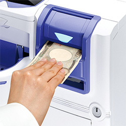
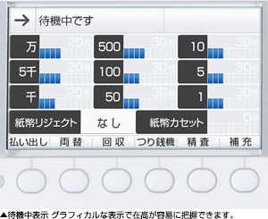

# GLORY 380シリーズ

## セルフ決済端末向けつり銭機380シリーズ

## 特長

### スリム端末にも収まる幅400mmのコンパクトサイズ

紙幣・硬貨の各ユニットを横置き設置しても幅は400mmとコンパクト。スリムな端末でも紙幣・硬貨の入出金口をそろえた使い勝手のよいレイアウトが可能です。

### お客さまの使いやすさを重視した機器レイアウト

#### 入出金ガイドランプ

入出金ガイドランプにより、紙幣・硬貨それぞれの入出金部分を分かりやすく伝え、お客さまをスムーズに誘導します。また入出金部が１カ所に集中したレイアウトのため、つり銭の取り忘れを防止します。

#### 紙幣長手水平挿入方式

駅の券売機や自動販売機、電子マネーのチャージ機などと同様の紙幣長手挿入方式を採用。お客さまに馴染みのある使い方でスムーズに入金ができます。

### 店舗スタッフの保守・管理がしやすい

取引中にエラーが発生した場合でも、自動でエラー解除を実行します。また人によるエラー解除が必要な場合でも、アニメーションでエラー解除方法を分かりやすくガイダンスします。  
操作性は、当社つり銭機300シリーズと同じなので、店舗スタッフ側の取り扱いもスムーズに取り扱いができます。

### ４.３インチカラーディスプレー搭載

機内在高をはじめ、万が一のトラブル時の復旧ガイダンスに至るまで、さまざまな情報をリアルタイムで分かりやすく確認できます。

### つり銭機の稼動・操作履歴もすぐに把握

#### 履歴参照機能

つり銭機の稼動履歴（取引内容・動作状況など）が確認ができます。  
必要に応じていつでも履歴確認が可能なので、万が一のトラブル発生時にも状況確認が速やかに行えます。

#### 装置監視機能

つり銭機内部の収納庫の開閉など、つり銭機操作を監視し、ログとして記録・管理します。  
つり銭機の稼動履歴とあわせて、より厳正な管理を実現します。

## スペック

#### 硬貨つり銭機RT-380

| 外形寸法 | 260（W）×540（D）×130（H）mm　※突起部を除く |
| --- | --- |
| 質量 | 約22kg |
| --- | --- |
| 消費電力 | \[RAD-380接続時\]　待機時20W　定格140W（50 / 60W） |
| --- | --- |

#### 紙幣つり銭機RAD-380

| 外形寸法 | 140（W）×540（D）×260（H）mm　※突起部を除く |
| --- | --- |
| 質量 | 約19kg　※電源部を除く　電源部：約1.5kg |
| --- | --- |
