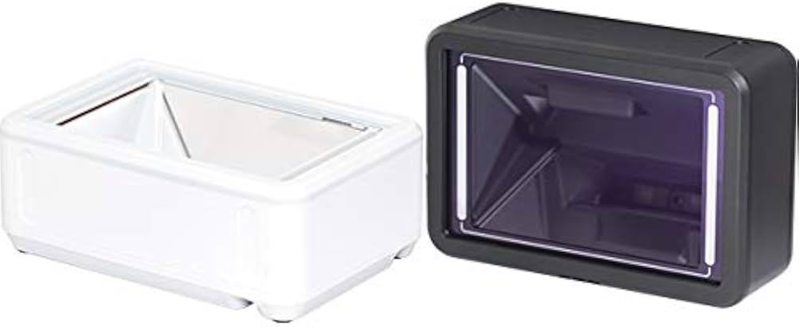
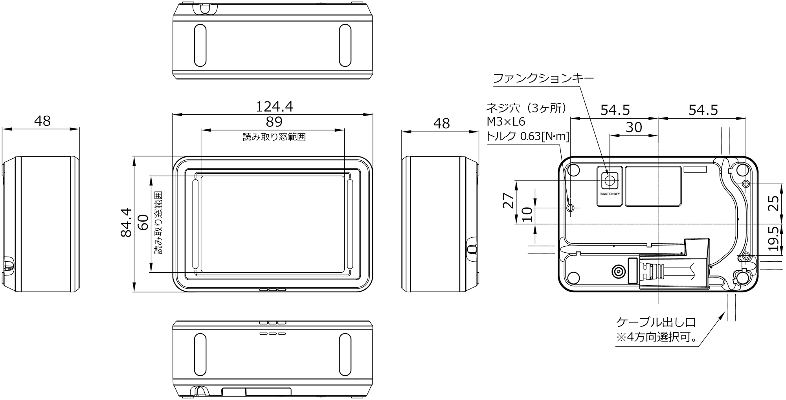
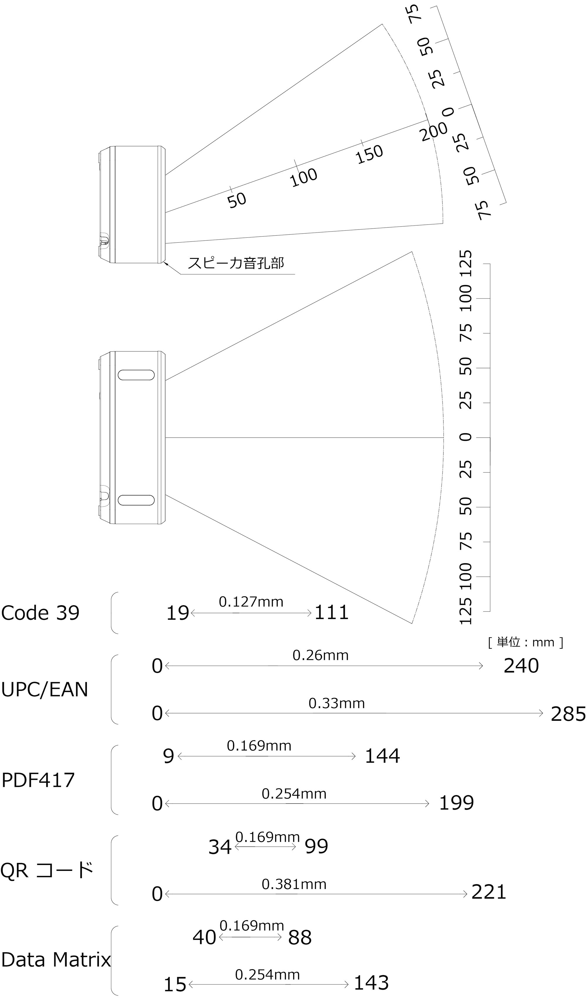
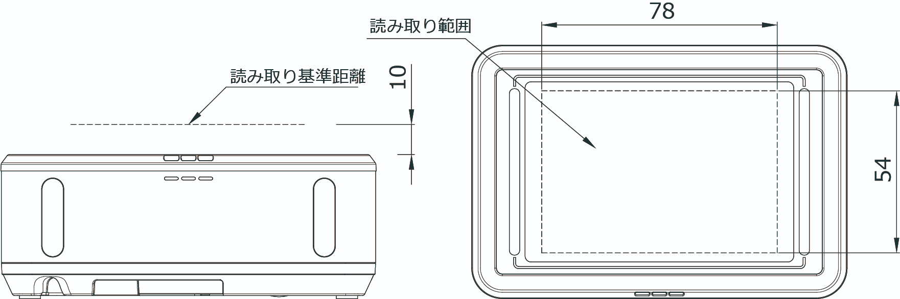

# OPTICON M-11

‌

## 特長

* 組み込みに最適 スクエアボディ  
  POSレジ、キオスク端末、自動ゲートなど
* 卓上最適 スッキリデザイン  
  モバイル決済やチケットリーダの利用もOK
* 液晶画面シンボル読み取り
* スキャンウィンドウに強化アクリル採用
* 聞き取りやすい前面スピーカ採用
* インターフェイス　  
  USB\[HID/COM\]、RS232C

## 仕様

| 標準品と型式 |
| --- |
| M-11-WHT-USB | 白色筐体 USB-HID 2.1ｍケーブル |
| --- | --- |
| M-11-BLK-USB | 黒色筐体 USB-HID 2.1ｍケーブル |
| --- | --- |

| インターフェイス |
| --- |
| USB | USB 2.0 Full Speed 12 Mbps (HID/COM)、USB-A |
| --- | --- |
| RS-232C | 300 ～ 115200 bps、D-Sub9pin |
| --- | --- |
| 電源部 |
| 動作電圧 | 5.0 V(4.5 ～ 5.5 V) |
| --- | --- |
| 消費電流  
(USB High-Power: 500mA) | 読取時: 445 mA (max)  
待機時: 190 mA (typ) |
| --- | --- |
| 光学部 |
| 読み取り光源 | 電球色 LED × 2 個 (ハンズフリーモード)  
上部パネル　白色LED　2箇所(スクリーン優先モード) |
| --- | --- |
| 読み取り方式 | モノクロCMOS エリアセンサ |
| --- | --- |
| 読み取り画素数 | 100 万画素 (H: 1280 × V: 800) |
| --- | --- |
| 画像取得速度 | 120 fps (最速値) |
| --- | --- |
| 視野角 | 水平 約 48.0°、垂直 約 30.8° |
| --- | --- |
| 読み取り基準位置  
(スクリーン優先モード) | 距離:10mm、 水平×垂直:78×54mm(Typical値) |
| --- | --- |
| 読取部 |
| 読み取りコード  
(1次元コード) | \[1次元コード\]  
JAN-13, JAN-8, EAN-13, EAN-8, EAN-13 Add-on/EAN-8 Add-on, UPC-A, UPC-E, UPC-A Add-on, UPC-E Add-on, Code 39, NW-7(Codabar), Industrial 2 of 5, Interleaved 2 of 5, Code 93, Code 128, GS1-128, MSI/Plessey  
\[ポスタルコード\]  
Japan Postal, Intelligent Mail Barcode, POSTNET, PLANET, Netherlands KIX Code, UK Postal, Australian Postal, Korean Postal Authority code |
| --- | --- |
| 読み取りコード  
(GS1/合成シンボル) | GS1 DataBar, GS1 DataBar Limited, GS1 DataBar Expanded, Composite GS1-DataBar, Composite GS1-128, Composite EAN/UPC |
| --- | --- |
| 読み取りコード  
(2次元コード) | PDF417, MicroPDF417, Codablock F, QRコード, マイクロQRコード, Data Matrix (ECC 200), MaxiCode (Modes 2 to 5), Aztec Code, Chinese-Sensible Code |
| --- | --- |
| 読み取りコード(OCR) | Machine Readable Travel Documents, OCR-A/B |
| --- | --- |
| ピッチ角度 | ±60° |
| --- | --- |
| スキュー角度 | ±70° |
| --- | --- |
| チルト角度 | 360° |
| --- | --- |
| 最小 PCS 値 | 0.3 以上、反射率差 (MRD) 23% 以上 |
| --- | --- |
| 最小分解能 (PCS 0.9 の場合) | 0.1 mm (Code 39)  
0.169 mm (GS1 Databar、Composite Code、PDF417、QRコード)  
0.169 mm (Data Matrix) |
| --- | --- |
| インジケータ | サイドバー3色LED表示, スピーカ |
| --- | --- |
| 画像データ形式 | BMP、JPEG |
| --- | --- |
| 環境特性 |
| 動作温度 | -5 ～ 45 ℃ (AC アダプタ 0 ～ 40 ℃) |
| --- | --- |
| 保存温度 | -30 ～ 60 ℃ (AC アダプタ -20 ～ 85 ℃) |
| --- | --- |
| 動作湿度 | 10 ～ 90%RH (非結露、非氷結) |
| --- | --- |
| 保存湿度 | 10 ～ 90%RH (非結露、非氷結) |
| --- | --- |
| 耐外乱光　蛍光灯 | 10,000 lx 以下 |
| --- | --- |
| 耐外乱光　太陽光 | 100,000 lx 以下 |
| --- | --- |
| 耐静電気 | 破壊なし　 : ±15 kV (気中放電、直接)  
誤動作なし: ±8 kV (気中放電、直接) ±6 kV (接触放電、直接/間接) |
| --- | --- |
| 耐落下強度 | 高さ 150 cm からコンクリート床面に計 18 回 (6 面 x 3 回) 自由落下後、読み取りが可能なこと。 |
| --- | --- |
| 防塵・防滴 | IP42 相当 |
| --- | --- |
| 物理仕様 |
| 外形寸法 | 約84.4(D)×124.4(W)×48(H)mm |
| --- | --- |
| 質量 | 約 220 g (ケーブルを除く) |
| --- | --- |
| ケーブル長 | 2.1 m |
| --- | --- |
| 読み取り窓 | 鉛筆硬度:6H～7H/モース硬度:4相当 |
| --- | --- |
| 適合法令および規格 |
| LED 安全規格 | IEC 62471 リスク免除グル-プ |
| --- | --- |
| EMC | VCCI クラス B / FCC Class B / EN55032 Class B |
| --- | --- |
| 環境負荷抑制対応 | RoHS 指令 |
| --- | --- |
| 付属品 |
| 付属品 | 吸着ジェルシート、AC アダプタ (RS-232Cのみ ※RS-232Cモデルについてはお問合せください。) |
| --- | --- |

‌

外観図[単位:mm]
分解能図[単位:mm]
読み取り範囲[単位:mm]
‌
