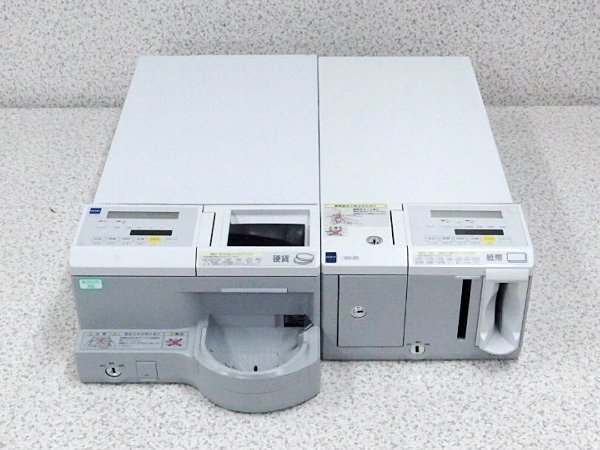
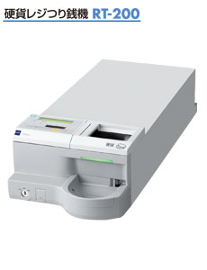
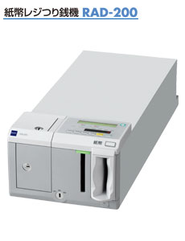

# GLORY 200シリーズ

‌

200シリーズ
‌

RT-200
‌

| 硬貨レジつり銭機 ＲＴ-200 |
| --- |
| 取扱金種 | 国内発行貨現行6金種 |
| 投出速度 | \[一括出金時\]約2.7秒/1取引(999円最小構成枚数かつリトライなし) |
| 投出口容量 | 約50枚(100円硬貨換算) |
| 投入口容量 | 約50枚(100円硬貨換算) |
| 取込(搬送)速度 | 約6枚/秒 |
| 収納枚数 | 500円硬貨：約105枚、100円・10円・1円硬貨：各160枚  
50円・5円硬貨：各約120枚 |
| 回収方法 | 投出口より回収(全金種一括または金種指定)※トレースル―機構あり |
| リジェクト機能 | \[入金\]トレー払出 |
| 表示 | 6桁ＬＥＤ： 投出金額、投入金額、金種別収納枚数、  
　　　　　　　 金種別収納金額、エラーコード等  
ＬＣＤ(20桁×２行）：稼働状態  
ＬＥＤランプ：緑／赤 |
| 操作部 | 6キー（払出・両替・回収・在高・リセット・スタート） |
| 外部接続 | RS-232C×1 |
| 外形寸法 | \[突起部含む\]260(W)×630(D)×145(H)㎜  
\[突起部除く\]260(W)×580(D)×125(H)㎜ |
| 質量（重量） | 約25㎏ |
| 使用電源 | AC100V±10V　(50/60Hz) |
| 消費電力 | 待機時23W/23W (50/60Ｈｚ）  
最大時166VA/170VA (50/60Hz) |

‌

RAD-200
| 紙幣レジつり銭機 ＲAD-200 |
| --- |
| 取扱金種 | 日本銀行券現行4金種 |
| 投出速度 | 約2.7秒/1取引(9,000円最小構成枚数) |
| 投出口容量 | 最大10枚 |
| 投入口容量 | 最大20枚 |
| 取込(搬送)速度 | 約2.5枚/秒 |
| 収納枚数 | 一万円紙幣：100枚、五千円・二千円紙幣（選択式）：100枚  
千円紙幣：200枚 |
| 回収方法 | 回収カセット×1（200枚） |
| リジェクト機能 | \[入金\]機内リジェクトボックス／払出口（設定により選択可）  
\[出金\]機内リジェクトボックスに収納 |
| 機内リジェクトボックス | 最大20枚 |
| 表示 | 7桁ＬＥＤ： 投出金額、投入金額、金種別収納枚数、  
　　　　　　　 金種別収納金額、エラーコード等  
ＬＣＤ(20桁×２行）：稼働状態  
ＬＥＤランプ：緑／赤 |
| 操作部 | 6キー（払出・両替・回収・在高・リセット・スタート） |
| 外部接続 | RS-232C×2 |
| 外形寸法 | \[突起部含む\]220(W)×590(D)×145(H)㎜  
\[突起部除く\]220(W)×570(D)×125(H)㎜ |
| 質量（重量） | 約15㎏　※電源部除く（電源部約2kg） |
| 使用電源 | AC100V±10V　(50/60Hz) |
| 消費電力 | 待機時15W/15W (50/60Ｈｚ）  
最大時130VA/170VA (50/60Hz) |
