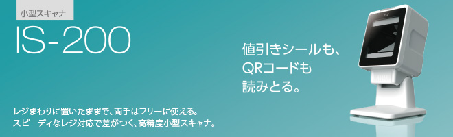
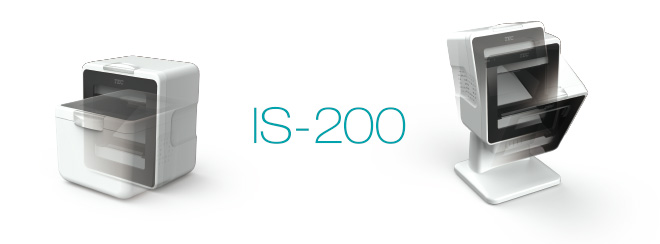
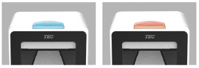
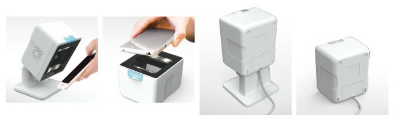

# TEC IS-200

‌

### 主な特長

#### 多彩なスキャンに対応、設置スタイルも自在。高精度小型スキャナ

‌

##### 小型ながら値引きシール、QRコードも読み取りOK。

イメージセンサの搭載により、値引きシール、QRコード、お客様のスマホ表示など多彩なスキャンに対応します。

##### LED表示で読み取りが確認できて、安心。

正常なスキャン時は青、エラー時はオレンジのLEDで表示。スキャニングできたかなどの操作状況が、離れた場所からでも把握できます。

##### お店の運用に応じて平置き、スタンド付きなど使い方自在。

スタンドはチルト機構により、角度調整が可能。また、本体のみの手持ちスキャンはもちろん、平置きにすれば、お客様のスマホに表示されたQRコードなどの読み取りにも便利です。

### IS-200の主な仕様

| IS-200-G-24S-S（汎用タイプ） |
| --- |
| 使用電源 | ホストよりバスパワー供給  
直流5V±5% |
| 消費電流 | 900mA以下 |
| 使用温度範囲 | 5℃～35℃ |
| 使用湿度範囲 | 10%～80%（ただし、結露なきこと） |
| 読み取り可能  
バーコード | 標準 | JAN-8/13、EAN-8/13、UPC-A/E |
| オプション | CODE39/93/128、ITF、CODABAR（NW7）、GS1 DataBar オムニダイレクショナル、GS1 DataBar トランケート、 GS1 DataBar スタック、GS1 DataBar スタックオムニダイレクショナル、GS1 DataBar リミテッド、GS1 DataBar エクスパンデッド、 GS1 DataBar エクスパンデッドスタック、多段（2/3段）バーコード（JAN-8/13,EAN-8/13いずれかの組み合わせ可能） 、 EAN-8/13、UPC-A/Eのアドオン2桁または5桁、QR（モデル2） |
| 光源 | 白色LED |
| インターフェース | USB2.0（パスパワーは消費電流を参照） |
| コネクタ形状 | USB Mini-B |
| チルト可動域 | 前30°、後15° |
| 通信ケーブル長 | 2400㎜ |
| 本体寸法 | W85×D67×H101.5㎜･･･付属品を除く |
| 本体重量 | 約350g･･･付属品除く |
| 付属品 | チルトスタンド×1個、通信ケーブル×1本、コネクタカバー×1個、ゴムキャップ×1個、結束バンド×1個、 チルトスタンド取付用板金×1個、ゴム足×4個、ネジ穴隠しシート×1枚、ネジ（M4×12 Wセムス）×1個、 ナベ小ねじ（M3×10 Pタイト）×1個、保証書×1式、安全上のご注意×1冊、設置手順書×1枚 |

‌

