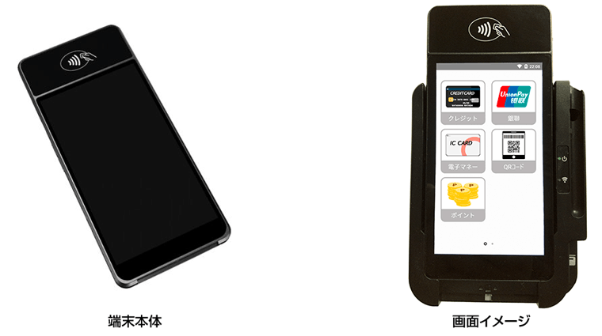
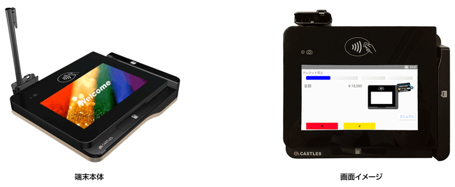

# Saturn 1000シリーズ

## **【SATURNシリーズ】**

VEGAシリーズの後継として次世代端末SATURNシリーズが2022年１月に新製品としてリリースされました。

 

## **【製品の種類】**

1000Elite　1000Laneの２種類となります。

###  ①薄型モバイル決済端末 1000 Elite

薄型で携帯性に優れた決済端末であり特にテーブル決済等に真価を発揮します。クレードルにはオートカッター付きのプリンターが搭載されています。端末単体での利用に加えPOS連動でのご使用にも優れています。

### ②据置き型決済端末 1000 Lane

POS連動のPINPADとしてご利用できます。

‌

## **【製品の特長】**

・直感的なユーザーインターフェイスを備えておりますので、初めての操作でもストレス無く使用できます。

・AndroidOSを採用し5インチタッチディスプレイ、NFCリーダー、フロントカメラやWifi、Bluetooth、4GLTE/3Gを搭載しています。

・クレジット決済をはじめ、電子マネー、コード決済、ポイント処理に対応しています。

・アプリケーションはお客様の要望に応じカスタマイズが可能です。

・クレジットカード読み取り端末のセキュリティ基準であるPCI-PTS Ver5.xの認定を獲得済みです。

 

## **【搭載する決済の種類】**

（１）クレジット決済

磁気、接触IC、非接触IC　(主要なブランド対応済み) への対応

（２）銀聯決済

磁気、接触IC、非接触ICへの対応

（３）電子マネー決済

主要な交通系電子マネーなどへの対応

（４）コード決済

主要なコード決済事業者への対応

（５）ポイント

主要な共通ポイント事業者への対応

‌

販売会社：株式会社ジィ・シィ企画

‌
