# GLORY N300シリーズ

‌

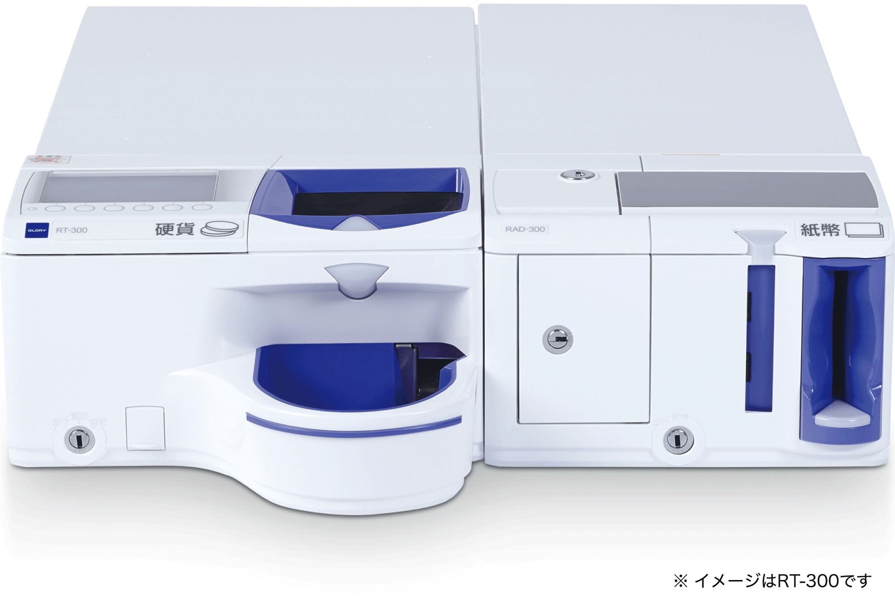
‌

## 特長

#### 店舗との調和を考慮したデザイン

どんな店舗でも馴染みやすいカラーを採用。  
ホワイトとブラックの2色のラインアップで店舗イメージや周辺機器に合わせてカラー選択出来ます。  
コントラストのある配色によって入出金口を強調し、迷うことなく操作が可能です。

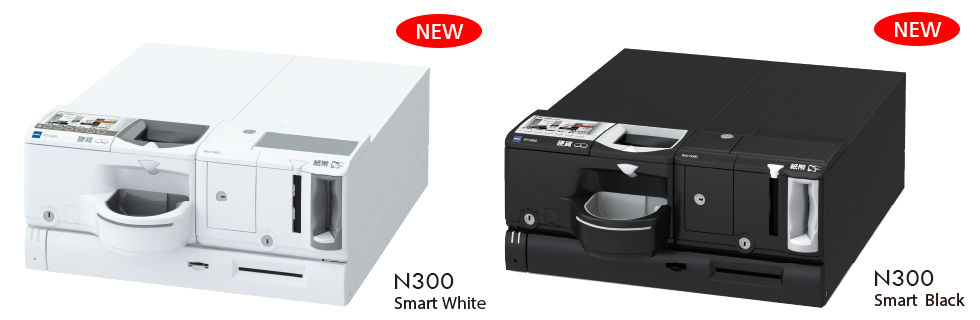
#### 抗菌カバーの採用

硬貨トレーや操作ボタン等、レジ業務時に頻繁に手が触れる部分に抗菌樹脂を採用。  
衛生的な状態でつり銭機をご利用いただけます。

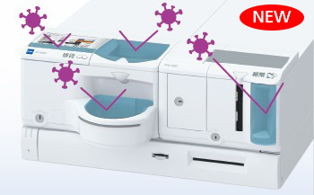
#### 大画面で見やすい4.3インチカラーディスプレー搭載

機内残高をはじめ、万が一のトラブル時の復旧ガイダンスに至るまで、さまざまな情報をリアルタイムで分かりやすく確認することができます。

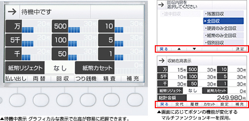
#### エラー解除ガイダンスを標準搭載

トラブル発生時は、エラーの解除方法を液晶画面にアニメーションで分かりやすく表示。  
画面に従って操作をしていくことでスムーズな復旧が可能になります。

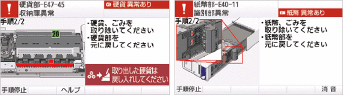
#### つり銭機の稼動･操作履歴もすぐに把握

##### 履歴参照機能

つり銭機の稼働履歴（取引内容・動作状況など）の確認ができます。  
履歴は必要に応じていつでも確認が可能なので、万が一のトラブル発生時には状況確認が速やかに行えます。

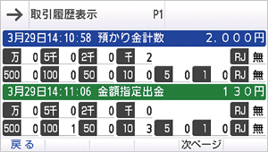
##### 装置監視機能

装置内部や収納庫の開閉など、つり銭機に関する操作を監視し、ログとして記録し管理します。  
つり銭機の稼働履歴とあわせてより厳正な管理を実現します。

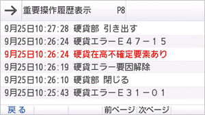
#### つり銭機補充ガイダンス

エンプティ時やフル時にはアラートを表示します。さらに、機内のつり銭が少なくなると「どの金種を、どれだけ補充すれば良いか」を待機画面で表示します。

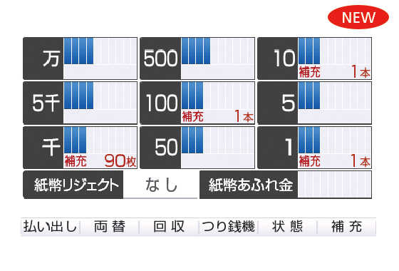
#### ログ分析ツールの提供

ユーザー自身で取得したログを分析ツールにかけることで、PC上で稼働履歴や在高推移が確認可能。トラブル時の調査や店舗運用の見直しをサポートします。

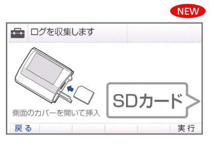

#### 機内状態のリアルタイム表示

従来の在高不確定時の表示に加え、エンプティー時やフル時の処理内容が表示されるので、誰でも簡単につり銭機を使いこなすことができます。

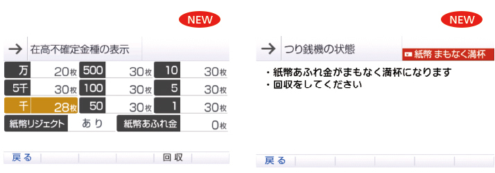

#### 硬貨・紙幣ユニットの左右置き換えが自在

硬貨･紙幣それぞれのつり銭機は独立したユニットになっているので、使用環境に合わせたレイアウトも可能です。

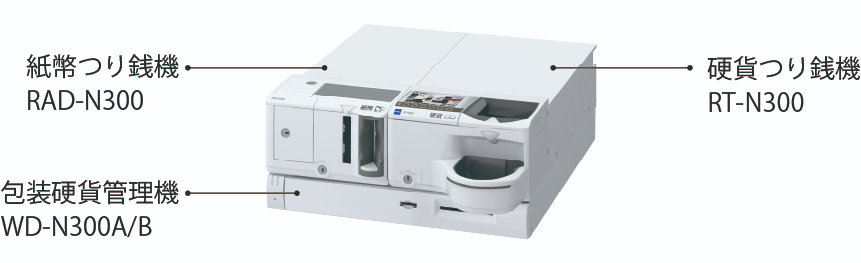

## スペック

#### 硬貨つり銭機　RT-N300

| 外形寸法 | 260（W）×540（D）×130（H）mm　※突起部を除く |
| --- | --- |
| 質量 | 約14kg |
| --- | --- |
| 収納枚数 | 500円硬貨：約105枚、100円・10円・1円硬貨：各約160枚、50円・5円硬貨：各約120枚 |
| --- | --- |
| 消費電力 | \[RAD-N300接続時\] 待機時20W 定格140W 省電力時 13W(50 / 60Hz)  
\[RAD-N300 / WD-N300接続時\] 待機時22W 定格140W 省電力時 16W(50 / 60Hz) |
| --- | --- |

#### 紙幣つり銭機　RAD-N300

| 外形寸法 | 220（W）×540（D）×130（H）mm　※突起部を除く |
| --- | --- |
| 質量 | 約14kg |
| --- | --- |
| 収納枚数 | 一万円紙幣：100枚、五千円・二千円紙幣（選択式）：100枚、千円紙幣：200枚、回収カセット：200枚、リジェクトボックス：20枚 |
| --- | --- |

#### 包装硬貨管理機　WD-300

| 外形寸法 | 480（W）×535（D）×65（H）mm　※突起部を除く、スペーサーを含む |
| --- | --- |
| 質量 | 約13kg |
| --- | --- |
| 収納枚数 | ドロワータイプ（WD-N300A）  
500円・50円・5円：各1本、100円・10円･1円：各4本  
※500円硬貨20枚巻の場合は2本、ただし、別売アタッチメントと設定変更が必要です。  
損貨収納部×1（前面スロット）、現金外収納部×1（前面スロット）、予備紙幣収納部×１（約100枚）、  
予備硬貨収納部×6（各約10枚）、硬貨オーバーフロー収納箱×1（約50枚：10円硬貨換算） 大収納量タイプ（WD-N300B）  
500円・50円・5円：各2本、100円・10円･1円：各8本  
※500円硬貨20枚巻の場合は4本、ただし、別売アタッチメントと設定変更が必要です。 |
| --- | --- |
