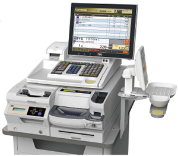

# M-8750

‌

### 商品仕様

|  | オペレータ表示  
12.1型カラーTFT＋客面蛍光表示器 | オペレータ表示  
12.1型カラーTFT＋客面12.1型カラーTFT | オペレータ表示  
12.1型カラーTFT＋客面7型カラーTFT | オペレータ表示  
15型カラーTFT＋客面7型カラーTFT | （※）オペレータ表示  
15型カラーTFT＋客面12.1型カラーTFT |
| --- | --- | --- | --- | --- | --- |
| 外形寸法 | 439～503(W)×530～627(D)×456～517(H)mm  
※客面表示の向き・高さによって異なります（7型客面表示は含まず） |
| 質量 | 約21kg | (※)約23kg | 約20kg+7型：2.5kg  
（コイントレイ、海綿トレイ、L型取付金具は含まず） | 約21kg+7型：2.5kg  
（コイントレイ、海綿トレイ、L型取付金具は含まず） | (※)約24kg |
| OS | サテライト：Microsoft® Windows® Embedded POS Ready 2009  
マスター：Microsoft® Windows Server® 2008 Standard SP2　Microsoft® Windows Server® 2012R2 Standard with spring update |
| CPU | 64ビット デュアルコアプロセッサ |
| メモリ | 4GB |
| 補助記憶 | HDD | マスターのみ：120GB×2 |
| SSD | サテライトのみ：60GB×1 |
| LAN  
(10/100/1000BASE-T) | ○ |
| 内蔵UPS | ○（シャットダウン・瞬停用） |
| カードリーダ | JIS II、ISO2 |
| プリンタ | 印字方式：発色型感熱記録方式ラインサーマル  
文字：漢字JIS第1・第2水準 ANK特殊記号 |
| 表示 | オペレータ | 12.1型カラーTFT（タッチパネル）  
スイーベル15°／チルト45°～70° | 15型カラーTFT（タッチパネル）  
スイーベル15°／チルト45°～70° |
| 客面 | 漢字16桁×3段  
スイーベル左右150°／チルト45° | (※)12.1型カラーTFT  
チルト45°～70° | （※）7型カラーTFT（タッチパネル）スイーベル左右15°／チルト20° | (※)12.1型カラーTFT  
チルト45°～70° |
| 用紙 | 58mm幅 ※テックサーマルロール58R-80-TRとご指定ください |
| キーボード | max104キー |

‌
