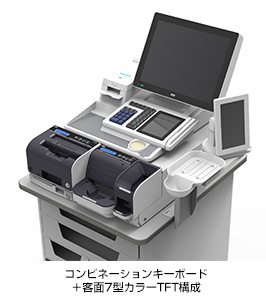
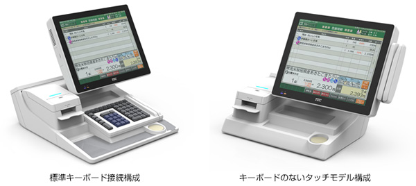

# M-9000シリーズ

## 「M-9000シリーズ」の特長

#### 1)制御部とフルフラットディスプレイが一体となった新筐体

本製品は、制御部とディスプレイを一体化したことにより、操作範囲が小さくなり、操作の負担軽減に寄与いたします。またエンジンは高性能CPUを搭載し、最新のOSであるWindows10を採用。さらにディスプレイのフルフラット化を実現。デザイン性に優れ、清掃のしやすい構造になりました。

#### 2)機器を自由に選択可能

これまでのPOSターミナルは、本体と周辺機器を一体で提供していましたが、本製品では従来の販売形態に加え、本体（制御部）、キーボード部、客面表示部、プリンタ部をそれぞれ自由に選択可能としました。これによりユーザーの店舗運用にあった機器構成が可能になりました。

#### 3)新型高速マルチカットプリンタ（ニアエンドセンサー付き）搭載

搭載するレシートプリンタは、従来の1.25倍の印字スピードである300mm/sを実現しました。また、LEDを搭載することで、販促レシートなどの特別なレシートが発行された時やレシートの残量が減った時などにLEDにより操作者が視覚的に状態が分かるようになりました。さらに、フルカットとパーシャルカットをアプリケーションでコントロールすることができます。

#### 4)コンビネーションキーボード搭載

キーボードとサブディスプレイを一体型にした「コンビネーションキーボード」を機器構成のラインアップに追加しました。コンビネーションキーボードは、従来の画面で表示し切れなかった補足情報や店内のコミュニケーションツールとして活用できます。（コンビネーションキーボードの発売は2018/3予定です）

### 「M-9000」の主な仕様

| 外形寸法 | 400(W)×307～455(D)×246～379(H)  
※機器構成・表示器の高さにより異なります。（客面表示は含まず）  
幅及び奥行はフットスペース寸法となります。 |
| --- | --- |
| 質量 | 13.5kg～15kg  
※機器構成・表示器の高さにより異なります。（客面表示は含まず） |
| --- | --- |
| OS | Windows10(Windows 10 IoT Enterprise 2016 LTSB) |
| --- | --- |
| CPU | Intel Skylake-H |
| --- | --- |
| メモリ | 4GB(最大8GB) |
| --- | --- |
| 補助記憶装置 | サテライト:60GB×1、マスタ:120GB×2 |
| --- | --- |
| UPS | 内蔵(シャットダウン・瞬停用) |
| --- | --- |
| カードリーダー | JISII、ISO2 |
| --- | --- |
| プリンタ | 発色型感熱記録方式サーマル  
漢字JIS第1・第2水準ANK特殊記号  
オプションにてパーシャルカットへ変更可能 |
| --- | --- |
| 表示 | フロント表示:15型カラーTFT(タッチパネル付き)  
客面表示は以下から選択可能。  
・12型カラーTFT(タッチパネル付き) ※2018/3発売予定  
・7型カラーTFT(タッチパネル付き)  
・漢字16桁×3段 |
| --- | --- |
| 用紙 | 58mm幅 |
| --- | --- |
| キーボード | 以下から選択可能。  
・最大70キータイプ  
・最大40キータイプ ※2018/3発売予定  
・コンビネーションキーボードタイプ ※2018/3発売予定 |
| --- | --- |
| ドロワ | オプション |
| --- | --- |

### 「M-9000シリーズ」の発売概要

| 商品名 | WILLPOS Unity M-9000 |
| --- | --- |
| 発売日 | 2017年（平成29年）9月1日 |
| --- | --- |
| 価格 | 1,140,000円～（税別） |
| --- | --- |
| 発売地域 | 全国 |
| --- | --- |
| 販売予定数 | 20,000台/年間 |
| --- | --- |
| 販売ターゲット | 食品スーパー、ホームセンター、ドラッグストア等の量販店 |
| --- | --- |

東芝テック株式会社は、食品スーパーマーケット等の量販店向けにPOSターミナル「WILLPOS Unity M-9000シリーズ」を2017年（平成29年）9月1日から発売いたします。

M-9000シリーズは従来のM-8000シリーズのコンセプトを継承しつつ、より使いやすくフレキシブルな機器構成を可能としました。制御部とフルフラットディスプレイが一体となった対面性に優れた新筐体を採用したことにより、スタイリッシュなデザインを実現しながらタッチパネル、キーボード、自動釣銭機、ドロワの配置を近づけ、操作性を向上させました。さらに、各種周辺機器をユニット化したことにより、従来のPOSターミナルの構成からキーボードのないタッチタイプやセルフタイプの構成等、十店十色それぞれのチェックアウトシーンにあわせたフレキシブルな構成が可能になりました。

‌

‌
