# お札の基本情報

**発行順を表すため、お札をABCDEFの記号で区別することがあります。2024（令和6）年7月3日から発行されたお札は、戦後6番目の発行ということで、「F券」と呼ばれています。**

※2024年7月3日に、一万円、五千円、千円の3券種を改刷しました。

## F一万円券

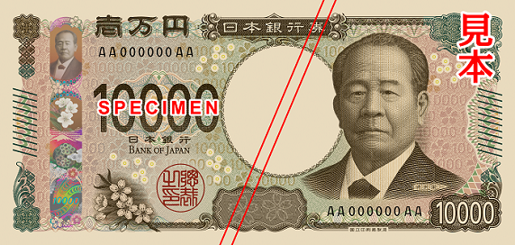F一万円券(表)
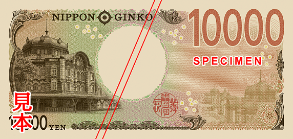F一万円券(裏)
| 図柄 | 表面には、生涯に約500もの企業の設立などに関わったと言われ、実業界で活躍した渋沢栄一（しぶさわ・えいいち）の肖像を描いています。裏面には、「赤レンガ駅舎」として親しまれた歴史的建造物（重要文化財）の東京駅（丸の内駅舎）を描いています。 |
| --- | --- |
| 寸法 | 縦76mm、横160mm |
| --- | --- |
| 色数 | 表面は、凹版2色・地模様など11色。裏面は、凹版1色・地模様など6色。 |
| --- | --- |
| 発行開始日 | 令和6年（2024年）7月3日 |
| --- | --- |
| 記番号 | 黒色 |
| --- | --- |

## F五千円券

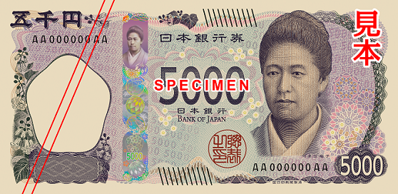F五千円券(表)
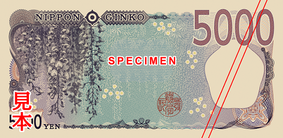F五千円券(裏)
| 図柄 | 表面には、女子英学塾（現：津田塾大学）を創設するなど、近代的な女子高等教育に尽力した津田梅子（つだ・うめこ）の肖像を描いています。裏面には、古事記や万葉集にも登場し、古くから親しまれている花（フジ（藤））を描いています。 |
| --- | --- |
| 寸法 | 縦76mm、横156mm |
| --- | --- |
| 色数 | 表面は、凹版2色・地模様など11色。裏面は、凹版1色・地模様など6色。 |
| --- | --- |
| 発行開始日 | 令和6年(2024年）7月3日 |
| --- | --- |
| 記番号 | 黒色 |
| --- | --- |

## F千円券

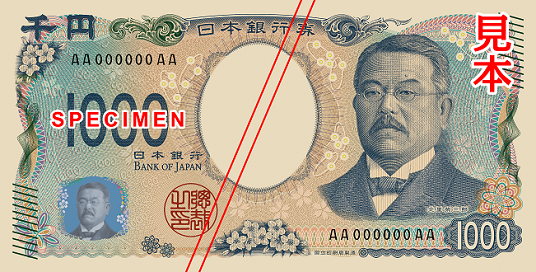F千円券(表)
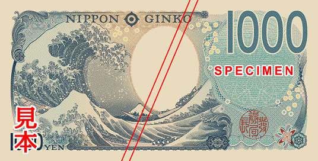F千円券(裏)
| 図柄 | 表面には、破傷風血清療法の確立、ペスト菌の発見のほか、伝染病研究所、北里研究所を創立し後進の育成にも尽力した北里柴三郎（きたさと・しばさぶろう）の肖像を描いています。裏面には、江戸時代の浮世絵師・葛飾北斎の代表作で知名度も高く、世界の芸術家に影響を与えた「富嶽三十六景（神奈川沖浪裏）」を描いています。 |
| --- | --- |
| 寸法 | 縦76mm、横150mm |
| --- | --- |
| 色数 | 表面は、凹版2色・地模様など11色。裏面は、凹版1色・地模様など6色。 |
| --- | --- |
| 発行開始日 | 令和6年(2024年）7月3日 |
| --- | --- |
| 記番号 | 黒色 |
| --- | --- |

## E一万円券

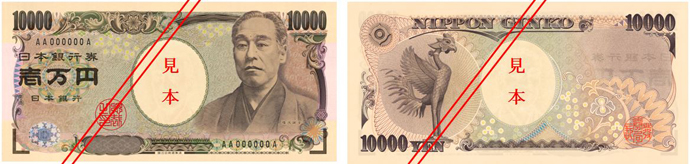E一万円券
| 図柄 | 表面には、明治の思想家で慶應義塾大学を設立した福沢諭吉（ふくざわゆきち）の肖像を描いています。裏面には、平等院鳳凰堂に据えられている鳳凰像を描いています。 |
| --- | --- |
| 寸法 | 縦76mm、横160mm |
| --- | --- |
| 色数 | 表面は、凹版2色・地模様など12色。裏面は、凹版1色・地模様など6色。 |
| --- | --- |
| 発行開始日 | 平成16年（2004年）11月1日 |
| --- | --- |
| 記番号 | 黒色　平成16年（2004年）11月1日発行分から  
褐色　平成23年（2011年）7月19日発行分から |
| --- | --- |

## E五千円券

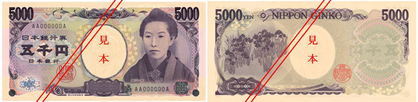E五千円券
| 図柄 | 表面には、明治時代の小説家・歌人の樋口一葉（ひぐちいちよう）の肖像を描いています。裏面には、江戸時代の画家である尾形光琳（おがたこうりん）作の国宝「燕子花図」（かきつばたず）の一部を描いています。 |
| --- | --- |
| 寸法 | 縦76mm、横156mm |
| --- | --- |
| 色数 | 表面は、凹版2色・地模様など12色。裏面は、凹版1色・地模様など6色。 |
| --- | --- |
| 発行開始日 | 平成16年(2004年）11月1日 |
| --- | --- |
| 記番号 | 黒色　平成16年（2004年）11月1日発行分から  
褐色　平成26年（2014年）5月12日発行分から |
| --- | --- |

## E千円券

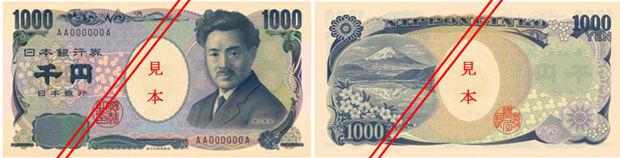E千円券
| 図柄 | 表面には、細菌学者で黄熱病研究に尽力した野口英世（のぐちひでよ）の肖像を描いています。裏面には、世界遺産に登録された富士山と日本を象徴する花である桜を描いています。 |
| --- | --- |
| 寸法 | 縦76mm、横150mm |
| --- | --- |
| 色数 | 表面は、凹版2色・地模様など11色。裏面は、凹版1色・地模様など6色。 |
| --- | --- |
| 発行開始日 | 平成16年(2004年）11月1日 |
| --- | --- |
| 記番号 | 黒色　平成16年（2004年）11月1日発行分から  
褐色　平成23年（2011年）7月19日発行分から  
紺色　平成31年（2019年）3月18日発行分から |
| --- | --- |

## D二千円券

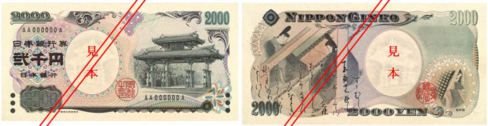D二千円券
| 図柄 | 表面は、世界遺産に登録された沖縄の首里城にある守礼門を主模様として描いています。裏面は、「源氏物語絵巻」第38帖「鈴虫」の絵図に詞書（ことばがき）を重ねた図柄と源氏物語の作者である紫式部（むらさきしきぶ）を描いています。 |
| --- | --- |
| 寸法 | 縦76mm、横154mm |
| --- | --- |
| 色数 | 表面は、凹版4色・地模様など11色。裏面は、凹版1色・地模様など6色。 |
| --- | --- |
| 発行開始日 | 平成12年(2000年）7月19日 |
| --- | --- |
| 記番号 | 黒色　平成12年（2000年）7月19日発行分から |
| --- | --- |

## D一万円券

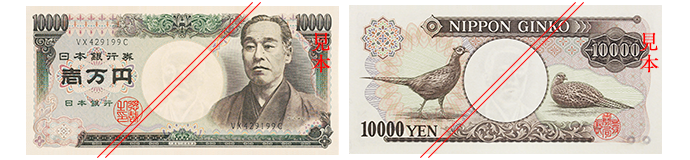D一万円券
| 図柄 | 表面には福沢諭吉（ふくざわゆきち）、裏面にはきじを描いています。 |
| --- | --- |
| 寸法 | 縦76mm、横160mm |
| --- | --- |
| 発行開始日 | 昭和59（1984）年11月1日 |
| --- | --- |
| 支払停止日 | 平成19（2007）年4月2日 |
| --- | --- |
| 記番号 | 黒色　昭和59年(1984年)11月1日発行分から  
褐色　平成5年(1993年)12月1日発行分から |
| --- | --- |

## D五千円券

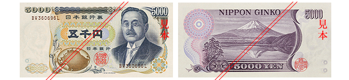D五千円券
| 図柄 | 表面には新渡戸稲造（にとべいなぞう）、裏面には富士山を描いています。 |
| --- | --- |
| 寸法 | 縦76mm、横155mm |
| --- | --- |
| 発行開始日 | 昭和59（1984）年11月1日 |
| --- | --- |
| 支払停止日 | 平成19（2007）年4月2日 |
| --- | --- |
| 記番号 | 黒色　昭和59年(1984年)11月1日発行分から  
褐色　平成5年(1993年)12月1日発行分から |
| --- | --- |

## D千円券

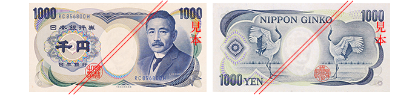D千円券
| 図柄 | 表面には夏目漱石（なつめそうせき）、裏面には鶴を描いています。 |
| --- | --- |
| 寸法 | 縦76mm、横150mm |
| --- | --- |
| 発行開始日 | 昭和59（1984）年11月1日 |
| --- | --- |
| 支払停止日 | 平成19（2007）年4月2日 |
| --- | --- |
| 記番号 | 黒色　昭和59年(1984年)11月1日発行分から  
青色　平成2年(1990年)11月1日発行分から  
褐色　平成5年(1993年)12月1日発行分から  
暗緑色　平成12年(2000年)4月3日発行分から |
| --- | --- |

## C一万円券

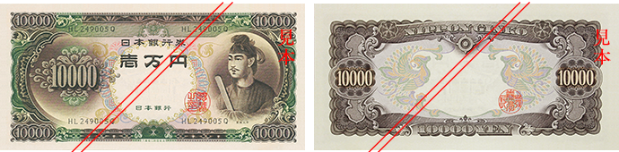C一万円券
| 図柄 | 表面には聖徳太子（しょうとくたいし）、裏面には彩紋を描いています。 |
| --- | --- |
| 寸法 | 縦84mm、横174mm |
| --- | --- |
| 発行開始日 | 昭和33（1958）年12月1日 |
| --- | --- |
| 支払停止日 | 昭和61（1986）年1月4日 |
| --- | --- |

## C五千円券

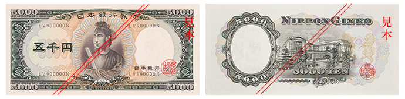C五千円券
| 図柄 | 表面には聖徳太子（しょうとくたいし）、裏面には日本銀行が描かれています。 |
| --- | --- |
| 寸法 | 縦80mm、横169mm |
| --- | --- |
| 発行開始日 | 昭和32（1957）年10月1日 |
| --- | --- |
| 支払停止日 | 昭和61（1986）年1月4日 |
| --- | --- |

## C千円券

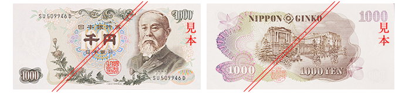C千円券
| 図柄 | 表面には伊藤博文（いとうひろぶみ）、裏面には日本銀行を描いています。 |
| --- | --- |
| 寸法 | 縦76mm、横164mm |
| --- | --- |
| 発行開始日 | 昭和38（1963）年11月1日 |
| --- | --- |
| 支払停止日 | 昭和61（1986）年1月4日 |
| --- | --- |
| 記番号 | 黒色　昭和38年(1963年)11月1日発行分から  
青色　昭和51年(1976年)7月1日発行分から |
| --- | --- |

## C五百円券

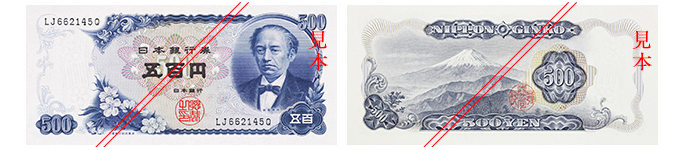C五百円券
| 図柄 | 表面には岩倉具視（いわくらともみ）、裏面には富士山を描いています。 |
| --- | --- |
| 寸法 | 縦72mm、横159mm |
| --- | --- |
| 発行開始日 | 昭和44（1969）年11月1日 |
| --- | --- |
| 支払停止日 | 平成6（1994）年4月1日 |
| --- | --- |

## B千円券

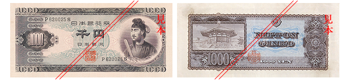B千円券
| 図柄 | 表面には聖徳太子（しょうとくたいし）、裏面には法隆寺夢殿を描いています。 |
| --- | --- |
| 寸法 | 縦76mm、横164mm |
| --- | --- |
| 発行開始日 | 昭和25(1950)年1月7日 |
| --- | --- |
| 支払停止日 | 昭和40(1965)年1月4日 |
| --- | --- |

## B五百円券

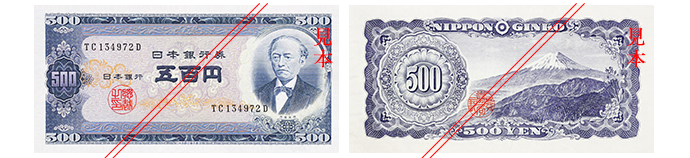B五百円券
| 図柄 | 表面には岩倉具視（いわくらともみ）、裏面には富士山を描いています。 |
| --- | --- |
| 寸法 | 縦76mm、横156mm |
| --- | --- |
| 発行開始日 | 昭和26(1951)年4月2日 |
| --- | --- |
| 支払停止日 | 昭和46(1971)年1月4日 |
| --- | --- |

## B百円券

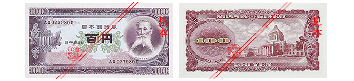B百円券
| 図柄 | 表面には板垣退助（いたがきたいすけ）、裏面には国会議事堂を描いています。 |
| --- | --- |
| 寸法 | 縦76mm、横148mm |
| --- | --- |
| 発行開始日 | 昭和28(1953)年12月1日 |
| --- | --- |
| 支払停止日 | 昭和49(1974)年8月1日 |
| --- | --- |

## B五十円券

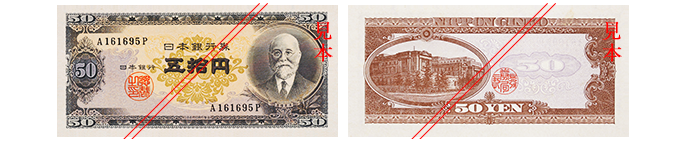B五十円券
| 図柄 | 表面には高橋是清（たかはしこれきよ）、裏面には日本銀行を描いています。 |
| --- | --- |
| 寸法 | 縦68mm、横144mm |
| --- | --- |
| 発行開始日 | 昭和26(1951)年12月1日 |
| --- | --- |
| 支払停止日 | 昭和33(1958)年10月1日 |
| --- | --- |

## A百円券

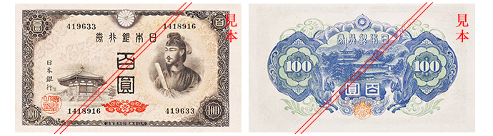A百円券
| 図柄 | 表面には聖徳太子（しょうとくたいし）が描かれています。 |
| --- | --- |
| 寸法 | 縦93mm、横162mm |
| --- | --- |
| 発行開始日 | 昭和21(1946)年2月25日 |
| --- | --- |
| 支払停止日 | 昭和31(1956)年6月5日 |
| --- | --- |

※中央の「百圓」の文字の下にある赤色標識がなく、裏面模様が赤い色のものは失効券です。

## A十円券

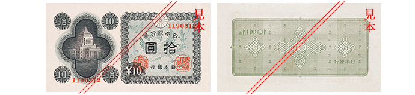A十円券
| 図柄 | 表面には国会議事堂が描かれています。 |
| --- | --- |
| 寸法 | 縦76mm、横140mm |
| --- | --- |
| 発行開始日 | 昭和21(1946)年2月25日 |
| --- | --- |
| 支払停止日 | 昭和30(1955)年4月1日 |
| --- | --- |

## A五円券

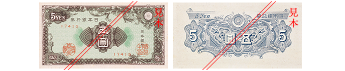A五円券
| 図柄 | 表面には彩紋模様が描かれています。 |
| --- | --- |
| 寸法 | 縦68mm、横132mm |
| --- | --- |
| 発行開始日 | 昭和21(1946)年3月5日 |
| --- | --- |
| 支払停止日 | 昭和30(1955)年4月1日 |
| --- | --- |

## A一円券

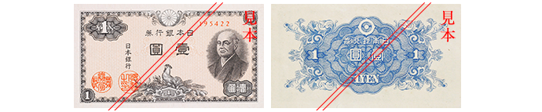A一円券
| 図柄 | 表面には二宮尊徳（にのみやそんとく）が描かれています。 |
| --- | --- |
| 寸法 | 縦68mm、横124mm |
| --- | --- |
| 発行開始日 | 昭和21(1946)年3月19日 |
| --- | --- |
| 支払停止日 | 昭和33(1958)年10月1日 |
| --- | --- |

## い一円券

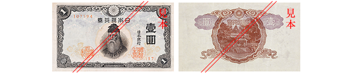い一円券
| 図柄 | 表面には武内宿禰（たけのうちのすくね）が描かれています。 |
| --- | --- |
| 寸法 | 縦70mm、横122mm |
| --- | --- |
| 発行開始日 | 昭和18(1943)年12月15日 |
| --- | --- |
| 支払停止日 | 昭和33(1958)年10月1日 |
| --- | --- |

## 改造一円券

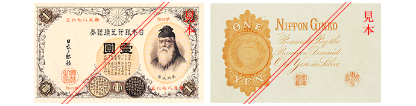改造一円券
| 図柄 | 表面には武内宿禰（たけのうちのすくね）が描かれています。 |
| --- | --- |
| 寸法 | 縦85mm、横145mm |
| --- | --- |
| 発行開始日 | 記番号が漢字：明治22(1889)年5月1日  
記番号が英数字：大正5(1916)年8月15日 |
| --- | --- |
| 支払停止日 | 昭和33(1958)年10月1日 |
| --- | --- |

## 旧一円券

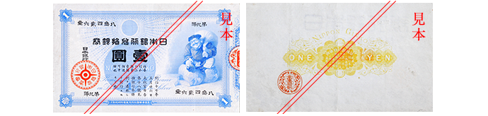旧一円券
| 図柄 | 表面には大黒天が描かれています。 |
| --- | --- |
| 寸法 | 縦78mm、横135mm |
| --- | --- |
| 発行開始日 | 明治18(1885)年9月8日 |
| --- | --- |
| 支払停止日 | 昭和33(1958)年10月1日 |
| --- | --- |
