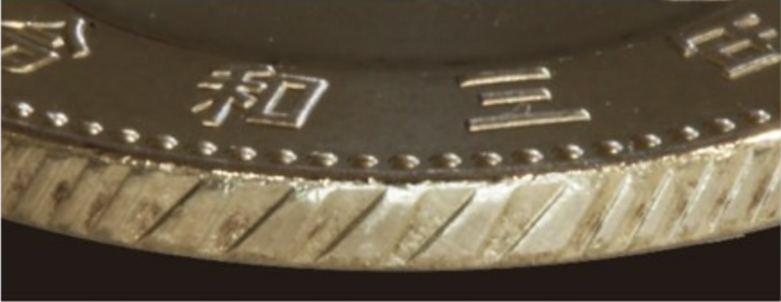
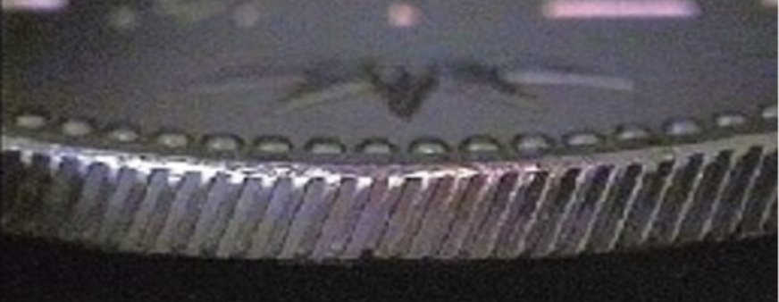
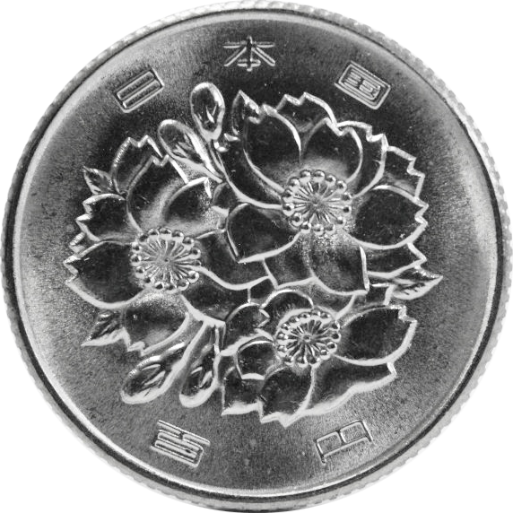
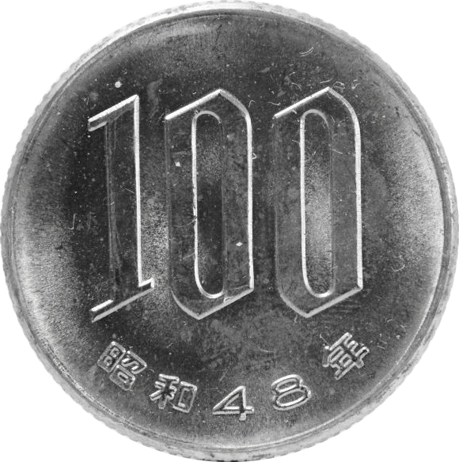

# 現在発行されている銀行券・貨幣

## 一万円券

‌

* **寸法**：76×160mm
* **発行開始日**：令和6（2024）年7月3日

＜表面＞肖像：渋沢栄一
＜裏面＞図柄：東京駅（丸の内駅舎）
‌

* **寸法**：76×160mm
* **発行開始日**：平成16（2004）年11月1日

＜表面＞肖像：福沢諭吉
＜裏面＞図柄：鳳凰像（平等院）
## 五千円券

‌

* **寸法**：76×156mm
* **発行開始日**：令和6（2024）年7月3日

＜表面＞肖像：津田梅子
＜裏面＞図柄：フジ（藤）
‌

* **寸法**：76×156mm
* **発行開始日**：平成16（2004）年11月1日

＜表面＞肖像：樋口一葉
＜裏面＞図柄：「燕子花図」（尾形光琳）
## 二千円券

* **寸法**：76×154mm
* **発行開始日**：平成12（2000）年7月19日

＜表面＞図柄：守礼門
＜裏面＞図柄：「源氏物語絵巻」「紫式部日記絵巻」
## 千円券

‌

* **寸法**：76×150mm
* **発行開始日**：令和6（2024）年7月3日

＜表面＞肖像：北里柴三郎
＜裏面＞図柄：「富嶽三十六景」「神奈川沖浪裏」（葛飾北斎）
‌

* **寸法**：76×150mm
* **発行開始日**：平成16（2004）年11月1日

＜表面＞肖像：野口英世
＜裏面＞図柄：富士山と桜
## 500円貨（バイカラー・クラッド）

* **素材**：銅75％、亜鉛12.5％、ニッケル12.5％
* **直径**：26.5mm
* **量目**：7.1g
* **縁刻**：異形（いけい）斜めギザ
* **発行開始年**：令和3（2021）年

＜表面＞図柄：桐　＜裏面＞図柄：竹、橘
‌

  

### 新しい 500 円貨と 500 円ニッケル黄銅貨との比較

|  | **新しい５００円貨** | **従来の５００円貨** |
| --- | --- | --- |
| 表 |  |  |
| 裏 |  |  |
| **素材** | ３種類（ニッケル黄銅、白銅、銅） | **１種類（ニッケル黄銅）** |
| 重さ | **７．１グラム** | **７．０グラム** |
| **大きさ** | **直径２６．５ミリメートル（同じ）** |
| **側面** | 異形斜めギザ | 斜めギ |

### バイカラー・クラッドについて

**匠の技、「バイカラー・クラッド」**  
　 **２種類の金属板をサンドイッチ状に挟み込む「クラッド技術」でできた円板を、別の種類の金属でできたリングの中にはめ合わせる「バイカラー技術」を組み合わせた技術です。**

## 100円貨（白銅）

* **素材**：銅75%、ニッケル25%
* **直径**：22.6mm
* **量目**：4.8g
* **縁刻**：ギザ
* **発行開始年**：昭和42（1967）年

＜表面＞図柄：桜花

＜裏面＞－

## 50円貨（白銅）

* **素材**：銅75%、ニッケル25%
* **直径**：21.0mm
* **量目**：4.0g
* **縁刻**：ギザ
* **発行開始年**：昭和42（1967）年

＜表面＞図柄：菊花
＜裏面＞－
## 10円貨（青銅）

* **素材**：銅95%、亜鉛4%～3%、錫1%～2%
* **直径**：23.5mm
* **量目**：4.5g
* **縁刻**：ギザなし
* **発行開始年**：昭和34（1959）年

＜表面＞図柄：平等院鳳凰堂、唐草
＜裏面＞図柄：常磐木
## 5円貨（黄銅）

* **素材**：銅60%～70%、亜鉛40%～30%
* **直径**：22.0mm
* **量目**：3.75g
* **縁刻**：ギザなし
* **発行開始年**：昭和34（1959）年

＜表面＞図柄：稲穂、歯車、水
＜裏面＞図柄：双葉
## 1円貨（アルミニウム）

* **素材**：アルミニウム100%
* **直径**：20.0mm
* **量目**：1.0g
* **縁刻**：ギザなし
* **発行開始年**：昭和30（1955）年

＜表面＞図柄：若木
＜裏面＞－
