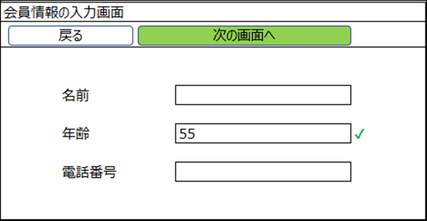
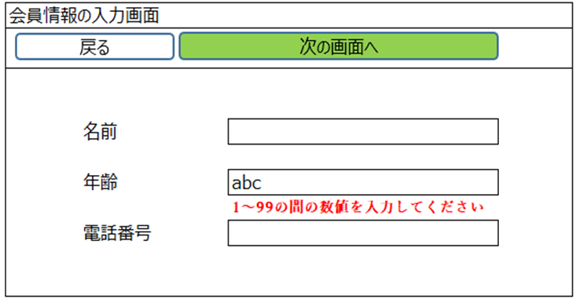

# 正常系と異常系テスト

### 正常系の定義

正常系テスト（Positive Testing）は、システムやアプリケーションが期待通りに動作するかを確認するためのテストです。このテストでは、正しい入力や条件を与え、システムが仕様通りの出力や動作を行うことを検証します。具体的には、次のような内容が含まれます。

* 正常なデータの入力
* 期待される結果の確認
* ユーザーインターフェースの使いやすさ
* パフォーマンスや応答時間のチェック

### 異常系の定義

異常系テスト（Negative Testing）は、システムやアプリケーションが異常な状況や不正な入力に対してどのように反応するかを確認するためのテストです。このテストでは、意図的に不正なデータや条件を与え、システムが適切にエラーメッセージを表示したり、予期しない動作をしないことを検証します。具体的には、次のような内容が含まれます。

* 不正なデータの入力（例：文字列を数値フィールドに入れる）
* 期待されるエラーメッセージの表示
* システムのクラッシュやデータの損失を防ぐこと
* セキュリティ面での脆弱性チェック

### 正常系テストと異常系テストの例

年齢を入力するテキストボックスが含まれるアプリケーションをテストするシナリオで、テキストボックスの要件は以下の通りです。

1～99の間の数値のみを受け取る。

1～99の間の数値を入力すると、テキストボックスの右側に緑チェックアイコンが表示される。

その範囲以外の数値を入力すると、テキストボックスの下に「1～99の間の数値を入力してください」のエラーが赤い文字で表示される。

**正常系テスト：**年齢を入力するテキストボックスに1～99の間の数値（例：55）を入力

**異常系テスト：**年齢を入力するテキストボックスに1～99の間の数値範囲以外（例：abc）を入力

‌
