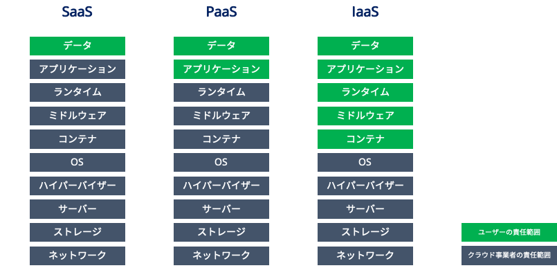
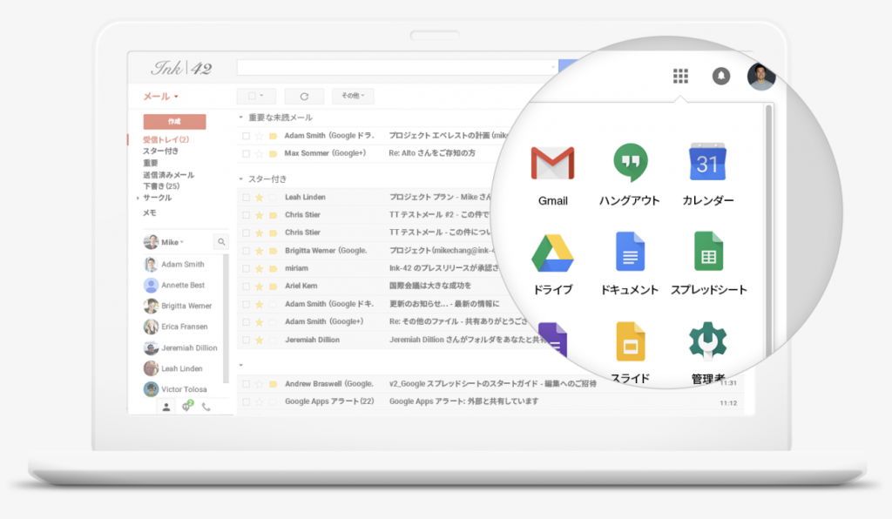
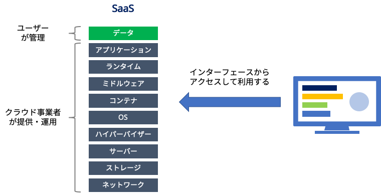
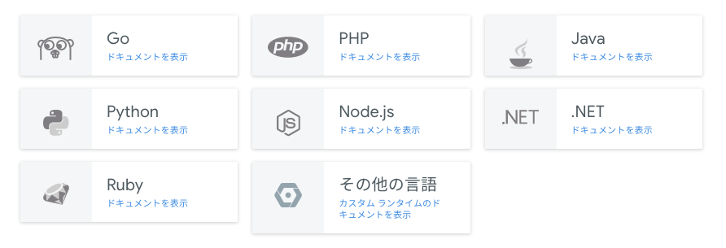
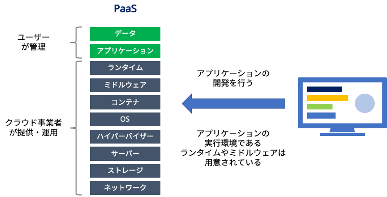
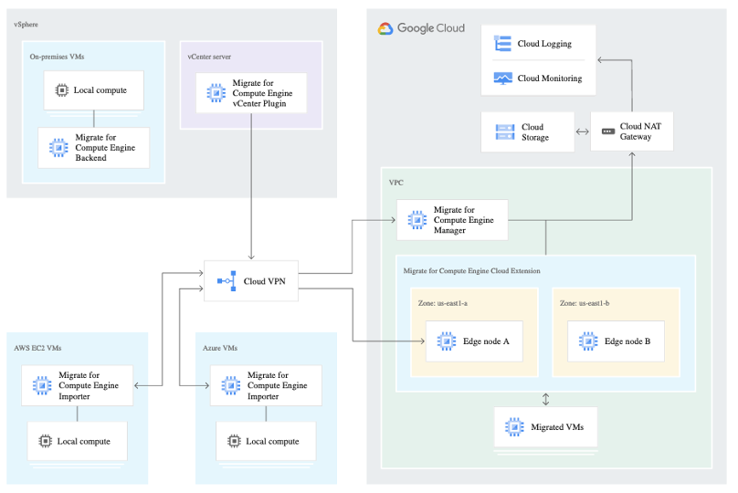
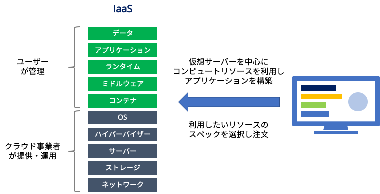

# Cloud Serviceについて

# クラウド コンピューティング

クラウドコンピューティングの略称で、「共有のコンピューティングリソースをどこからでも簡単に、必要に応じて、ネットワーク経由で利用することができるようにしたモデル」と定義されています。これはアメリカの米国国立標準技術研究所(NIST)により定義されたもので、「The NIST Definition of Cloud Computing」という文書の中で紹介されています。

つまり、クラウドとはサーバーやネットワーク、ストレージといったリソースを自分で所有するのではなく、クラウドを提供する事業者のデータセンター上にあるプールの中から割り当てられた分をネットワーク経由で利用するITの利用モデルであるということができます。

クラウドを利用することで、今までIT資産の調達にかかっていた時間を大幅に短縮することができ、市場の変化に迅速に対応することが可能となります。

 

# クラウド コンピューティングのデプロイモデルの種類

## パブリック クラウド

[パブリック クラウド](https://cloud.google.com/learn/what-is-public-cloud)は、サードパーティのクラウド サービス プロバイダによって実行されます。インターネット経由でコンピューティング、ストレージ、ネットワークのリソースが提供され、企業は独自の要件とビジネス目標に基づいて、オンデマンドの共有リソースにアクセスできます。

## プライベート クラウド

[プライベート クラウド](https://cloud.google.com/discover/what-is-a-private-cloud)は、単一の組織によって構築、管理、所有され、独自のデータセンターで非公開でホストされます。通常、「オンプレミス」と呼ばれます。データの制御、セキュリティ、管理が強化され、内部ユーザーはコンピューティング、ストレージ、ネットワークの各リソースの共有プールを利用できます。

## ハイブリッド クラウド

[ハイブリッド クラウド](https://cloud.google.com/learn/what-is-hybrid-cloud)は、パブリック クラウド モデルとプライベート クラウド モデルを組み合わせたもので、企業はパブリック クラウド サービスを活用し、プライベート クラウドのアーキテクチャ内でよく利用されるセキュリティとコンプライアンスの機能を維持できます。

 

# クラウド コンピューティング サービスの種類

クラウド コンピューティングのサービスモデルは、大きく分けて 3 つのタイプがあり、ビジネスニーズに合った制御性、柔軟性、管理のレベルから選択できます。

#### _Infrastructure as a Service（IaaS）_

[Infrastructure as a Service](https://cloud.google.com/learn/what-is-iaas)（IaaS）は、コンピューティング、ストレージ、ネットワーキング、仮想化などの IT インフラストラクチャ サービスへのオンデマンド アクセスを提供します。IT リソースを詳細に制御でき、従来のオンプレミス IT リソースに最もよく似ています。

#### _Platform as a Service（PaaS）_

[Platform as a Service](https://cloud.google.com/learn/what-is-paas)（PaaS）は、クラウド アプリケーション開発に必要なすべてのハードウェアとソフトウェア リソースを提供します。PaaS を使用することで、企業は基盤となるインフラストラクチャの管理やメンテナンスの負担なしに、アプリケーション開発に完全に集中できます。

#### _Software as a Service（SaaS）_

Software as a Service（SaaS）は、基盤となるインフラストラクチャからアプリケーション ソフトウェア自体のメンテナンスや更新まで、アプリケーション スタック全体をサービスとして提供します。多くの場合、SaaS ソリューションはエンドユーザー アプリケーションで、サービスとインフラストラクチャの両方がクラウド サービス プロバイダによって管理、保守されます。

 

 

クラウド コンピューティングのメリット

* 柔軟

クラウド コンピューティングのアーキテクチャにより、企業とそのユーザーは、インターネット接続を介してどこからでもクラウド サービスにアクセスでき、必要に応じてサービスをスケールアップまたはスケールダウンできます。

* 効率的

企業は、基盤となるインフラストラクチャを心配することなく、新しいアプリケーションを開発し、本番環境に迅速に移行できます。

* 戦略的に価値を提供

クラウド プロバイダは最新のイノベーションを把握して顧客にサービスを提供しているので、企業は間もなく廃止となる技術に投資するよりも競争上の優位性を得ることができ、費用対効果も高まります。

* 安全性

企業から、クラウド コンピューティングのセキュリティ リスクは何かという質問をよくを受けます。リスクは比較的低いとみなされます。クラウド コンピューティングのセキュリティは通常、企業のデータセンターより強力であると認識されています。これは、クラウド プロバイダが高度で幅広いセキュリティ メカニズムを実装しているからです。さらに、クラウド プロバイダのセキュリティ チームはこのフィールドにおけるエキスパートとして知られています。

* コスト効率の良さ

クラウド コンピューティングのどのサービスモデルを使用する場合でも、企業は使用するコンピューティング リソースに対してのみ課金されます。需要の急増やビジネスの拡大に備えてデータセンターの容量を過剰に増やす必要がありません。また、IT スタッフをデプロイすることで、より戦略的な取り組みに注力できるようになります。

 

クラウド コンピューティングが組織にもたらすメリット

研究の推進や新たなプロダクト開発の高速化を実現するうえで、イノベーションのペースと、この成長を加速させるために高度なコンピューティングが必要とされることから、クラウド コンピューティングは有効な選択肢となっています。クラウド コンピューティングにより、企業は資本支出や限られた固定インフラストラクチャについて心配することなく、スケーラブルなリソースと最新のテクノロジーにアクセスできます。クラウド コンピューティングの未来クラウド コンピューティングは今後、企業の IT 環境の中核をなすと予想されています。

組織が次のいずれかに該当する場合は、クラウド コンピューティングの利用をおすすめします。

* ビジネスの成長がインフラストラクチャの能力を上回っている
* 既存のインフラストラクチャ リソースの使用率が低い
* オンプレミスのデータ ストレージ リソースを圧倒する大量のデータ
* オンプレミス インフラストラクチャからの応答が遅い
* インフラストラクチャの制約によりプロダクトの開発サイクルに遅れがある
* コンピューティング インフラストラクチャの費用が高額になることによるキャッシュ フローの課題
* 高度なモバイル性または配信を実現する大規模なユーザー人口

これらのシナリオでは、従来のデータセンター以上のものが求められます。

 

# ユースケース

クラウド コンピューティングは、組織にメリットのあるさまざまなアプリケーションを提供します。一般的なユースケースを次に示します。

* インフラストラクチャのスケーリング

小売業者を含む多くの企業のコンピューティング容量に対するニーズは、それぞれ大きく異なります。クラウド コンピューティングは、こうした違いに容易に対応できます。  

* 障害復旧

企業は、障害発生時の継続性を確保するために、さらにデータセンターを構築するのではなく、クラウド コンピューティングを使用してデジタル資産を安全にバックアップします。

* データ ストレージ

クラウド コンピューティングは、大量のデータを保存し、データへのアクセスやデータの分析、バックアップを容易にすることで、データセンターのオーバーロードに対処します。

* アプリケーション開発

クラウド コンピューティングでは、企業のデベロッパーはアプリケーションのビルドとテスト用のツールとプラットフォームにすばやくアクセスできるため、製品化までの時間を短縮できます。

* ビッグデータ分析

クラウド コンピューティングでは、ほぼ無制限のリソースにより膨大な量のデータを処理して調査を高速化し、短時間で分析情報が得られます。

 

\------------------------------------------------------------

# クラウドコンピューティングの種類

クラウドとは「インターネット上の仮想基盤」を意味する言葉です。PCやスマホなどの端末にデータを保存するのではなく、インターネット上に存在する仮想空間（サーバー）に保存して、運用することを「クラウド化」と言います。

クラウドコンピューティングもクラウド化の一種であり、クラウドは一般的に「SaaS」「PaaS」「IaaS」という3つに分類されます。

| **種類** | **特徴** | **サービス例** |
| --- | --- | --- |
| SaaS | アプリやソフトをクラウド上で動作させる | ・Google Workspace(旧 G Suite ) ・Microsoft 365(旧 Office365) ・オンラインストレージ |
| PaaS | アプリの開発環境をクラウド上で提供する | ・Google App Engine ・Microsoft Azure |
| IaaS | システムのインフラをクラウド上で提供する | ・Google Compute Engine ・Amazon Elastic Compute Cloud |

また、クラウドの中には「パブリッククラウド」と「プライベートクラウド」があります。

パブリッククラウドは、誰でも利用できるオープンなクラウドサービスの形態です。Google、Yahoo!、Amazonなどがパブリッククラウドの代表例であり、不特定多数がサービスを共有できる点が特徴です。

プライベートクラウドは、企業または個人が専用環境を構築するクラウドサービスの形態です。IBMやNECなどがプライベートクラウドの代表例であり、サービス内容をカスタマイズしたり、コントロールできるのが特徴です。

さらに最近では、「ハイブリッドクラウド」や「マルチクラウド」などの新しい運用形態も登場しています。

ハイブリッドクラウドはオンプレミスとクラウドを組み合わせた運用形態です。例えば、「データはクラウドで保存して、システムはオンプレミスで運用」のように、両者のメリット・デメリットを踏まえた上で自社にとって最適な運用を実現することができます。

マルチクラウドは複数のクラウドサービスを組み合わせて使う運用形態です。例えば、「本番環境は高価格な質の高いサービスを利用し、バックアップ環境は別の廉価なサービスを利用」など、目的に応じて使い分けを行います。様々なサービスを組み合わせることができるため、自社の要件に合わせて柔軟にカスタマイズできる点が大きなメリットです。

\------------------------------------------

 

# 3つの提供形態

‌

‌

また、クラウドにはその責任分界点に応じて、3つの提供形態が存在します。そのそれぞれはSaaS、PaaS、IaaSと呼ばれており、こちらもNISTの同文書により定義されています。

それぞれの提供形態はクラウド事業者がどのレイヤーまで提供するかによって分類されています。クラウド事業者の責任範囲が少なくなるほどユーザーの管理部分が増え、その分カスタマイズ性が高くなります。つまり「運用管理や構築の負荷」と「構成の柔軟性」がトレードオフの関係となります。

そのため、クラウドを利用する際には自身がクラウドを利用する目的に合わせてどの提供形態が最適であるかを考慮し、選択する必要があります。

# SaaSについて

‌

ここからは各提供形態の定義について解説していきます。まずはSaaSです。

‌

‌

**SaaSとは？**

SaaS(Software as a Service)とは、ソフトウェアやアプリケーションの機能をサービスとしてネットワーク経由で利用するモデルです。例えばメールやコミュニケーションツール、資産管理や監視といったソフトウェアを、自身のサーバーリソースに導入するのではなく、ネットワーク経由でサービスプロバイダーから利用する形態を指しています。

SaaSを提供しているプロバイダーとしてはSalesforceが非常に有名です。Salesforceは20年以上に渡って顧客管理(CRM)ソリューションをクラウドサービスとして提供しており、SaaSベンダーとして非常に大きなシェアを誇っています。

**SaaSの特徴と選定基準**

SaaSでは、ユーザーはサービスをWebブラウザやプログラミングインターフェースを通してアクセスすることで利用します。その際に、サーバーやストレージなどの構築や運用管理をする必要はありません。

責任範囲として、クラウド事業者はアプリケーションを含めた全てのレイヤーを管理します。基本的にユーザーはアプリケーション内部のユーザー固有の設定を変更することはできますが、それ以外の変更は許されていません。そのため、使いたい機能が明確であり、そのサービス内の機能で要件が充足する場合にSaaSの利用を検討すると良いでしょう。

**Googleが提供しているSaaSサービス**

Googleも大手のSaaS提供ベンダーです。数多くの有名なSaaSサービスを提供しており、無償で提供されているサービスも少なくありません。

例えばGmail、Googleドライブ、Google Meet、Googleカレンダー、GoogleドキュメントなどがSaaSサービスとして挙げられます。また、GoogleマップやGoogle検索などもGoogleのデータセンターにあるインフラストラクチャ上に構成されており、SaaSサービスであるということができます。

# PaaSについて

‌

次に、PaaSの定義についてご紹介します。

‌

‌

**PaaSとは？**

PaaS(Platform as a Service)とは、アプリケーション開発に必要な実行環境を利用するモデルです。アプリケーションのコードを実行するのに必要な言語のランタイムや、データベースなどのミドルウェアをサービスとして提供し、開発者はコードを記述することに専念することが可能です。

PaaSには、HerokuやAWS Elastic Beanstalk、Azure App Serviceのようにクラウド上のマネージドサービスとして提供されているものがある一方、Cloud FoundryやOpenShiftといった、インフラ環境上に構築して利用するオープンソースベースのサービスもあり、提供形態は様々です。

**PaaSの特徴と選定基準**

‌

‌

PaaSでは、アプリケーション開発に必要な環境はすでに用意されており、開発者はミドルウェアの運用管理を行う必要がありません。また、データ分析や人工知能、IoTなどといったクラウドサービスならではの機能をアプリケーションに簡単に組み込むことができるのも特徴の1つです。

しかし、マネージドサービスである以上は言語のランタイムや利用できるリソースに制限がある場合があります。開発環境を迅速に構築し、運用負荷を軽減したい場合に利用すると良いでしょう。

**Googleが提供しているPaaSサービス**

GoogleではGoogle App Engine(GAE)というPaaSサービスを提供しています。GAEはサーバーレスのアプリケーション実行環境であり、インフラ部分に関してはGoogleが管理するため、運用管理の負荷を軽減することができます。また、アプリケーションの負荷に応じてオートスケールが行われるため、需要予測をする必要がないことも大きな特徴の1つです。

# IaaSについて

‌

最後に、IaaSについてご紹介します。

‌

‌

**IaaSとは？**

IaaS(Infrastructure as a Service)とは、CPU、メモリ、ストレージやネットワークといったコンピュートリソースを提供するモデルです。ユーザーはリソース構成を自由に選択して利用することができ、そのリソース上に任意のアプリケーションを構築することが可能です。

IaaSサービスは2006年にAWSによってAmazon Elastic Compute Cloud(Amazon EC2)の提供が開始されました。これにより自社データセンターのサーバー台数を削減する方法として、仮想化による集約ではなく、クラウドサービスの利用が検討されるように市場が変化していきました。

**IaaSの特徴と選定基準**

‌

‌

IaaSは非常にカスタマイズ性が高く、柔軟に構成を作成することが可能です。その分ユーザーの管理範囲は多く、運用の負荷がSaaSやPaaSに比べて高くなります。

サービス提供の迅速性やリソースの負荷に対する柔軟性といったクラウドのメリットを享受しつつもシステムとしてのカスタマイズ性を確保したいときにIaaSの利用を検討すると良いでしょう。

**Googleが提供しているIaaSサービス**

GoogleではGoogle Compute Engine(GCE)というIaaSサービスを提供しています。ライブマイグレーションやオートスケールなど、クラウドならではの機能と容易に連携することが可能であり、自社のデータセンターでは実現するのが困難な可用性の高い環境を安価に利用することができます。

# まとめ

この記事では、クラウドの3つの提供形態であるSaaS、PaaS、IaaSについて解説し、それぞれの利用指針をご紹介しました。クラウドサービスには数多くのサービスが存在し、その責任範囲や運用管理の範囲が異なります。自身のシステムに最適な提供形態を理解して活用することが重要となります。

 

‌
