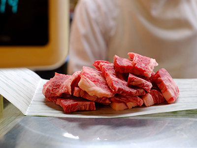
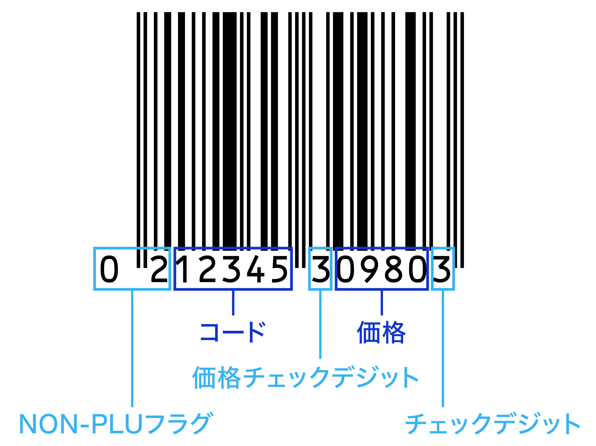

# PLUとNON-PLU

## 定義

### PLU

[ソースマーキング](https://www.weblio.jp/content/%E3%82%BD%E3%83%BC%E3%82%B9%E3%83%9E%E3%83%BC%E3%82%AD%E3%83%B3%E3%82%B0)された [バーコード](https://www.weblio.jp/content/%E3%83%90%E3%83%BC%E3%82%B3%E3%83%BC%E3%83%89)には[通常](https://www.weblio.jp/content/%E9%80%9A%E5%B8%B8)[値段](https://www.weblio.jp/content/%E5%80%A4%E6%AE%B5)は[表示され](https://www.weblio.jp/content/%E8%A1%A8%E7%A4%BA%E3%81%95%E3%82%8C)[ていない](https://www.weblio.jp/content/%E3%81%A6%E3%81%84%E3%81%AA%E3%81%84)。 同じ[商品](https://www.weblio.jp/content/%E5%95%86%E5%93%81)[でも、](https://www.weblio.jp/content/%E3%81%A7%E3%82%82%E3%80%81)[小売り](https://www.weblio.jp/content/%E5%B0%8F%E5%A3%B2%E3%82%8A)店によって、また[時期](https://www.weblio.jp/content/%E6%99%82%E6%9C%9F)によって[販売価格](https://www.weblio.jp/content/%E8%B2%A9%E5%A3%B2%E4%BE%A1%E6%A0%BC)が[変動する](https://www.weblio.jp/content/%E5%A4%89%E5%8B%95%E3%81%99%E3%82%8B)ため、 [商品](https://www.weblio.jp/content/%E5%95%86%E5%93%81)[自体](https://www.weblio.jp/content/%E8%87%AA%E4%BD%93)の[情報](https://www.weblio.jp/content/%E6%83%85%E5%A0%B1)しか[入って](https://www.weblio.jp/content/%E5%85%A5%E3%81%A3%E3%81%A6)いない。 [販売価格](https://www.weblio.jp/content/%E8%B2%A9%E5%A3%B2%E4%BE%A1%E6%A0%BC)はストアコントローラに[入力される](https://www.weblio.jp/content/%E5%85%A5%E5%8A%9B%E3%81%95%E3%82%8C%E3%82%8B)ので、 [ポスレジ](https://www.weblio.jp/content/%E3%83%9D%E3%82%B9%E3%83%AC%E3%82%B8)で[商品情報](https://www.weblio.jp/content/%E5%95%86%E5%93%81%E6%83%85%E5%A0%B1)が[バーコード](https://www.weblio.jp/content/%E3%83%90%E3%83%BC%E3%82%B3%E3%83%BC%E3%83%89)[出入](https://www.weblio.jp/content/%E5%87%BA%E5%85%A5)力されると [同時に](https://www.weblio.jp/content/%E5%90%8C%E6%99%82%E3%81%AB)[販売価格](https://www.weblio.jp/content/%E8%B2%A9%E5%A3%B2%E4%BE%A1%E6%A0%BC)[情報](https://www.weblio.jp/content/%E6%83%85%E5%A0%B1)（[Price](https://www.weblio.jp/content/Price)）が ストアコントローラから[取り出される](https://www.weblio.jp/content/%E5%8F%96%E3%82%8A%E5%87%BA%E3%81%95%E3%82%8C%E3%82%8B)（[Look Up](https://www.weblio.jp/content/Look+Up)）。 [このような](https://www.weblio.jp/content/%E3%81%93%E3%81%AE%E3%82%88%E3%81%86%E3%81%AA)[バーコード](https://www.weblio.jp/content/%E3%83%90%E3%83%BC%E3%82%B3%E3%83%BC%E3%83%89)を PLUという。 

### NON PLU

[一つ](https://www.weblio.jp/content/%E4%B8%80%E3%81%A4)の[包装](https://www.weblio.jp/content/%E5%8C%85%E8%A3%85)[毎に](https://www.weblio.jp/content/%E6%AF%8E%E3%81%AB)[価格](https://www.weblio.jp/content/%E4%BE%A1%E6%A0%BC)の[異な](https://www.weblio.jp/content/%E7%95%B0%E3%81%AA)る[生鮮食品](https://www.weblio.jp/content/%E7%94%9F%E9%AE%AE%E9%A3%9F%E5%93%81)や[アイテム](https://www.weblio.jp/content/%E3%82%A2%E3%82%A4%E3%83%86%E3%83%A0)数が[膨大](https://www.weblio.jp/content/%E8%86%A8%E5%A4%A7)になり、 しかも[サイクル](https://www.weblio.jp/content/%E3%82%B5%E3%82%A4%E3%82%AF%E3%83%AB)の短い[書籍](https://www.weblio.jp/content/%E6%9B%B8%E7%B1%8D)・[雑誌](https://www.weblio.jp/content/%E9%9B%91%E8%AA%8C)、[一品](https://www.weblio.jp/content/%E4%B8%80%E5%93%81)[毎に](https://www.weblio.jp/content/%E6%AF%8E%E3%81%AB)[価格](https://www.weblio.jp/content/%E4%BE%A1%E6%A0%BC)の[異な](https://www.weblio.jp/content/%E7%95%B0%E3%81%AA)る[アパレル](https://www.weblio.jp/content/%E3%82%A2%E3%83%91%E3%83%AC%E3%83%AB)[製品など](https://www.weblio.jp/content/%E8%A3%BD%E5%93%81%E3%81%AA%E3%81%A9)は [価格](https://www.weblio.jp/content/%E4%BE%A1%E6%A0%BC)[情報](https://www.weblio.jp/content/%E6%83%85%E5%A0%B1)をストアコントローラに[入力する](https://www.weblio.jp/content/%E5%85%A5%E5%8A%9B%E3%81%99%E3%82%8B)のは[不可能な](https://www.weblio.jp/content/%E4%B8%8D%E5%8F%AF%E8%83%BD%E3%81%AA)ので、 [バーコード](https://www.weblio.jp/content/%E3%83%90%E3%83%BC%E3%82%B3%E3%83%BC%E3%83%89)に[直接販売](https://www.weblio.jp/content/%E7%9B%B4%E6%8E%A5%E8%B2%A9%E5%A3%B2)[価格](https://www.weblio.jp/content/%E4%BE%A1%E6%A0%BC)を[表示する](https://www.weblio.jp/content/%E8%A1%A8%E7%A4%BA%E3%81%99%E3%82%8B)。 ストアコントローラから [Price](https://www.weblio.jp/content/Price) を [Look Up](https://www.weblio.jp/content/Look+Up) しないので、 [価格](https://www.weblio.jp/content/%E4%BE%A1%E6%A0%BC)の[入った](https://www.weblio.jp/content/%E5%85%A5%E3%81%A3%E3%81%9F)[バーコード](https://www.weblio.jp/content/%E3%83%90%E3%83%BC%E3%82%B3%E3%83%BC%E3%83%89)をこう呼ぶ。

‌

## NONーPLUの運用事例

### NonPLUバーコード活用シーン例

#### 惣菜や肉などの量り売り

#### **パックや袋詰めの生鮮食品**

#### **アイテム数が多い雑誌や書籍**

### NonPLUバーコードのPOS製品の事例

#### １）スマレジ：

‌

| 項目 | 内容（上記の画像を例に記載しております） |
| --- | --- |
| NON-PLUフラグ | 02 | 『開始位置』=0  
『長さ』=2  
『フラグ』=02 ※フラグを0始まりにする場合、バーコードリーダーでも先頭の0を読む設定が必要です  
設定については[各バーコードリーダーのページ](https://help.smaregi.jp/hc/ja/articles/900005776126)でご確認ください |
| コード | 12345 | 商品に設定している商品コードの値です。  
今回の例では、商品の商品コードを『12345』に設定する必要があります。  
『開始位置』=2  
『長さ』=5 |
| 価格チェックデジット | 3 | バーコードに価格チェックデジットがある場合は、『開始位置』と『長さ』を設定します。  
『開始位置』＝7  
『長さ』＝1 ※価格チェックデジットがない場合は、『開始位置』と『長さ』はどちらも『0』を設定します |
| 価格 | 0980 | バーコードを読み取った際の価格を表します。  
今回の例では、980円の商品として表示されます。  
『開始位置』＝8  
『長さ』＝4 |
| チェックデジット | 3 | バーコードが正しく読み取られているかを確認する値です。  
『開始位置』＝12  
『長さ』＝1 |

#### **２）Airレジ**

NON-PLUバーコードの形式

| ①プリフィクス | 02または20〜29の2桁の数字を入力します。 |
| --- | --- |
| ②商品コード桁数 | 商品コードの桁数を、「4桁」または「5桁」から選択します。 |
| --- | --- |
| ③価格チェックデジット | 取り扱うバーコードに価格チェックデジットがある場合は「オン」にします。 ただし、Airレジでは価格チェックデジットが正しいかどうかの確認は行いません。 |
| --- | --- |
| ④価格桁数 | 価格として登録できる桁数が表示されます。 表示される桁数は、4〜6桁です。「商品コード桁数」と「価格チェックデジット」の設定により異なります。 |
| --- | --- |
| ⑤チェックデジット | バーコードが正しく読み取れたかどうかを確認するための桁で、1〜12桁目により自動的に決定されます。 |
| --- | --- |
