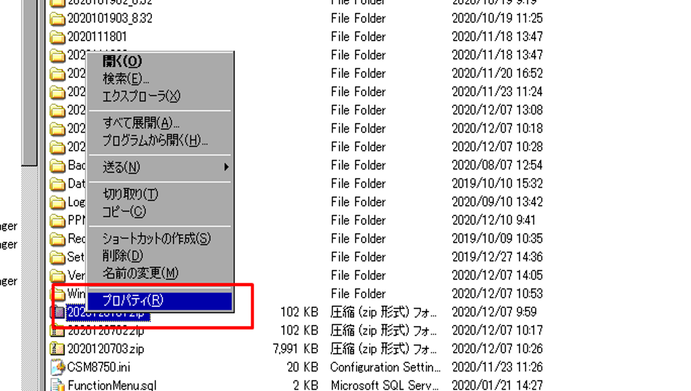
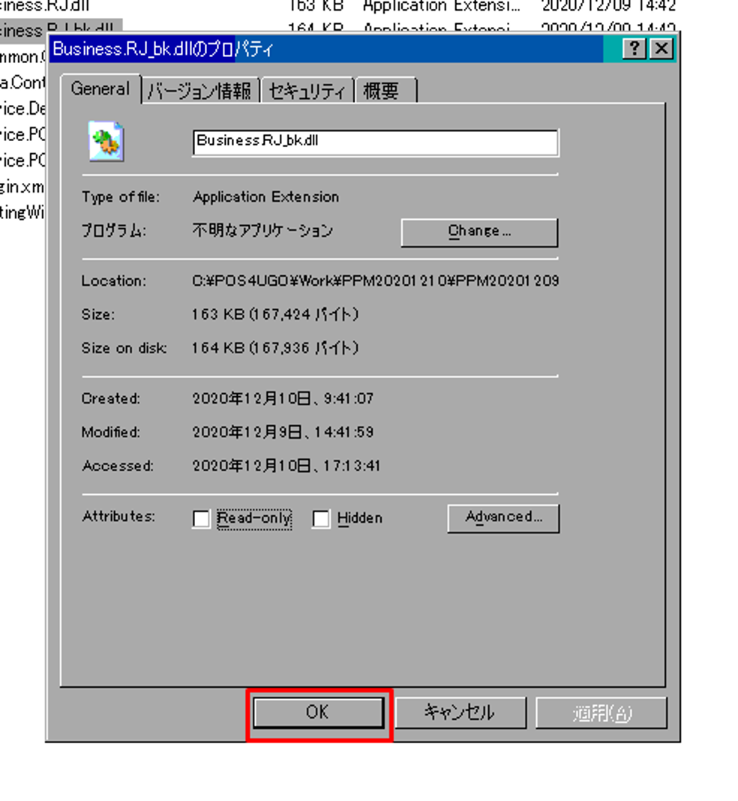

# 実機検証ルール

## VM環境

### 実機DLL準備

ファイル命名規則：YYYYMMDD00_Function ※英語（例：2021091701_Credit）

石に依頼する時、Redmineへアップ	  
	実機\\\\192.168.8.226\\workフォルダに置いて  
	実機に入れたら、Redmine上に削除

菊池さんに依頼する時、TRECShare共有フォルダに置いて	  
	何番実機のパスを教えられて

‌

## 実機

### 環境構築　C:\\POS4UGO\\

必要なければ、１台しか実機を使う	  
フォルダ命名規則：YYYYMMDD00_Function ※英語	

#### 手順

##### １）全DLLはVM環境から用意する

| 下記8つファイル除外必要 | 替换理由 |
| --- | --- |
| Settings\\PluginDevice.xml | 端末别的设备OR服务 |
| Settings\\PluginDeviceCH.xml | 端末别的设备OR服务 |
| Settings\\SettingTerminal.xml | 端末信息配置 |
| Settings\\SettingWinPOSTerminal.xml | 端末信息配置 |
| Settings\\SettingWinPOSTerminalCH.xml | 端末信息配置 |
| Settings\\SettingWinPOSDevice.xml | 端末别的设备OR服务的设定信息 |
| Settings\\SettingWinPOSDeviceCH.xml | 端末别的设备OR服务的设定信息 |
| POS4U.exe.config | 内含釣銭機型号的信息 |

※Redmineアップする時20M制御あり

①	\\\\192.168.8.102\\d$\\Share_POS4UGOから、C:\\BK_POS4UGOに移動  
②	zipファイル解凍する前に、プロパティーのSecurityにUnblock設定して、解凍






※一般的に必要なし

③	C:\\POS4UGO\\YYYYMMDD00 からコピーしてリネームする		  
	フォルダ命名規則：YYYYMMDD00_Function ※英語		  
④	zipファイル解凍して、C:\\POS4UGO\\YYYYMMDD00_Function に置き換える		  
	端末固有配置ファイル置換不要、Key追加可		  
		Settings\\PluginDevice.xml	  
		Settings\\SettingTerminal.xml	  
		Settings\\SettingWinPOSTerminal.xml	  
		Settings\\SettingWinPOSDevice.xml	  
		POS4U.exe.config	  
⑤	C:\\POS4UGO\\YYYYMMDD00_Function\\Settingsに、SettingWinPOSTerminal.xmlのManagedNo値設定		  
		MangedNoは0に設定	  
			初回環境構築  
			Azureデータ同期できない  
			データテスト

‌

##### ２）差分DLL更新

①	同上  
②	同上  
③	DLLバックアップ  
④	同上

‌

### **環境構築　DB更新とXML更新**

|  | 会社コード | URL |
| --- | --- | --- |
| 検証環境 | 1405000001 | [https://testtrialappgw.posaas.net](https://testtrialappgw.posaas.net/) |
| DEV環境 | 1 | [https://devtrialappgw.japanwest.cloudapp.azure.com](https://devtrialappgw.japanwest.cloudapp.azure.com/) |

#### １）DB環境

※テストした後、元の値に戻る

  
①会社コードと店舗コード設定用ＳＱＬはシート「参照用\_DB環境構築用SQL」に参照

| 会社 | 環境 | 会社コード | 備考 |
| --- | --- | --- | --- |
| タイトル | 検証環境 | 1405000001 | 店舗コード：00900　00400(AttendantPCテスト用) |
| タイトル | Dev環境 | 1 |  |
| FC | 検証環境 | 201 |  |
| FC | Dev環境 | 2 |  |

**※メモリーの確認が必要**

②NodeMasterテーブルにNodeType値設定	

| NodeType | 名称 |
| --- | --- |
| 05 | 現金会計機 |
| 07 | セミセルフ登録機 |
| 08 | セミセルフ会計機 |
| 09 | フルセルフ |
| 10 | 対面レジ(サービス) |
| 11 | 医薬品レジ |
| 12 | オーダーキッチン |
| 13 | レーンレジ |
| 50 | チャージ機 |

オーダーセルフテストのため  
・NodeMasterテーブルに、IPAdressとMacAddress設定必須

セミセルフテストのため  
・NodeMasterテーブルに、IPAdressとSelfPaymentstation設定必須

‌

③SettingMasterテーブル	  
オーダーセルフテストのため  
・SettingMasterテーブルに、KeyはCRMBaseURLのValue値が[http://10.100.2.192設定](http://10.100.2.xn--192-qf0ft96r)

Attendant監視テスト（フルターンキー）  
・SettingMasterテーブルに、KeyはAttendantServiceIPAddressのValue値が35.187.220.155:9001/api/v1設定

‌

#### ２）XML配置

①Azure接続先

C:\\POS4UGO\\YYYYMMDD00_Function

| Settings\\SettingWinPOSTerminal.xml | Key：TransactionServerAddress |
| --- | --- |
| Settings\\SettingWinPOSDevice.xml | Key：LogicServiceBaseAddress |
| Settings\\SettingTerminal.xml | CompanyCode=1 |

②シミュレーターとデバイス設定

C:\\POS4UGO\\YYYYMMDD00_Function  
Settings\\PluginDevice.xml

③マウス隠す設定

C:\\POS4UGO\\YYYYMMDD00_Function

Settings\\SettingWinPOS.xml

　　<Setting Key="CursorHide" Value="True"/>

④モジュール最新バージョン設定

C:\\POS4UGO\\YYYYMMDD00_Function

Settings\\SettingWinPOS.xml

　　<Setting Key="ModuleVersion" Value="YYYYMMDDXX"/>　

　　　　※YYYYMMDDXX：該当最新バージョン番号

### **アプリ起動**

#### １）バージョンアップ必要ない場合

再起動Launcher防止のため、スタートのLauncherは削除する

‌

方式①：C:\\POS4UGO\\YYYYMMDD00_Function  
	TRAN4U.exe 起動	  
	POS4U.exe 起動	

‌

方式②：C:\\POS4UGO\\YYYYMMDD00_Function  
Launcher\\LauncherSetting.xmlに下記内容をコメントアウトされる	

```xml
<LauncherSetting>
		<No>3</No>
		<Name>POSシステムバージョンアップ</Name>
		<ProgramPath>VersionUp.exe</ProgramPath>
		<ProgramArguments></ProgramArguments>
		<WaitForExit>true</WaitForExit>
		<ErrorMode>0</ErrorMode>
		</LauncherSetting>
		<LauncherSetting>
		<No>4</No>
		<Name>POS DB更新</Name>
		<ProgramPath>MasterSync.exe</ProgramPath>
		<ProgramArguments></ProgramArguments>
		<WaitForExit>true</WaitForExit>
		<ErrorMode>0</ErrorMode>
</LauncherSetting>
```

Launcher.exe 起動

#### ２）バージョンアップ

リリース前に、モジュールダウンロードテストする時必要

‌

#### チェック項目

①容量確保	  
	②配置ファイル	  
		POS4U.exe.config  
		Settings\\SettingTerminal.xml  
		Settings\\SettingWinPOS.xml  
		Settings\\SettingWinPOSTerminal.xml  
		Launcher\\LauncherSetting.xml  
	③EXE	  
		POS4U.exe  
		TRUN4U.exe  
C:\\POS4UGO\\YYYYMMDD00		  
Launcher.exe 起動		

方式①、手動でLauncher.exe起動		  
方式②、スタートでLauncher.exe起動

‌

### **Ａｚｕｒｅリリース**

マージ作業：jinianxiangさんの承認が前提

リリース依頼：菊池さん・渡邊さん・石室さん経由で曲さんへ依頼

‌

### キッチン	

#### オーダー環境

‌

1. PluginDevice に OrderKitchenApiService 追加する必要
2. DBのNodeMaster に  IpAddress ＆ MacAddress  空白ではなく
3. キッチン端deviceConfig-API用端末IPはpostgres端のDBに追加する必要
4. 検証環境の場合、SettingMaster に url はtrechina.cnではなく、[http://10.100.2.192](http://10.100.2.192)

‌

SettingWinPOSTerminal.xml

```
OrderKitchenSkipUnify　オーダーセルフ一体化:false
ShowKitchenIsHasPrepaidCard　プリカ選択画面表示
```

#### **注意事項**

釣銭機、プリンター、スキャナー シミュレーターで動く	  
音量が小さく/ミュート	  
ディレクトリ定期整理、不要なの削除	  
C:\\POS4UGO\\  
C:\\POS4UGO\\work\\  
C:\\POS4UGO\\Log\\  
スキャンナーシミュレーターに商品はItemMasterテーブルに各項目値変更不要

### **ドロアオープン設定（実機192.168.8.122）**

PluginDevice.xml設定ファイルに、設定追加

```
<Plugin Id="CashDrawer" Assembly="Device.CashDrawerM8500, Version=1.0.0.0, Culture=neutral, PublickeyToken=7f613065d93c5dd1" 
Class="ForYouApplications.POS4U.Device.CashDrawer.CashDrawerM8500" />
```

MainMenuListLocalPOS.xmlにメインメニュー追加

```
<MenuButton>
    <MenuNumber>1</MenuNumber>
    <PageNumber>3</PageNumber>
    <ButtonNumber>9</ButtonNumber>
    <Description>ドロアオープン</Description>
    <ButtonType>1</ButtonType>    
    <EventCode>449</EventCode>
    <InputData></InputData>
    <AddInfos>Opened</AddInfos>
</MenuButton>
```
