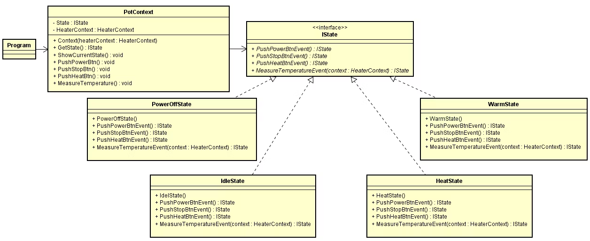
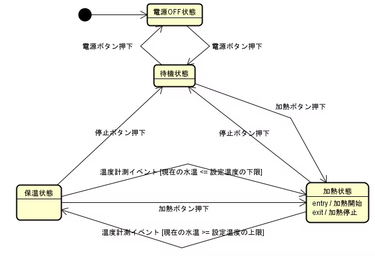

# Stateパターン [C#]

## はじめに

状態を多く持ち、状態ごとの操作の動作が異なるプログラムで、恐ろしく長い条件分岐処理(if文, switch文)を見かけたことはありませんか？

たとえば、簡単な電気ポットのプログラムがあるとします。このプログラムでは、以下の状態を持ちます。

* 電源OFF状態
* 待機状態
* 加熱状態
* 保温状態

また、以下のボタンを持ちます。

* 電源ボタン
* 加熱ボタン
* 停止ボタン

各状態ごとに特定のボタンを押したときの電気ポットの動作は異なります。  
(電源OFF状態で加熱ボタンを押しても何も起こらないが、待機状態で加熱ボタンを押すと加熱が始まるなど)

デザインパターンを使わないで、プログラムを記載すると、以下のようになると思います。

```csharp
if (加熱ボタンが押されたとき)
{
    if (電源OFF状態であるか)
    {
       // 何もしない
    }
    else if (待機状態であるか)
    {
       加熱処理実行();
    }
    else if (加熱状態であるか)
    {
       // 何もしない
    }
    else  if (保温状態であるか)
   {
       加熱処理実行();
   }
}

if (電源ボタンが押されたとき)
{
    // 加熱ボタンが押されたときと同じような条件分岐処理
}

if (停止ボタンが押されたとき)
{
    // 加熱ボタンが押されたときと同じような条件分岐処理
}
```

ここで、次の新商品では、以下の機能が新しく追加されました。

* ロックボタンを押すことにより、誤操作を防止する機能

    * ロックボタンとロック状態が追加されました
    
* さらに、電気ポットがインターネットに接続できるようになり、自動的に電気ポットのプログラムを更新する機能

    * プログラム更新状態が追加されました
    
* ECOモード(省電力モード)ボタンを押すことで、省電力モードに移行する機能

    * ECOモードボタンと省電力状態が追加されました
    

死ぬ気で機能追加しましたが、次の商品では、以下の機能がさらに追加されます。

* せっかく、わが社の電気ポットがインターネットにつながったので、Amazon EchoとGoogle Homeにも対応させましょう。(by上司)
* 競合他社の製品にもある便利機能を10個追加したいです。そこまで工数もかからないでしょう。(by上司)

上記のように機能が増え状態が増えるたびに、状態を特定する条件分岐処理は延々と長くなり、コード修正・コードテストしにくくなります…。

if文、switch文地獄の始まりです…。

上記のように、多くの状態を持ち、状態ごとの操作のふるまいが異なる場合こそ、\__Stateパターン\_\_の出番です。

Stateパターンを用いることで、\_\_状態に関する条件分岐処理をなくす\_\_ことが可能です。

電気ポットのクラス図とステートマシン図は以下のとおりです。

## クラス図

‌


#### 重要クラス説明

| クラス名 | クラス説明 |
| --- | --- |
| IState | インターフェースクラスであり、各状態で異なる振る舞いをする操作(関数)を定義する |
| PowerOffState | 電源OFF状態を表すクラス。IStateクラスを継承する。 |
| IdleState | 待機状態を表すクラス。IStateクラスを継承する。 |
| HeatState | 加熱状態を表すクラス。IStateクラスを継承する。 |
| WarmState | 保温状態を表すクラス。IStateクラスを継承する。 |
| PodContext | 電気ポット制御情報クラス。本クラスが、IStateクラスのインスタンスを保有する |

## ステートマシン図 (状態遷移図)

‌


## 実行イメージ \[C#\]

```csharp
コマンドを指定してください。
0 : 現在の状態を表示する
1 : 電源ボタンを押す
2 : 加熱ボタンを押す
3 : 停止ボタンを押す
4 : ヒーターモードを弱に変更する(固定(Min:30度, Max:60度))
5 : ヒーターモードを強に変更する(固定(Min:70度, Max:100度))

[IState : State_Pattern_CSharp.State.PowerOffState] [Current Temperature : 20] [Heater Mode : High]
[IState : State_Pattern_CSharp.State.IdleState] [Current Temperature : 20] [Heater Mode : Low]
[IState : State_Pattern_CSharp.State.HeatState] [Current Temperature : 25] [Heater Mode : Low]
[IState : State_Pattern_CSharp.State.HeatState] [Current Temperature : 50] [Heater Mode : Low]
[IState : State_Pattern_CSharp.State.HeatState] [Current Temperature : 60] [Heater Mode : Low]
[IState : State_Pattern_CSharp.State.WarmState] [Current Temperature : 57] [Heater Mode : Low]
[IState : State_Pattern_CSharp.State.WarmState] [Current Temperature : 54] [Heater Mode : Low]
[IState : State_Pattern_CSharp.State.WarmState] [Current Temperature : 30] [Heater Mode : Low]
[IState : State_Pattern_CSharp.State.HeatState] [Current Temperature : 35] [Heater Mode : Low]
[IState : State_Pattern_CSharp.State.HeatState] [Current Temperature : 40] [Heater Mode : Low]
```

##   
コード説明

Stateパターンでは、状態1つにつき、必ず1つクラスを作成します。

コードでは、タイマークラスを用いて、1秒間ごとに、外気温によるポットの水温低下(3度)、加熱による水温上昇(5度)を再現しています。

#### コード (インタフェースクラス)

IStateクラスは、インターフェースクラスであり、各状態で異なる振る舞いをする操作(関数)を定義します。  
状態クラスは、本クラスを必ず継承します。

```csharp
/// <summary>
/// 電気ポット状態を表すクラス
/// </summary>
public interface IState
{
    IState PushPowerBtnEvent();
    IState PushStopBtnEvent();
    IState PushHeatBtnEvent();
    IState MeasureTemperatureEvent(HeaterContext someHeaterContext);
}
```

#### 状態クラス

状態クラスでは、状態ごとの各動作実施、状態遷移先の判断と遷移先の決定のみ行うようにします。他の機能を一切持たせません。

```csharp
/// <summary>
/// 待機状態 (非加熱状態)
/// </summary>
public class IdleState : IState
{
    public IdleState()
    {
    }

    public IState PushPowerBtnEvent()
    {
        return new PowerOffState();
    }

    public IState PushStopBtnEvent()
    {
        return this;
    }

    public IState PushHeatBtnEvent()
    {
        return new HeatState();
    }

    public IState MeasureTemperatureEvent(HeaterContext someHeaterContext)
    {
        return this;
    }
}
```

#### コード (Contextクラス)

電気ポット制御情報クラスです。本クラスが、電気ポットが現在どの状態にあるかを表すIState変数をもちます。

```csharp
/// <summary>
/// 電気ポット制御情報クラス
/// </summary>
public class PotContext
{
    /// <summary>
    ///　電気ポットの稼働状態
    /// </summary>
    private IState state = null;

    /// <summary>
    /// ヒーター設定パラメーター
    /// </summary>
    public HeaterContext HeaterContext { get; set; } = null;

    public PotContext(HeaterContext someHeaterContext)
    {
        this.HeaterContext = someHeaterContext;

        if (state == null)
        {
            state = new PowerOffState();
        }
    }

    public IState GetState()
    {
        return this.state;
    }

    public void ShowCurrentState()
    {
        Console.WriteLine("[IState : {0}] [Current Temperature : {1}] [Heater Mode : {2}]\\n\\n\\n", this.state.ToString(), Thermometer.CurrentTemp, this.HeaterContext.HeaterMode.ToString());
    }

    public void PushPowerBtn()
    {
        this.state = this.state.PushPowerBtnEvent();
    }

    public void PushStopBtn()
    {
        this.state = this.state.PushStopBtnEvent();
    }

    public void PushHeatBtn()
    {
        this.state = this.state.PushHeatBtnEvent();
    }

    public void MeasureTemperature()
    {
        this.state = this.state.MeasureTemperatureEvent(this.HeaterContext);
    }
}
```

## まとめ

Stateパターンを用いることで、現在何の状態であるかという条件分岐を削除することができました。

ただし、Stateパターンは、状態が増えることによって、クラスが必ず１つ追加される設計パターンです。

そのため、必ずしも本デザインパターンを使用すれば、設計がよくなるデザインパターンではないと思います。

うまく使いこなすには、本当に腕が必要なデザインパターンだと思います。

## 状態クラス内の設計について

各状態クラスの設計方法は、以下のようにいくつかあるようです。  
(1) シングルトンパターンを利用して、状態クラスが1つのみ存在することを保証する。そして、他の状態クラスに自己状態を公開する  
(2) 状態クラス内で、遷移先の状態クラスのインスタンスを生成する。他の状態クラスに自己状態を公開しない

本プログラムでは、(2)の方法で設計しています。理由は、シングルトンパターンを利用することで、グローバルな変数を増やすと、テストがしにくくなるためです。  
なお、各状態クラス内で、遷移先の状態のインスタンス化を実施していますが、IDEで確認したところ、メモリリークは発生しませんでした。

これは、状態クラスで、データを保有せず、必ずガーベッジコレクションによって、生成したインスタンス化が破棄されているからと思われます。

状態クラス内で、別のデータを持ち、かつどこかのクラスからそのデータを参照されつづけた場合は、ガーベッジコレクションが動作せずに、メモリリークが発生すると思います。その場合は、状態クラスでは、\_\_シングルトンパターン\_\_を採用したほうがよさそうです。

## コード全体

<custom data-type="smartlink" data-id="id-0">https://github.com/a143321/Design-Patterns-CSharp</custom> 

‌

## 参考リンク

* \[<custom data-type="smartlink" data-id="id-1">https://taiyoproject.com/post-121</custom> \]
* \[<custom data-type="smartlink" data-id="id-2">https://www.slideshare.net/ayumuitou52/gof-state</custom> \]
* \[<custom data-type="smartlink" data-id="id-3">https://github.com/solenovex/Head-First-Design-Patterns-in-CSharp</custom> \]
