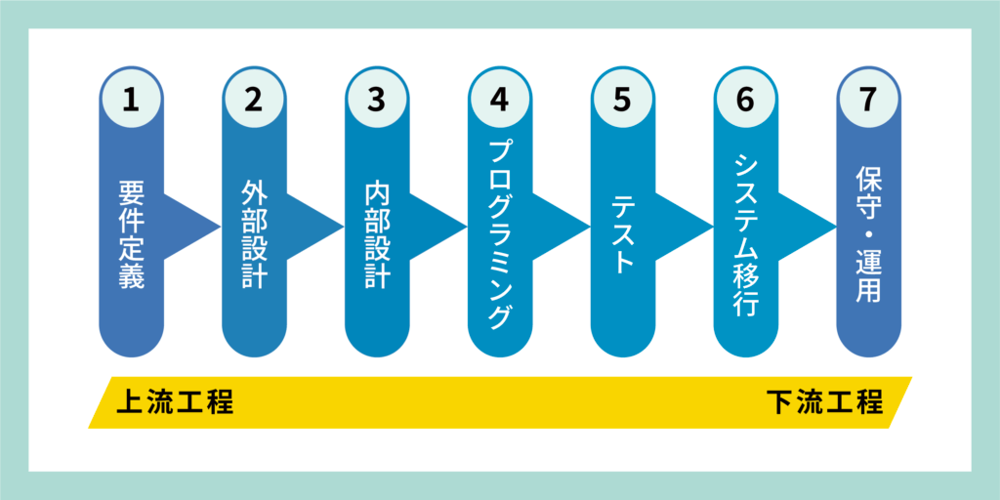

# 要件定義（入門篇）※事例解説付き

## システム開発の全体像

※ コンサルの領域だと要件定義の前に企画構想というフェーズがある場合もあります。

今回はこのフェーズの中の要件定義について解説をしていきます。

## 要件定義とは

要件定義は、システム開発の初期段階で、**開発するべきシステムの機能や要求を明確にする作業**です。

クライアントやユーザーの要望を具体的な形にまとめ、開発の方向性やゴールを設定する「**設計図**」を作成します。

### なぜ要件定義をするのか

要件定義をする理由としては下記の3つが挙げられます。

* 共通認識の形成
* 成功の方向性確立
* リスクの識別と回避

#### 共通認識の形成

プロジェクト関係者（クライアント、エンジニア、デザイナー等）が何を達成すべきかについての共通認識を持つため。

#### 成功の方向性確立

どのような成果がプロジェクトの成功につながるかを明確にし、計画を立てやすくするため。

#### リスクの識別と回避

早い段階での潜在的な問題や障壁を識別し、事前に対策を計画するため。

### 要件定義・設計フェーズの成果物

要件定義と設計フェーズの成果物は、プロジェクトの方向性を明確にし、チーム全体の理解と認識を統一するために不可欠です。

特に、**2W1H**の枠組み（Why, What, How）を用いることで、成果物を整理しやすくなります。

下記のうち、上の2つが要件定義フェーズの成果物で下の1つが設計フェーズの成果物になります。

* システム開発の目的 (Why)
* どのように課題を解決するか (What)
* どのようなシステムを作るか (How)

#### システム開発の目的 (Why) - 要件定義

* 現状の課題は何か
* 目指すべきゴールは何か
* 現状とゴールのギャップは何か

#### どのように課題を解決するか (What) - 要件定義

* 課題解決をするために何が必要なのか
* 機能要件
* 非機能要件

#### どのようなシステムを作るか (How) - 設計

* 画面設計 (UI/UX設計)

    * 画面遷移図
    * ワイヤーフレーム
    
* 機能設計

    * システムアーキテクチャ
    * API設計
    
* データ設計

    * ER図
    * データベース設計
    

この整理により、要件定義と設計フェーズで具体的に取り組むべき項目と成果物が明確化され、プロジェクトの進行を円滑にするための基盤が築かれます。

### 上流工程のステークホルダー (関係者)

上流工程に携わる関係者としては主に下記の3グループが挙げられます。

* クライアント
* エンドユーザー
* エンジニア・デザイナー

※ 実際のプロジェクトではもう少し関係者が多いが割愛

#### クライアント

プロジェクトの目的や目標、期待する成果を提供する人。

#### エンドユーザー

システムを実際に利用する、課題やニーズを持つ人。

#### エンジニア・デザイナー

開発やデザインを実際に担当する人。技術的な可否やデザインの方向性などを決定する。

※ これ以外にも、経営者、投資家、法規制当局など、プロジェクトによっては他の関係者も存在することがありますが、ここでは主要な関係者に焦点を当てます。

## システム開発における課題と解決策

### ビジネス側とエンジニア側の認識のズレ

システム開発（特に要件定義・設計フェーズ）において、ビジネス側とエンジニア側の間で認識のズレが生じることが多く、これが様々な問題を引き起こします。

一例として下記のような項目が挙げられます。

|  | ビジネス側 | エンジニア側 |
| --- | --- | --- |
| 優先すること | ビジネス的な課題解決 | バグ回避や保守運用工数の削減 |
| 要望 | 開発途中の追加要望や修正の対応 | 要件定義以外のことは対応しない |
| 期限 | できるだけ早く製品を市場に出したい | 品質を確保するために十分な開発時間が必要 |
| 費用 | コストを最小限に抑えたい | 必要な機能や品質を確保するための予算が必要 |

あくまで一例ですが、このようにビジネス側とエンジニア側の間で認識のズレが生じるのは、優先事項や目標、価値観の違いから来ることが多いです。

このようなズレは、プロジェクトの成功を阻害する可能性があるため、初期段階での明確なコミュニケーションと合意が非常に重要になってきます。

### ビジネス側とエンジニア側の認識のズレを減らすには

ビジネス側とエンジニア側の認識のズレを減らす一例として下記のようなものが挙げられます。

| 対策項目 | 説明 |
| --- | --- |
| 要件の明確化 | 要件定義の初期段階で、ビジネス側とエンジニア側が共通の言語で要件を明確にし、誤解をなくします。 |
| 設計のレビュー | エンジニア側が作成した設計をビジネス側も確認し、技術的な側面とビジネスの要望が一致しているかチェックします。 |
| 画面のワイヤーフレームの共有 | ビジネス側の要件定義を元に作成された画面のワイヤーをビジネス側に提示し、理解と合意及び潜在ニーズを引き出します。 |
| スケジュールと費用の調整 | 開発期限と予算に関してもビジネス側とエンジニア側で合意を得て、予期せぬ誤解を防ぎます。 |
| 変更管理プロセスの明確化 | 要件の変更や追加が発生した際のプロセスを事前に定め、両者の間で共有します。 |

## 要件定義の進め方

### 5段階の要件定義のフェーズ

要件定義を5段階に分けてそれぞれを落とし込んでいきます。

1. **要望** (こんなシステムが欲しい) - クライアントからの一般的な希望やビジョン
2. **要求** (こんな機能を作って欲しい) - クライアントからの具体的な機能や仕様のリクエスト
3. **検討** (要求元に仮説を作成) - ベンダーやエンジニアが技術的な検討を行う
4. **提案** (開発可能なラインを提案) - エンジニアが実現可能な解決策を提案し、検討する
5. **要件** (この機能を作ろう) - ビジネス側とエンジニア側で具体的な開発要件を合意

各フェーズを詳しく解説していきます。

なお、最後の章にある要件定義の事例で具体的なプロジェクトを例にそれぞれの成果物を作成していくので、最初の紹介では抽象的な内容が含まれています。

### 要望フェーズ

要望フェーズでは「**こんなシステムあったら良いな**」というアイディアをビジネスサイドが出していきます。この段階でプロジェクトの「**何を達成したらゴールなのか**」も明確にします。

要望フェーズではシステム利用者へのヒアリングがメインになっています。

#### 成果物

要望フェーズの成果物としては、ヒアリングを元に下記の項目が挙げられます。

* 現状の課題の洗い出し (課題一覧表)
* プロジェクトのゴール設定
* 現状とゴールのギャップの特定

#### 失敗例

要望フェーズの失敗例としては、ビジネスサイド側から「**あれも作って、これも作って**」と無計画に要望が増えるケースがあります。

この段階で「**システム開発における目的**」を共通認識として持ち、常に参照できるようにすることが重要です。それによってスコープの拡大を防ぎ、プロジェクトの成功につなげます。

具体的な事例は要件定義の事例で解説をしています。

### 要求フェーズ

要求フェーズではビジネス側で得た要望を元に、情報をより詳細化していきます。

ビジネス側がエンジニア側に対して成果物を伝え、具体的な開発要件を明確にします。

#### 成果物

要求フェーズの成果物は要望フェーズの項目をブラッシュアップし、下記が挙げられます。

* 開発目的のブラッシュアップ
* ゴール達成条件の文書化
* 開発後の業務
* 機能一覧

それぞれの項目を詳しくみていきます。

#### 開発目的のブラッシュアップ

* 達成すべきゴールを定量化する
* 解決すべき課題をより詳細に分類する

#### ゴール達成条件の文書化

ゴールの達成条件を下記の項目に分けてそれぞれ詳しく定義していきます。

* 具体的な項目になっているか
* 数値的に計測が可能か
* 誰がやるのか割り当て可能か
* 現実的か
* 開発期間は明確か

#### 開発後の業務

* 開発後のビジネスフロー

#### 機能一覧

* スプレッドシートに必要な機能を洗い出す。

「簡易的なTODOアプリを開発」を例にすると、下記のような機能ができます。

| No | カテゴリー | 優先度 | 機能の概要 | 要求内容 |
| --- | --- | --- | --- | --- |
| 1 | 認証 | 高 | ログイン・ログアウト | ユーザー認証のためのメールとパスワード |
| 2 | スケジュール | 中 | タスクの日付設定 | タスクに日付と時間の設定機能 |
| 3 | タスク管理 | 高 | タスクの追加・削除 | タスクの追加、編集、削除機能 |
| 4 | 通知 | 低 | リマインダー機能 | タスクの期限が近づいた際の通知機能 |

具体的な事例は要件定義の事例で解説をしています。

### 検討フェーズ

検討フェーズではビジネス側の成果物である要求を、エンジニア目線で実現性を考えます。

さらに積極的に「提案ベースの回答」をすることで最適な解決策を模索します。

#### 成果物

検討フェーズの成果物としては下記の項目が挙げられます。

* ゴールが達成できる機能要件か
* 技術的に開発が可能かの検討
* 必要となる予算・工数の評価
* 開発期間の見積もり

#### 失敗しない検討フェーズ

検討フェーズを成功させるために気を付けるべきポイントとして以下が挙げられます。

* ビジネスサイドの要求が必ずしも正解ではないと理解する
* エンジニアは要求を受け入れるだけでなく、技術的観点からの提案やアドバイスも積極的に行う

この段階では、ビジネスの目的と技術の可能性をマッチさせるための調整が重要となります。

エンジニアが提案を積極的に行うことで、プロジェクトの方向性をより明確にし、成功に近づけることが可能になります。

具体的な事例は要件定義の事例で解説をしています。

### 提案フェーズ

検討フェーズを元に、実際にビジネスサイドに提案する項目をまとめ、整理します。

この段階では、開発の方向性と実際の実行計画を明確にし、関係者間での合意を形成します。

#### 成果物

成果物としては下記の項目が挙げられます。

* ビジネス要求へのフィードバックと対応策
* 実装する機能としない機能の明確化
* 開発工数・見積もり・期間の概算

#### 失敗例と対策

提案フェーズでは以下の点に注意する必要があります。

* ビジネス側からの後からの修正要求への対策として、基本設計の段階でワイヤーフレーム等を作成しておく
* 初回フェーズでの機能盛り込みを避け、予算や期間に応じて2次フェーズ、3次フェーズなど開発期間を分ける提案をする

これらの対策により、後からの変更を最小限に抑え、プロジェクトの進行をスムーズにすることが可能となります。

全体的なスコープや進行計画の合意が取れた段階で、実際の開発に移行します。

具体的な事例は要件定義の事例で解説をしています。

### 要件フェーズ

要望フェーズから提案フェーズを元に、ビジネス側とエンジニア側との間での決定事項を明確化し、開発に向けた具体的な要件を定義します。

#### 成果物

* 開発する機能一覧
* 各機能の優先度付け
* 業務フローの確定

#### 失敗例と対策

このフェーズでは、目的から外れた要件定義を防ぐための注意が必要です。

* 要件定義が机上の空論にならないように、開発対象となる「**使うユーザーのニーズ**」を常に考慮する
* 業務フローに落とし込む際に、「**当初定義した課題が本当に解決できるのか**」を検討し、再確認する

これらの対策によって、ゴールとかけ離れた要件定義を防ぎ、開発の方向性を保つことができます。このフェーズを経て、実際の開発工程へと移行します。

## 要件定義の具体的な事例

先ほどまでの内容が少し抽象的なので、具体的に「**◯◯企業における資料のDX化**」というプロジェクトを例にそれぞれのフェーズにおける成果物や進め方を紹介していきます。

### 前提

* 「◯◯企業における資料のDX化」プロジェクトを例に要件定義を進めていく
* あくまで入門向けなので大枠のみ決め、細かい部分は本記事では割愛する
* **非機能要件についても本プロジェクトの事例では割愛する**
* 作成予定のアプリは社内向けツールであり、一般的なユーザー向けではない

### 成果物

下記の2つを成果物とします。

* 要望フェーズから要件フェーズを通して要件定義書を作成
* 要件定義から必要な機能一覧をスプレットシートに洗い出す

### 要望フェーズ

要望フェーズの成果物はクライアントへのヒアリングをした上で下記が挙げられます。

* 現状の課題の洗い出し
* プロジェクトのゴール設定
* 現状とゴールのギャップの特定

ヒアリングをしたという程で一つずつ内容を確認していきます。

#### 現状の課題の洗い出し

建築業界の資料整理において下記のような課題が挙げられました。

* 紙による資料管理のため資料作成や必要な資料を探すのに時間がかかる
* 紙の資料作成に時間がかかるため、教育やナレッジの共有ができていない
* バージョン管理が難しく整合性の確保が難しい
* 社員による資料作成のフォーマットが異なっており統一化されていない

#### プロジェクトのゴール設定

課題を解決するためのゴールを下記のように設定します。

* 資料整理のDX化により、資料の作成、検索及び整理の迅速化
* 作成された資料を元に情報をナレッジ化し共有
* バージョン管理システムを導入し、一貫性と整合性を保つ

#### 現状とゴールのギャップの特定

課題とゴールを比較することで、現状とゴールの間に存在するギャップを明確に特定します。

1. **資料管理の非効率性**

    * 現状: 紙による管理で時間がかかり、フォーマットも統一されていない。
    * ゴール: DX化による迅速な整理、検索、そしてフォーマットの統一。
    
2. **教育とナレッジ共有の不足**

    * 現状: 紙の資料作成が時間を取り、共有が不足。
    * ゴール: 資料のナレッジ化とオンライン共有で教育を促進。
    
3. **バージョン管理の困難**

    * 現状: バージョン管理が難しく、整合性の確保ができていない。
    * ゴール: バージョン管理システムの導入で一貫性と整合性を保つ。
    

### 要求フェーズ

要求フェーズでは、要望フェーズで得た情報を基に、より具体的な開発要件を明確化します。

成果物としては下記が挙げられます。

* 開発目的のブラッシュアップ
* ゴール達成条件の文書化
* 開発後の業務
* 機能一覧

一つずつ見ていきます。

#### 開発目的のブラッシュアップ

初期のゴール設定を詳細化し、以下のように開発目的をブラッシュアップします。

* 資料整理の効率化を実現し、時間を節約する
* 統一されたフォーマットで資料を作成、共有し、ナレッジ化を促進する
* バージョン管理システムによる一貫性と整合性の保持

まとめると開発目的は下記のように定義します。

**本プロジェクトの開発の目的は、資料整理の効率化を通じて時間の節約、統一されたフォーマットでの資料作成と共有によるナレッジ化の促進、そしてバージョン管理システムによる一貫性と整合性の保持を実現することです。**

#### ゴール達成条件の文書化

開発が成功したと認識するためのゴール達成条件を数値化し明確に文書化します。

* 資料作成時間の削減率が50%以上
* 資料検索時間の削減率が70%以上
* 社内のナレッジ共有数が2倍以上
* バージョン管理が全てのドキュメントで実施されている

具体的な数値の測定方法に関しては今回は割愛します。

#### 開発後の業務

開発が完了した後の新しい業務フローを定義します。

* 資料作成は指定されたテンプレートを使用
* すべての資料は適切なディレクトリへ保存
* 更新の際はバージョン管理システムを使用

今回は割愛しますが、業務フローに関しては、テキストベースではなく、登場人物とそれぞれの業務をまとめた図(シーケンス図的なもの)を作成することが望ましいです。

#### 機能一覧

開発が必要とする機能一覧を作成します。

| No | カテゴリー | 優先度 | 要求内容 |
| --- | --- | --- | --- |
| 1 | 資料のDX化 | 高 | 資料のデジタル化による作成・整理・検索の効率化 |
| 2 | ナレッジ共有 | 中 | 作成された資料を共有可能な形式に整形・保存 |
| 3 | バージョン管理 | 中 | 資料のバージョン管理システムの導入 |
| 4 | 検索機能 | 高 | 高速で正確な資料検索機能の実装 |
| 5 | 資料整理の自動化 | 高 | 資料の自動整理・分類機能の追加 |
| 6 | ナレッジベースの構築 | 低 | 作成された資料からナレッジベースの構築 |
| 7 | バージョン履歴の可視化 | 低 | 各バージョンの変更履歴を一覧・表示できる機能 |
| 8 | ナレッジ共有の促進 | 中 | 社内でのナレッジ共有を促進する機能 |
| 9 | バージョン間の差分表示 | 低 | 異なるバージョン間での変更点を視覚的に表示 |
| 10 | 資料のセキュリティ強化 | 高 | 資料のセキュリティを強化し、不正アクセスを防止 |

今回はわかりやすくするための「資料のDX化」という大きい項目で機能を定義していますが、本来ならば「**どの資料をどのようにDX化できるのか**」を細く機能として分けて入れます。

具体的には下記のような建築現場で出てくる資料のどれをどのようにDX化していくかを細かく記載していきます。

* 仕様書
* 図面作成
* 現場説明書
* 質問回答書
* 工事工程表
* 品質証明書  
  他多数..

※ 非機能要件については本プロジェクト事例では割愛します

### 検討フェーズ

検討フェーズではビジネス側の成果物である要求を、エンジニア目線で実現性を考えます。

さらに積極的に「**提案ベースの回答**」をすることで最適な解決策を模索します。

#### 成果物

検討フェーズの成果物としては下記の項目が挙げられます。

* ゴールが達成できる機能要件か
* 必要となる予算・工数の評価
* 開発期間の見積もり

また、リリース期間や予算を考慮し、下記の2つの機能については2次フェーズ以降の開発という想定で進めていきます。

* ナレッジ共有
* バージョン管理

#### ゴールが達成できる機能要件か

* 資料整理のDX化による迅速化: 実装可能
* 作成された資料を元に情報をナレッジ化し共有: 2次フェーズ以降の実装
* バージョン管理システムを導入し一貫性・整合性を保つ: 2次フェーズ以降の実装

#### 必要となる予算・工数・開発期間の見積もり

下記の項目はあくまで想定です。より細かい工数については機能を全て洗い出した上で、各機能の実装工数を見積もり、合計値を記載します。

また細かい開発スケジュールはガントチャートやWBSに落とし込みますが、今回は割愛します。

| 項目 | 詳細 | 予算 | 工数 | 開発期間 |
| --- | --- | --- | --- | --- |
| 資料整理のDX化による迅速化 | 実装可能 | 800万円 | 6人月 | 10週間 |
| 作成された資料を元に情報をナレッジ化し共有 | 2次フェーズ以降の実装 (新しい技術要件が必要) | 400万円(予定) | 3人月(予定) | 6週間(予定) |
| バージョン管理システムの導入 | 2次フェーズ以降の実装 (既存システムとの連携が必要) | 300万円(予定) | 2人月(予定) | 4週間(予定) |

### 提案フェーズ

提案フェーズでは検討フェーズを元にエンジニア側からビジネス側に提案をしていきます。

成果物としては下記が挙げられます。

#### ビジネス要求へのフィードバック

* 資料整理のDX化による迅速化は実現可能であり、即時の取り組みを推進します。
* 2次フェーズ以降の実装が必要な機能については、ビジネス側と連携しながら詳細な計画を作成します。

#### 実装する機能、しない機能の明記

* 実装する機能

    * 資料整理のDX化による迅速化
    
* 実装しない機能（2次フェーズ以降の実装）

    * 作成された資料を元に情報をナレッジ化し共有
    * バージョン管理システムを導入し一貫性・整合性を保つ
    

#### 開発コスト、期間

| 項目 | 詳細 | 予算(バッファ含) | 工数(バッファ含) | 開発期間(バッファ含) |
| --- | --- | --- | --- | --- |
| 資料整理のDX化による迅速化 | 実装可能 | 900万円 | 7人月 | 12週間 |
| 作成された資料を元に情報をナレッジ化し共有 | 2次フェーズ以降の実装 (新しい技術要件が必要) | 450万円(予定) | 3.5人月(予定) | 7週間(予定) |
| バージョン管理システムの導入 | 2次フェーズ以降の実装 (既存システムとの連携が必要) | 330万円(予定) | 2.5人月(予定) | 5週間(予定) |

注: 予算調整により開発内容が変更される可能性があるため、柔軟な対応が求められます。

### 要件フェーズ

#### やること

やる内容としては、資料整理のDX化による迅速化資料の作成。検索及び整理の時間を節約するため、資料整理の効率化を図ります。

* 仕様書
* 図面作成
* 現場説明書
* 質問回答書
* 工事工程表
* 品質証明書

#### やらないこと

* ナレッジ共有:

    * 作成された資料を元に情報をナレッジ化し共有する機能は、2次フェーズ以降の実装を検討します。
    
* バージョン管理システムの導入:

    * 一貫性と整合性を保つためのバージョン管理は、2次フェーズ以降の実装を検討します。
    

#### 業務フローの最新版

1. 資料作成: 適切なフォーマットで資料を作成。
2. 資料検索: 効率的に必要な資料を検索。
3. 資料整理: 作成された資料を整理し、必要に応じて更新。
4. ナレッジ共有: 作成された資料を元に情報を共有 (2次フェーズ以降の実装)。
5. バージョン管理: 資料のバージョンを管理し、一貫性と整合性を保つ (2次フェーズ以降の実装)。

### 最終的な成果物

下記にまとめました。あくまでサンプルの事例なのでかなり簡潔に記載しています。  
実際のプロジェクトではより細かい内容も追加するようにしてください。

[https://docs.google.com/document/d/1le36k0MrgJHwWQwPjshtywg7t82NmmRxVDmAt9hY32U/edit?usp=sharing](https://docs.google.com/document/d/1le36k0MrgJHwWQwPjshtywg7t82NmmRxVDmAt9hY32U/edit?usp=sharing)
