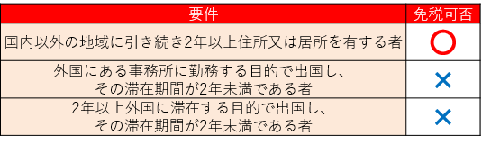

# 免税販売

## 免税とは

「免税」とは、​商品に​かかっている​税金を​免除する​ことです。​「免税店」は、​「非居住者」​（外国人旅行者など）に​対して、​特定の​物品を​一定の​方法で​販売する​場合に、​税金を​免除して​販売できる​店舗の​ことです。

**免除される​税金は？**​  
日本の​税金は、​課税対象に​よって​分類すると、​所得税など​個人や​会社の​利益を​対象に​課税する​所得課税、​相続税など​土地や​建物と​いった​資産を​対象に​課税する​資産課税等、​消費税など物品の​消費や​サービスの​提供などを​対象に​課税する​消費課税の​3種類に​分けられます。**​外国人旅行者が​免税を​受けられる​主な​税は、​消費課税の​うちの​消費税、​酒税、​入湯税、​関税の​四つです。**

**タックスフリーと​デューティーフリーの​違い**​  
免税には、​タックスフリー​（Tax Free）と​デューティーフリー​（Duty Free）の​2種類が​あります。​タックスフリーで​免除されるのは​消費税のみで、​デューティーフリーで​免除されるのは​消費税、​酒税、​入湯税、​関税です。

タックスフリーの​店舗には、​ドラッグストアや​ディスカウントストア、​百貨店などが​該当します。​税務署に​申請し許可を​得た、​消費税の​免税手​続きが​できる​免税店の​ことです。​免税対象となる​ものは​「輸出する、​通常生活の​用に​供される​物品​（一般物品、​消耗品）の​消費」のみです。​海外で​使う​ことが​前提の、​一般消費者と​して​購入した​「物品」でなければなりません。​そのため、​化粧品を​はじめと​した​消耗品は、​国内で​使えないよう専用の​袋に​入れると​いった​対応が​なされます。

デューティーフリーの​店舗には、​出国手続き後の​国際空港内出発エリアに​ある​空港型免税店と、​その派生型の​空港型市中免税店と​いった​保税免税店が​該当します。​空港型市中免税店で​購入した​商品は、​出発当日に​出発する​空港で​受け取る​ことに​なります。

## 免税店とは

免税店とは外国人旅行者等の非居住者に対して特定の物品を一定の方法で販売する場合に、  
消費税を免除して販売できる店舗のことです。  
ここでいう「免税店」とは、消費税法第８条に定める「輸出物品販売場」のことです。

### 1.場所：

#### 「免税店」の許可を受けた店舗であること。

免税販売は、誰でもできるものではありません。  
まずは、店舗ごとに納税地を所轄する税務署長の許可が必要になります。  
[**〉免税店の許可申請**](https://www.mlit.go.jp/kankocho/tax-free/howto.html)

### 2.対象者：

#### 「非居住者」に対する販売であること。

令和5年4月1日に消費税免税制度が改正されました。  
令和5年4月1日以降の免税対象者は以下となります。

非居住者のうち「外国籍」を有する者本邦入国後6ヶ月未満であることを確認出来ること（外交・公用・米軍を除く）。

非居住者のうち「日本国籍」を有する者

本邦入国後6ヶ月未満であることを確認出来ること。

※直近の入国（帰国）日の６ヵ月前の日以降に作成された「戸籍の附票の写し」または「在留証明」により確認出来ることが必要です。

### 3.対象物品：

#### 通常生活の用に供される物品（一般物品、消耗品）であること。

非居住者が事業用又は販売用として購入することが明らかな場合は、  
免税販売対象外になります。

**一般物品**

・１人の非居住者に対して同じ店舗における１日の販売合計額が５千円以上。

**消耗品**

・１人の非居住者に対して同じ店舗における１日の販売合計額が５千円以上、50万円以下の範囲内であること。

・日本国内で消費されないように[**指定された方法による包装**](https://www.mlit.go.jp/kankocho/tax-free/after.html)がされていること。

| 一般物品  | 消耗品  |
| --- | --- |

### 4.手続き：

#### 所定の手続に基づく販売であること。

免税手販売を行うには、販売時に一定の手続が必要になります。  
※「包装」と「免税手続き」を正しく行いましょう。

#### 1.免税手続について確認しよう

※2021年10月1日以降、従来の紙による免税販売はできなくなりました。免税販売を行う場合は必要な手続きを完全電子化する必要があります。

**【免税手続の流れ】**

**\[1\]旅券（パスポート）等の提示を受けます。**

※非居住者であっても、旅券等を所持していない者には、免税販売ができません。  
※旅券以外に以下のものが認められます。  
船舶観光上陸許可書、乗員上陸許可書、緊急上陸許可書、遭難による上陸許可書  
※旅券に上陸許可の証印が押印されていないことにより、非居住者であることが確認できない場合には、免税販売することはできませんが、外国人ビジネスマン等がトラスティド・トラベラー・プログラムを利用して入国した場合には、旅券と特定登録者カードの提示を受けることで、非居住者であることの確認をすれば、免税販売することは可能です。

**\[2\]非居住者であることを確認します。**

**\[3\]必要事項を説明します。**

**\[4\]免税対象物品の引渡しをします。**

**\[5\]国税庁へ購入記録情報を送信します。**

**\[6\]購入記録情報を保存します（約７年）。**

**\[7\]非居住者は、出国の際に税関に旅券等を提示します。**

**\[8\]非居住者は、購入した免税物品を携帯して国外へ持ち出します。**

※非居住者は免税物品を出国前に他人に譲渡してはいけません。  
※飲料類、化粧品類等における液体物は、国際線においては客室内への持込制限があるので、受託手荷物とする必要があります。  
（詳細は国土交通省ホームページ参照：[http://www.mlit.go.jp/koku/15_bf_000006.html](https://www.mlit.go.jp/koku/15_bf_000006.html)）

#### 2.消耗品の包装について確認しよう

外国人旅行者向け消費税免税制度では、消耗品について免税販売する際には国土交通大臣及び経済産業大臣が指定する方法により包装することが必要です。

具体的には、袋と箱による包装を認め、開封した場合に開封したことがわかるシールで封印することなどを指定しております。（詳細は別紙１参照）

[別紙1 包装の方法に関する詳細　PDF：154kb](https://www.mlit.go.jp/common/001044306.pdf)

#### 3.免税手続の多言語説明シート

外国人旅行者向け消費税免税制度を分かり易く多言語で説明するためのシートです。  
店舗への掲載、手続カウンターでの説明等にご活用下さい。

[英語　PDF：1023kb](https://www.mlit.go.jp/common/001396424.pdf)

[簡体字　PDF：2.6mb](https://www.mlit.go.jp/common/001396425.pdf)

[繁体字　PDF：2.8mb](https://www.mlit.go.jp/common/001396426.pdf)

[韓国語　PDF：2.1mb](https://www.mlit.go.jp/common/001396427.pdf)

[タイ語　PDF：2.7mb](https://www.mlit.go.jp/common/001396428.pdf)

[インドネシア語　PDF：2.7mb](https://www.mlit.go.jp/common/001396429.pdf)

[ベトナム語　PDF：2.8mb](https://www.mlit.go.jp/common/001396430.pdf)

‌

### ※免税店の都道府県別分布

[免税店の都道府県別分布（2023年9月30日現在）](https://www.mlit.go.jp/common/001717368.pdf)
